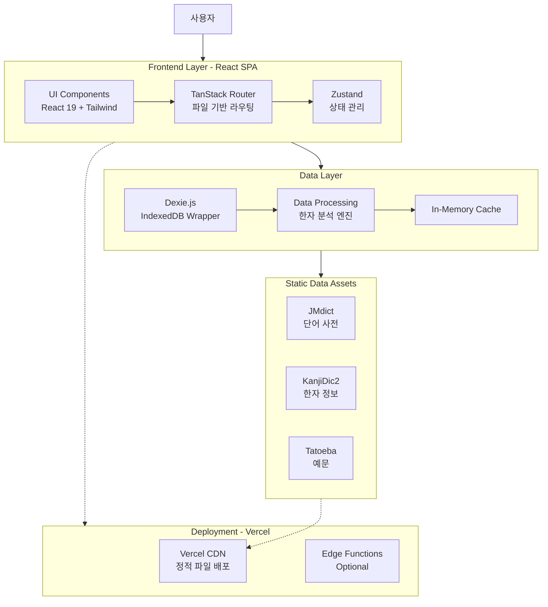
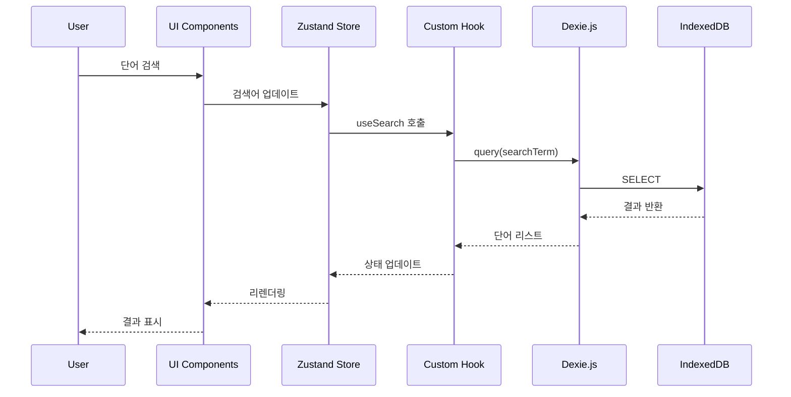
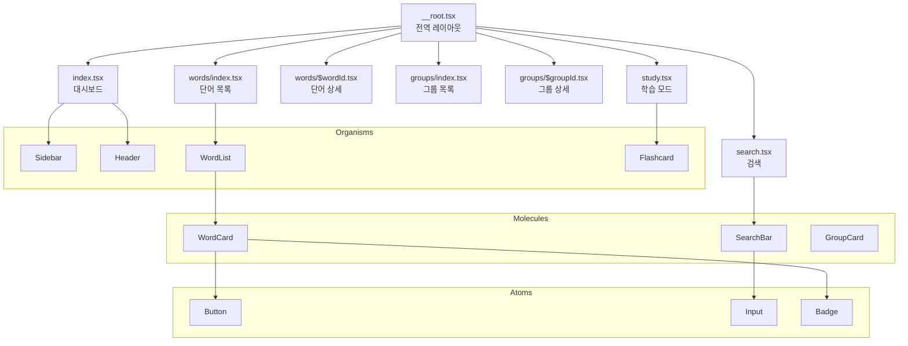

# 일본어 학습 단어장 서비스 - Code Architecture

## 문서 정보

- **버전**: 1.0
- **작성일**: 2026-01-22
- **대상**: 개발자
- **기반 문서**: [service-plan.md](service-plan.md), [wireframes.md](wireframes.md), [design-guide.md](design-guide.md)
- **배포 플랫폼**: Vercel

---

## 목차

1. [프로젝트 개요](#1-프로젝트-개요)
2. [기술 스택](#2-기술-스택)
3. [프로젝트 구조](#3-프로젝트-구조)
4. [핵심 아키텍처](#4-핵심-아키텍처)
5. [데이터 계층](#5-데이터-계층)
6. [컴포넌트 설계](#6-컴포넌트-설계)
7. [라우팅 구조](#7-라우팅-구조)
8. [상태 관리](#8-상태-관리)
9. [배포 전략](#9-배포-전략)
10. [개발 환경](#10-개발-환경)
11. [성능 최적화](#11-성능-최적화)
12. [보안 및 품질](#12-보안-및-품질)

---

## 1. 프로젝트 개요

### 1.1 서비스 설명

비슷한 한자를 자동으로 그룹화해주는 일본어 학습 단어장 서비스입니다.

**핵심 기능**:
- 일본어 단어 검색 및 저장
- 한자 자동 그룹화 (부수, 구성요소, 음독/훈독 기반)
- 플래시카드 학습 모드
- 오프라인 우선 데이터 저장

### 1.2 아키텍처 목표

1. **빠른 MVP 개발**: 1-2일 내 프로토타입 완성
2. **타입 안전성**: TypeScript strict mode 사용
3. **오프라인 우선**: IndexedDB를 통한 로컬 데이터 저장
4. **성능 최적화**: 번들 크기 최소화, 빠른 초기 로딩
5. **확장 가능성**: 기능 추가가 용이한 모듈 구조
6. **Vercel 최적화**: 간단한 배포 및 호스팅

### 1.3 전체 아키텍처 다이어그램



---

## 2. 기술 스택

### 2.1 핵심 기술 선택 및 근거

#### 프레임워크: Vite + React (Not Next.js)

**선택한 기술**:
- **React 19.2.3** (2025년 12월 최신 안정화)
- **Vite 7.3.1** (2025년 12월 최신 안정화)
- **TypeScript 5.9** (2025년 8월 최신 안정화)

**선택 근거**:

| 기준 | Next.js | Vite + React | 선택 |
|------|---------|--------------|------|
| 개발 속도 | 중간 (설정 필요) | 매우 빠름 | ✅ Vite |
| 초기 로딩 | SSR로 빠름 | 최적화 필요 | Next.js |
| 빌드 시간 | 느림 | 매우 빠름 | ✅ Vite |
| SEO 필요성 | 필요 시 유리 | SPA로 불리 | - |
| 서버 로직 | 내장 | 불필요 | ✅ Vite |
| 학습 곡선 | 가파름 | 낮음 | ✅ Vite |
| Vercel 통합 | 네이티브 | 완벽 지원 | 둘 다 |

**결정**: 
- 이 프로젝트는 **학습 도구 SPA**로 SEO가 중요하지 않음
- **서버 사이드 로직 불필요** (모든 데이터가 클라이언트)
- **MVP 1-2일 개발**에 Vite의 빠른 개발 경험이 유리
- **오프라인 우선** 전략에 SPA가 더 적합

#### 주요 라이브러리

```json
{
  "dependencies": {
    "react": "^19.2.3",
    "react-dom": "^19.2.3",
    
    "@tanstack/react-router": "^1.154.0",
    "zustand": "^5.0.3",
    
    "dexie": "^4.2.1",
    "dexie-react-hooks": "^1.1.7",
    
    "tailwindcss": "^4.0.0",
    "framer-motion": "^12.12.0",
    
    "date-fns": "^4.1.0",
    "clsx": "^2.1.1"
  },
  "devDependencies": {
    "typescript": "^5.9.0",
    "vite": "^7.3.1",
    "@vitejs/plugin-react": "^4.3.4",
    
    "eslint": "^9.18.0",
    "prettier": "^3.4.2",
    
    "@tanstack/router-devtools": "^1.154.0",
    "@tanstack/router-plugin": "^1.154.0"
  }
}
```

### 2.2 기술 선택 상세

#### 라우팅: TanStack Router 1.154.0

**선택 근거**:
- ✅ **완전한 타입 안전성**: 자동 생성된 라우트 타입
- ✅ **파일 기반 라우팅**: `src/routes/` 폴더 구조
- ✅ **자동 코드 스플리팅**: 번들 크기 최적화
- ✅ **내장 Devtools**: 시각적 디버깅
- ✅ **검색 파라미터 관리**: URL 상태 관리

**대안 비교**:
- React Router v7: 타입 안전성 부족, 수동 설정 많음
- Wouter: 너무 간단함, 기능 부족

#### 상태 관리: Zustand

**선택 근거**:
- ✅ **최소 번들 크기**: 1.16KB gzipped
- ✅ **간단한 API**: Provider 불필요
- ✅ **React 19 호환**: 완벽 지원
- ✅ **성능 우수**: Atomic selectors
- ✅ **DevTools 지원**: Redux DevTools 호환

**대안 비교**:
- Redux Toolkit: 과도한 보일러플레이트
- Jotai: 복잡한 파생 상태에 유리하나 이 프로젝트에 과함
- Context API: 리렌더링 최적화 어려움

#### UI/스타일링

**Tailwind CSS v4.0** (2026년 1월 최신)
- ✅ **5배 빠른 빌드**: Rust 기반 컴파일러
- ✅ **제로 설정**: 자동 컨텐츠 감지
- ✅ **CSS 변수 지원**: 테마 변수 노출
- ✅ **현대적 CSS**: cascade layers, `@property`

**shadcn/ui 3.7.0**
- ✅ **복사-붙여넣기 컴포넌트**: 의존성 최소화
- ✅ **완전한 커스터마이징**: 코드 소유권
- ✅ **Radix UI 기반**: 접근성 보장
- ✅ **Tailwind 통합**: 디자인 시스템 일관성

#### 데이터베이스: Dexie.js 4.2.1

**선택 근거**:
- ✅ **IndexedDB 래퍼**: 간단한 API
- ✅ **TypeScript 지원**: 완벽한 타입
- ✅ **React Hooks**: `useLiveQuery` 등
- ✅ **안정성**: 10만+ 웹사이트 사용
- ✅ **오프라인 우선**: PWA 지원

### 2.3 기술 스택 전체 목록

| 카테고리 | 기술 | 버전 | 용도 |
|----------|------|------|------|
| **Core** | React | 19.2.3 | UI 프레임워크 |
| | TypeScript | 5.9 | 타입 안전성 |
| | Vite | 7.3.1 | 빌드 도구 |
| **Routing** | TanStack Router | 1.154.0 | 클라이언트 라우팅 |
| **State** | Zustand | 5.0.3 | 전역 상태 관리 |
| **Database** | Dexie.js | 4.2.1 | IndexedDB 래퍼 |
| | dexie-react-hooks | 1.1.7 | React 통합 |
| **Styling** | Tailwind CSS | 4.0.0 | 유틸리티 CSS |
| | Framer Motion | 12.12.0 | 애니메이션 |
| **UI Components** | shadcn/ui | 3.7.0 | 재사용 컴포넌트 |
| | Radix UI | - | Primitives |
| **Utils** | date-fns | 4.1.0 | 날짜 처리 |
| | clsx | 2.1.1 | className 유틸 |
| **Dev Tools** | ESLint | 9.18.0 | 린팅 |
| | Prettier | 3.4.2 | 포매팅 |
| | Vitest | - | 테스팅 (Phase 2) |

---

## 3. 프로젝트 구조

### 3.1 폴더 구조

```
project_40/
├── public/                          # 정적 파일
│   ├── data/                        # 사전 데이터
│   │   ├── jmdict-mini.json        # JMdict 필터링 데이터 (3-5MB)
│   │   ├── kanjidic2.json          # KanjiDic2 데이터 (1-2MB)
│   │   └── tatoeba-examples.json   # Tatoeba 예문 (2-3MB)
│   ├── fonts/                       # 웹 폰트
│   │   ├── KoddiUDOnGothic-Regular.woff2
│   │   └── BIZUDGothic-Regular.woff2
│   ├── icons/                       # 아이콘
│   │   ├── favicon.ico
│   │   └── icon-*.png
│   └── manifest.json                # PWA 매니페스트
│
├── src/
│   ├── routes/                      # TanStack Router 파일 기반 라우팅
│   │   ├── __root.tsx              # 루트 레이아웃
│   │   ├── index.tsx               # 대시보드 (/)
│   │   ├── search.tsx              # 검색 페이지 (/search)
│   │   ├── words/
│   │   │   ├── index.tsx           # 단어 목록 (/words)
│   │   │   └── $wordId.tsx         # 단어 상세 (/words/:wordId)
│   │   ├── groups/
│   │   │   ├── index.tsx           # 그룹 목록 (/groups)
│   │   │   └── $groupId.tsx        # 그룹 상세 (/groups/:groupId)
│   │   └── study.tsx               # 학습 모드 (/study)
│   │
│   ├── components/                  # 컴포넌트 (Atomic Design)
│   │   ├── atoms/                   # 원자 컴포넌트
│   │   │   ├── Button.tsx
│   │   │   ├── Input.tsx
│   │   │   ├── Checkbox.tsx
│   │   │   ├── Badge.tsx
│   │   │   ├── Tag.tsx
│   │   │   └── Icon.tsx
│   │   ├── molecules/               # 분자 컴포넌트
│   │   │   ├── WordCard.tsx
│   │   │   ├── SearchBar.tsx
│   │   │   ├── GroupCard.tsx
│   │   │   ├── KanjiDisplay.tsx
│   │   │   └── ProgressBar.tsx
│   │   ├── organisms/               # 유기체 컴포넌트
│   │   │   ├── Sidebar.tsx
│   │   │   ├── Header.tsx
│   │   │   ├── WordList.tsx
│   │   │   ├── GroupList.tsx
│   │   │   ├── Flashcard.tsx
│   │   │   └── FilterPanel.tsx
│   │   └── templates/               # 템플릿
│   │       ├── DashboardLayout.tsx
│   │       ├── SearchLayout.tsx
│   │       └── StudyLayout.tsx
│   │
│   ├── features/                    # 기능별 모듈
│   │   ├── search/                  # 검색 기능
│   │   │   ├── hooks/
│   │   │   │   ├── useSearch.ts
│   │   │   │   └── useSearchHistory.ts
│   │   │   ├── utils/
│   │   │   │   ├── searchEngine.ts
│   │   │   │   └── romajiConverter.ts
│   │   │   └── types.ts
│   │   │
│   │   ├── words/                   # 단어 관리
│   │   │   ├── hooks/
│   │   │   │   ├── useWords.ts
│   │   │   │   ├── useWordDetail.ts
│   │   │   │   └── useSaveWord.ts
│   │   │   ├── utils/
│   │   │   │   └── wordFormatter.ts
│   │   │   └── types.ts
│   │   │
│   │   ├── kanji/                   # 한자 분석
│   │   │   ├── hooks/
│   │   │   │   └── useKanjiAnalysis.ts
│   │   │   ├── utils/
│   │   │   │   ├── kanjiExtractor.ts
│   │   │   │   ├── radicalAnalyzer.ts
│   │   │   │   ├── componentAnalyzer.ts
│   │   │   │   └── readingAnalyzer.ts
│   │   │   └── types.ts
│   │   │
│   │   ├── groups/                  # 그룹 관리
│   │   │   ├── hooks/
│   │   │   │   ├── useGroups.ts
│   │   │   │   ├── useGroupSuggestions.ts
│   │   │   │   └── useAutoGrouping.ts
│   │   │   ├── utils/
│   │   │   │   └── groupGenerator.ts
│   │   │   └── types.ts
│   │   │
│   │   └── study/                   # 학습 모드
│   │       ├── hooks/
│   │       │   ├── useFlashcard.ts
│   │       │   └── useStudyProgress.ts
│   │       ├── utils/
│   │       │   └── studySession.ts
│   │       └── types.ts
│   │
│   ├── lib/                         # 핵심 라이브러리
│   │   ├── db/                      # 데이터베이스
│   │   │   ├── dexie.ts            # Dexie 설정
│   │   │   ├── schema.ts           # DB 스키마
│   │   │   ├── migrations.ts       # 마이그레이션
│   │   │   └── queries.ts          # 쿼리 함수
│   │   │
│   │   ├── data/                    # 정적 데이터 로더
│   │   │   ├── jmdict-loader.ts
│   │   │   ├── kanjidic-loader.ts
│   │   │   └── data-initializer.ts
│   │   │
│   │   └── utils/                   # 공통 유틸리티
│   │       ├── cn.ts               # className 병합
│   │       ├── date.ts             # 날짜 유틸
│   │       └── validation.ts       # 유효성 검사
│   │
│   ├── stores/                      # Zustand 스토어
│   │   ├── useAppStore.ts          # 전역 앱 상태
│   │   ├── useSearchStore.ts       # 검색 상태
│   │   ├── useWordStore.ts         # 단어 상태
│   │   ├── useGroupStore.ts        # 그룹 상태
│   │   └── useStudyStore.ts        # 학습 상태
│   │
│   ├── styles/                      # 스타일
│   │   ├── globals.css             # 전역 스타일 + Tailwind
│   │   └── variables.css           # CSS 변수
│   │
│   ├── types/                       # 전역 타입
│   │   ├── word.ts
│   │   ├── kanji.ts
│   │   ├── group.ts
│   │   └── api.ts
│   │
│   ├── main.tsx                     # 엔트리 포인트
│   ├── App.tsx                      # 루트 컴포넌트
│   ├── routeTree.gen.ts            # 자동 생성된 라우트 트리
│   └── vite-env.d.ts               # Vite 타입
│
├── scripts/                         # 빌드 스크립트
│   ├── prepare-data.js             # 데이터 준비
│   └── generate-icons.js           # 아이콘 생성
│
├── .vscode/                         # VSCode 설정
│   ├── settings.json
│   └── extensions.json
│
├── docs/                            # 문서
│   ├── service-plan.md
│   ├── wireframes.md
│   ├── design-guide.md
│   └── code-architecture.md        # 이 문서
│
├── .env.example                     # 환경 변수 예시
├── .eslintrc.json                   # ESLint 설정
├── .prettierrc                      # Prettier 설정
├── .gitignore
├── package.json
├── tsconfig.json                    # TypeScript 설정
├── tsconfig.node.json              # Node용 TS 설정
├── tailwind.config.ts              # Tailwind 설정
├── vite.config.ts                  # Vite 설정
├── vercel.json                     # Vercel 설정
└── README.md
```

### 3.2 파일 네이밍 컨벤션

#### 컴포넌트
- **React 컴포넌트**: PascalCase (`WordCard.tsx`)
- **Hooks**: camelCase + `use` 접두사 (`useWords.ts`)
- **Types**: PascalCase (`Word.ts`, `WordType`)
- **Utils**: camelCase (`searchEngine.ts`)
- **Constants**: UPPER_SNAKE_CASE (`API_ENDPOINTS.ts`)

#### 예시

```typescript
// ✅ Good
components/atoms/Button.tsx
hooks/useSearch.ts
types/Word.ts
utils/formatDate.ts
constants/ROUTES.ts

// ❌ Bad
components/atoms/button.tsx
hooks/search.ts
types/word.ts
utils/FormatDate.ts
```

### 3.3 Import 순서 규칙

```typescript
// 1. External dependencies
import { useState, useEffect } from 'react';
import { useNavigate } from '@tanstack/react-router';

// 2. Internal absolute imports
import { Button } from '@/components/atoms/Button';
import { useWords } from '@/features/words/hooks/useWords';

// 3. Internal relative imports
import { formatDate } from './utils';
import { WordType } from './types';

// 4. CSS imports
import './styles.css';
```

---

## 4. 핵심 아키텍처

### 4.1 전체 데이터 플로우



### 4.2 컴포넌트 계층 구조



### 4.3 아키텍처 패턴

#### Feature-Based 구조

각 기능(`features/`)은 독립적인 모듈로 구성:

```typescript
// features/search/hooks/useSearch.ts
export function useSearch() {
  const store = useSearchStore();
  const db = useDB();
  
  return {
    search: (term: string) => {
      // 검색 로직
    },
    results: store.results,
    isLoading: store.isLoading
  };
}
```

#### Atomic Design 패턴

컴포넌트를 5단계로 분리:

1. **Atoms**: 기본 UI 요소 (Button, Input)
2. **Molecules**: Atoms 조합 (SearchBar, WordCard)
3. **Organisms**: 복잡한 UI 섹션 (Sidebar, WordList)
4. **Templates**: 페이지 레이아웃
5. **Pages**: 라우트 컴포넌트 (`routes/`)

#### 관심사 분리

```
UI Layer (components/)
    ↓
Business Logic Layer (features/*/hooks/)
    ↓
Data Access Layer (lib/db/)
    ↓
Storage Layer (IndexedDB)
```

---

## 5. 데이터 계층

### 5.1 데이터베이스 스키마

#### Dexie.js 스키마 정의

```typescript
// lib/db/schema.ts
import Dexie, { Table } from 'dexie';

export interface Word {
  id: string;                    // UUID
  word: string;                  // 단어 표기 (清潔)
  reading: string;               // 후리가나 (せいけつ)
  meanings: WordMeaning[];       // 뜻 목록
  examples: Example[];           // 예문
  kanji: string[];              // 포함된 한자 배열 [清, 潔]
  jlptLevel?: 'N5' | 'N4' | 'N3' | 'N2' | 'N1';
  frequency?: number;            // 사용 빈도
  groupIds: string[];           // 소속 그룹 ID
  studyStatus: 'new' | 'learning' | 'mastered';
  studyCount: number;           // 학습 횟수
  correctCount: number;         // 정답 횟수
  lastStudied?: Date;
  nextReview?: Date;
  createdAt: Date;
  updatedAt: Date;
}

export interface WordMeaning {
  pos: string;                  // 품사 (noun, verb, etc.)
  definition: string;           // 뜻
  tags?: string[];              // 태그 (formal, colloquial, etc.)
}

export interface Example {
  japanese: string;             // 일본어 예문
  reading: string;              // 후리가나
  korean: string;               // 한국어 번역
  source?: string;              // 출처
}

export interface KanjiInfo {
  id: string;
  character: string;            // 한자 (清)
  meanings: string[];           // 의미 [맑을 청]
  readings: {
    on: string[];               // 음독 [セイ, ショウ]
    kun: string[];              // 훈독 [きよい, きよまる]
  };
  radical: string;              // 부수 (氵)
  radicalName: string;          // 부수명 (물 수변)
  strokes: number;              // 획수
  jlptLevel?: 'N5' | 'N4' | 'N3' | 'N2' | 'N1';
  grade?: number;               // 교육한자 학년
  frequency?: number;           // 사용 빈도
  components?: string[];        // 구성 요소 [氵, 青]
  similarKanji?: string[];      // 비슷한 한자
  createdAt: Date;
}

export interface Group {
  id: string;
  name: string;                 // 그룹명 (氵(물 수변) 한자 그룹)
  type: 'radical' | 'component' | 'on-reading' | 'kun-reading' | 'jlpt' | 'visual' | 'custom';
  criterion: string;            // 기준 (氵, 青, セイ, etc.)
  description?: string;         // 설명
  wordIds: string[];           // 포함 단어 ID
  autoGenerated: boolean;       // 자동 생성 여부
  color?: string;               // 그룹 색상
  createdAt: Date;
  updatedAt: Date;
}

export interface StudySession {
  id: string;
  startedAt: Date;
  endedAt?: Date;
  wordIds: string[];           // 학습한 단어
  results: {
    wordId: string;
    difficulty: 'easy' | 'normal' | 'hard' | 'unknown';
    timeSpent: number;         // 초 단위
  }[];
  totalWords: number;
  completedWords: number;
  accuracy: number;            // 정답률
}

export interface AppSettings {
  id: 'settings';              // 단일 레코드
  theme: 'light' | 'dark' | 'auto';
  language: 'ko' | 'ja' | 'en';
  studySettings: {
    dailyGoal: number;
    reviewInterval: number[];  // [1, 3, 7, 14, 30]
    autoPlayAudio: boolean;
  };
  uiSettings: {
    sidebarCollapsed: boolean;
    cardLayout: 'compact' | 'comfortable';
  };
  dataVersion: string;         // 데이터 버전
  lastSync?: Date;
}

// Dexie 데이터베이스 클래스
export class AppDatabase extends Dexie {
  words!: Table<Word, string>;
  kanjiInfo!: Table<KanjiInfo, string>;
  groups!: Table<Group, string>;
  studySessions!: Table<StudySession, string>;
  settings!: Table<AppSettings, 'settings'>;

  constructor() {
    super('JapaneseVocabDB');
    
    this.version(1).stores({
      words: 'id, word, *kanji, *groupIds, studyStatus, nextReview, createdAt',
      kanjiInfo: 'id, character, radical, *readings.on, *readings.kun, jlptLevel',
      groups: 'id, type, criterion, createdAt',
      studySessions: 'id, startedAt, endedAt',
      settings: 'id'
    });
  }
}

export const db = new AppDatabase();
```

### 5.2 정적 데이터 로딩

#### JMdict 데이터 처리

```typescript
// lib/data/jmdict-loader.ts
interface JMdictEntry {
  id: string;
  kanji?: string[];
  reading: string[];
  sense: Array<{
    pos: string[];
    gloss: string[];
    misc?: string[];
  }>;
}

export async function loadJMdict(): Promise<void> {
  try {
    const response = await fetch('/data/jmdict-mini.json');
    const data: JMdictEntry[] = await response.json();
    
    // IndexedDB에 없는 경우에만 초기화
    const count = await db.words.count();
    if (count > 0) return;
    
    console.log('Initializing JMdict data...');
    
    const words = data.map(entry => transformJMdictEntry(entry));
    await db.words.bulkAdd(words);
    
    console.log(`Loaded ${words.length} words`);
  } catch (error) {
    console.error('Failed to load JMdict:', error);
  }
}

function transformJMdictEntry(entry: JMdictEntry): Word {
  return {
    id: entry.id,
    word: entry.kanji?.[0] || entry.reading[0],
    reading: entry.reading[0],
    meanings: entry.sense.map(s => ({
      pos: s.pos[0] || 'unknown',
      definition: s.gloss.join(', '),
      tags: s.misc
    })),
    examples: [],
    kanji: extractKanji(entry.kanji?.[0] || ''),
    groupIds: [],
    studyStatus: 'new',
    studyCount: 0,
    correctCount: 0,
    createdAt: new Date(),
    updatedAt: new Date()
  };
}

function extractKanji(text: string): string[] {
  const kanjiRegex = /[\u4e00-\u9faf]/g;
  return [...new Set(text.match(kanjiRegex) || [])];
}
```

#### KanjiDic2 데이터 처리

```typescript
// lib/data/kanjidic-loader.ts
interface KanjiDic2Entry {
  character: string;
  radical: {
    classical: number;
    name: string;
  };
  misc: {
    grade?: number;
    stroke_count: number;
    freq?: number;
    jlpt?: number;
  };
  reading_meaning: {
    rmgroup: {
      reading: Array<{
        type: string;
        value: string;
      }>;
      meaning: string[];
    }[];
  };
}

export async function loadKanjiDic(): Promise<void> {
  try {
    const response = await fetch('/data/kanjidic2.json');
    const data: KanjiDic2Entry[] = await response.json();
    
    const count = await db.kanjiInfo.count();
    if (count > 0) return;
    
    console.log('Initializing KanjiDic2 data...');
    
    const kanjiList = data.map(entry => transformKanjiEntry(entry));
    await db.kanjiInfo.bulkAdd(kanjiList);
    
    console.log(`Loaded ${kanjiList.length} kanji`);
  } catch (error) {
    console.error('Failed to load KanjiDic2:', error);
  }
}

function transformKanjiEntry(entry: KanjiDic2Entry): KanjiInfo {
  const readings = entry.reading_meaning?.rmgroup[0]?.reading || [];
  
  return {
    id: entry.character,
    character: entry.character,
    meanings: entry.reading_meaning?.rmgroup[0]?.meaning || [],
    readings: {
      on: readings.filter(r => r.type === 'ja_on').map(r => r.value),
      kun: readings.filter(r => r.type === 'ja_kun').map(r => r.value)
    },
    radical: getRadicalChar(entry.radical.classical),
    radicalName: entry.radical.name,
    strokes: entry.misc.stroke_count,
    jlptLevel: convertJLPT(entry.misc.jlpt),
    grade: entry.misc.grade,
    frequency: entry.misc.freq,
    createdAt: new Date()
  };
}

function convertJLPT(level?: number): KanjiInfo['jlptLevel'] {
  if (!level) return undefined;
  return `N${level}` as KanjiInfo['jlptLevel'];
}

const RADICAL_MAP: Record<number, string> = {
  1: '一', 2: '丨', 3: '丶', 4: '丿', 5: '乙',
  // ... 214개 부수 매핑
  85: '氵', // 물 수변
  // ...
};

function getRadicalChar(radicalNumber: number): string {
  return RADICAL_MAP[radicalNumber] || '';
}
```

#### 데이터 초기화 순서

```typescript
// lib/data/data-initializer.ts
export async function initializeData(): Promise<void> {
  console.log('Starting data initialization...');
  
  const startTime = performance.now();
  
  try {
    // 병렬 로딩
    await Promise.all([
      loadJMdict(),
      loadKanjiDic(),
      // loadTatoeba(), // Phase 2
    ]);
    
    // 초기 설정
    await initializeSettings();
    
    const duration = performance.now() - startTime;
    console.log(`Data initialization complete in ${duration.toFixed(2)}ms`);
  } catch (error) {
    console.error('Data initialization failed:', error);
    throw error;
  }
}

async function initializeSettings(): Promise<void> {
  const existing = await db.settings.get('settings');
  
  if (!existing) {
    await db.settings.add({
      id: 'settings',
      theme: 'auto',
      language: 'ko',
      studySettings: {
        dailyGoal: 20,
        reviewInterval: [1, 3, 7, 14, 30],
        autoPlayAudio: false
      },
      uiSettings: {
        sidebarCollapsed: false,
        cardLayout: 'comfortable'
      },
      dataVersion: '1.0.0'
    });
  }
}
```

### 5.3 한자 분석 엔진

#### 부수 기반 분석

```typescript
// features/kanji/utils/radicalAnalyzer.ts
export interface RadicalGroup {
  radical: string;
  radicalName: string;
  kanji: string[];
  count: number;
}

export async function analyzeByRadical(
  kanjiList: string[]
): Promise<RadicalGroup[]> {
  // KanjiInfo에서 각 한자의 부수 정보 가져오기
  const kanjiInfoList = await db.kanjiInfo
    .where('character')
    .anyOf(kanjiList)
    .toArray();
  
  // 부수별로 그룹화
  const radicalMap = new Map<string, RadicalGroup>();
  
  for (const info of kanjiInfoList) {
    const key = info.radical;
    
    if (!radicalMap.has(key)) {
      radicalMap.set(key, {
        radical: info.radical,
        radicalName: info.radicalName,
        kanji: [],
        count: 0
      });
    }
    
    const group = radicalMap.get(key)!;
    group.kanji.push(info.character);
    group.count++;
  }
  
  // 2개 이상인 그룹만 반환
  return Array.from(radicalMap.values())
    .filter(g => g.count >= 2)
    .sort((a, b) => b.count - a.count);
}
```

#### 구성 요소 기반 분석

```typescript
// features/kanji/utils/componentAnalyzer.ts
export interface ComponentGroup {
  component: string;
  kanji: string[];
  count: number;
}

// 한자 분해 데이터 (간단한 버전)
const KANJI_COMPONENTS: Record<string, string[]> = {
  '清': ['氵', '青'],
  '晴': ['日', '青'],
  '静': ['青', '争'],
  '情': ['忄', '青'],
  '請': ['言', '青'],
  // ... 더 많은 한자
};

export function analyzeByComponent(
  kanjiList: string[]
): ComponentGroup[] {
  const componentMap = new Map<string, ComponentGroup>();
  
  for (const kanji of kanjiList) {
    const components = KANJI_COMPONENTS[kanji] || [];
    
    for (const comp of components) {
      if (!componentMap.has(comp)) {
        componentMap.set(comp, {
          component: comp,
          kanji: [],
          count: 0
        });
      }
      
      const group = componentMap.get(comp)!;
      group.kanji.push(kanji);
      group.count++;
    }
  }
  
  // 2개 이상인 그룹만 반환
  return Array.from(componentMap.values())
    .filter(g => g.count >= 2)
    .sort((a, b) => b.count - a.count);
}
```

#### 음독/훈독 기반 분석

```typescript
// features/kanji/utils/readingAnalyzer.ts
export interface ReadingGroup {
  reading: string;
  type: 'on' | 'kun';
  kanji: string[];
  count: number;
}

export async function analyzeByReading(
  kanjiList: string[]
): Promise<ReadingGroup[]> {
  const kanjiInfoList = await db.kanjiInfo
    .where('character')
    .anyOf(kanjiList)
    .toArray();
  
  const readingMap = new Map<string, ReadingGroup>();
  
  for (const info of kanjiInfoList) {
    // 음독 분석
    for (const reading of info.readings.on) {
      const key = `on:${reading}`;
      
      if (!readingMap.has(key)) {
        readingMap.set(key, {
          reading,
          type: 'on',
          kanji: [],
          count: 0
        });
      }
      
      const group = readingMap.get(key)!;
      group.kanji.push(info.character);
      group.count++;
    }
    
    // 훈독 분석
    for (const reading of info.readings.kun) {
      const key = `kun:${reading}`;
      
      if (!readingMap.has(key)) {
        readingMap.set(key, {
          reading,
          type: 'kun',
          kanji: [],
          count: 0
        });
      }
      
      const group = readingMap.get(key)!;
      group.kanji.push(info.character);
      group.count++;
    }
  }
  
  // 2개 이상인 그룹만 반환
  return Array.from(readingMap.values())
    .filter(g => g.count >= 2)
    .sort((a, b) => b.count - a.count);
}
```

#### 자동 그룹 생성

```typescript
// features/groups/utils/groupGenerator.ts
export interface GroupSuggestion {
  type: Group['type'];
  name: string;
  criterion: string;
  description: string;
  wordIds: string[];
  priority: number;  // 추천 우선순위
}

export async function generateGroupSuggestions(
  word: Word
): Promise<GroupSuggestion[]> {
  const suggestions: GroupSuggestion[] = [];
  
  if (word.kanji.length === 0) {
    return suggestions;
  }
  
  // 1. 부수 기반 그룹
  const radicalGroups = await analyzeByRadical(word.kanji);
  for (const group of radicalGroups.slice(0, 2)) {  // 상위 2개
    const relatedWords = await findWordsByKanji(group.kanji);
    
    suggestions.push({
      type: 'radical',
      name: `${group.radical}(${group.radicalName}) 한자 그룹`,
      criterion: group.radical,
      description: `${group.radicalName}을 부수로 가진 한자들`,
      wordIds: relatedWords.map(w => w.id),
      priority: 90
    });
  }
  
  // 2. 구성 요소 기반 그룹
  const componentGroups = analyzeByComponent(word.kanji);
  for (const group of componentGroups.slice(0, 2)) {
    const relatedWords = await findWordsByKanji(group.kanji);
    
    suggestions.push({
      type: 'component',
      name: `${group.component} 포함 한자 그룹`,
      criterion: group.component,
      description: `${group.component}을 구성 요소로 포함하는 한자들`,
      wordIds: relatedWords.map(w => w.id),
      priority: 85
    });
  }
  
  // 3. 음독 기반 그룹
  const readingGroups = await analyzeByReading(word.kanji);
  const onReadings = readingGroups.filter(g => g.type === 'on').slice(0, 1);
  
  for (const group of onReadings) {
    const relatedWords = await findWordsByKanji(group.kanji);
    
    suggestions.push({
      type: 'on-reading',
      name: `${group.reading} 음독 그룹`,
      criterion: group.reading,
      description: `${group.reading}으로 읽히는 한자들`,
      wordIds: relatedWords.map(w => w.id),
      priority: 70
    });
  }
  
  // 우선순위로 정렬
  return suggestions.sort((a, b) => b.priority - a.priority);
}

async function findWordsByKanji(kanjiList: string[]): Promise<Word[]> {
  const words: Word[] = [];
  
  for (const kanji of kanjiList) {
    const found = await db.words
      .filter(w => w.kanji.includes(kanji))
      .toArray();
    
    words.push(...found);
  }
  
  // 중복 제거
  const uniqueWords = Array.from(
    new Map(words.map(w => [w.id, w])).values()
  );
  
  return uniqueWords;
}
```

### 5.4 데이터 쿼리 최적화

```typescript
// lib/db/queries.ts

// 복합 인덱스를 활용한 효율적인 쿼리
export class WordQueries {
  // 단어 검색 (히라가나, 한자, 로마자)
  static async search(term: string): Promise<Word[]> {
    const normalizedTerm = term.toLowerCase().trim();
    
    // 히라가나/한자로 검색
    const byWord = await db.words
      .where('word')
      .startsWithIgnoreCase(normalizedTerm)
      .limit(20)
      .toArray();
    
    const byReading = await db.words
      .where('reading')
      .startsWithIgnoreCase(normalizedTerm)
      .limit(20)
      .toArray();
    
    // 중복 제거 및 병합
    const combined = [...byWord, ...byReading];
    const unique = Array.from(
      new Map(combined.map(w => [w.id, w])).values()
    );
    
    return unique.slice(0, 20);
  }
  
  // 복습 대기 단어 조회
  static async getReviewWords(): Promise<Word[]> {
    const now = new Date();
    
    return db.words
      .where('nextReview')
      .belowOrEqual(now)
      .and(w => w.studyStatus !== 'new')
      .toArray();
  }
  
  // 그룹별 단어 조회
  static async getWordsByGroup(groupId: string): Promise<Word[]> {
    return db.words
      .filter(w => w.groupIds.includes(groupId))
      .toArray();
  }
  
  // 학습 상태별 단어 수
  static async getWordCountByStatus(): Promise<Record<string, number>> {
    const all = await db.words.toArray();
    
    return {
      new: all.filter(w => w.studyStatus === 'new').length,
      learning: all.filter(w => w.studyStatus === 'learning').length,
      mastered: all.filter(w => w.studyStatus === 'mastered').length,
      total: all.length
    };
  }
}
```

---

## 6. 컴포넌트 설계

### 6.1 Atoms (원자 컴포넌트)

#### Button

```typescript
// components/atoms/Button.tsx
import { ButtonHTMLAttributes, forwardRef } from 'react';
import { cva, type VariantProps } from 'class-variance-authority';
import { cn } from '@/lib/utils/cn';

const buttonVariants = cva(
  'inline-flex items-center justify-center rounded-lg font-medium transition-all focus-visible:outline-none focus-visible:ring-2 focus-visible:ring-offset-2 disabled:pointer-events-none disabled:opacity-50',
  {
    variants: {
      variant: {
        primary: 'bg-sky-blue text-white hover:bg-sky-blue/90',
        secondary: 'border border-border bg-transparent hover:bg-sky-tint',
        text: 'text-sky-blue hover:bg-sky-tint',
        danger: 'bg-coral-pink text-white hover:bg-coral-pink/90',
      },
      size: {
        sm: 'h-7 px-3 text-xs',
        md: 'h-9 px-4 text-sm',
        lg: 'h-11 px-6 text-base',
      },
    },
    defaultVariants: {
      variant: 'primary',
      size: 'md',
    },
  }
);

export interface ButtonProps
  extends ButtonHTMLAttributes<HTMLButtonElement>,
    VariantProps<typeof buttonVariants> {}

export const Button = forwardRef<HTMLButtonElement, ButtonProps>(
  ({ className, variant, size, ...props }, ref) => {
    return (
      <button
        className={cn(buttonVariants({ variant, size, className }))}
        ref={ref}
        {...props}
      />
    );
  }
);

Button.displayName = 'Button';
```

#### Badge (JLPT 레벨)

```typescript
// components/atoms/Badge.tsx
import { cn } from '@/lib/utils/cn';

export interface BadgeProps {
  jlptLevel: 'N5' | 'N4' | 'N3' | 'N2' | 'N1';
  className?: string;
}

const jlptColors = {
  N5: 'bg-gray-tint text-dark-gray',
  N4: 'bg-gray-tint text-dark-gray',
  N3: 'bg-cream-yellow text-[#8a7a4a]',
  N2: 'bg-sky-blue text-white',
  N1: 'bg-coral-pink text-white',
};

export function Badge({ jlptLevel, className }: BadgeProps) {
  return (
    <span
      className={cn(
        'inline-flex items-center justify-center h-5 px-2 rounded text-[10px] font-semibold tracking-wide',
        jlptColors[jlptLevel],
        className
      )}
    >
      {jlptLevel}
    </span>
  );
}
```

### 6.2 Molecules (분자 컴포넌트)

#### WordCard

```typescript
// components/molecules/WordCard.tsx
import { Word } from '@/types/word';
import { Button } from '@/components/atoms/Button';
import { Badge } from '@/components/atoms/Badge';
import { Checkbox } from '@/components/atoms/Checkbox';
import { Tag } from '@/components/atoms/Tag';

export interface WordCardProps {
  word: Word;
  onToggleStudy?: (wordId: string) => void;
  onViewDetail?: (wordId: string) => void;
  selected?: boolean;
}

export function WordCard({
  word,
  onToggleStudy,
  onViewDetail,
  selected = false,
}: WordCardProps) {
  return (
    <div
      className={cn(
        'bg-cream-tint border border-border rounded p-3 transition-all',
        'hover:shadow-soft hover:border-medium-gray',
        selected && 'border-sky-blue shadow-[0_0_0_3px_rgba(143,193,227,0.2)]'
      )}
    >
      {/* Header */}
      <div className="flex items-center gap-2 mb-2">
        <Checkbox
          checked={word.studyStatus === 'mastered'}
          onCheckedChange={() => onToggleStudy?.(word.id)}
        />
        <span className="flex-1 font-japanese text-lg font-medium text-text">
          {word.word}
        </span>
        {word.jlptLevel && <Badge jlptLevel={word.jlptLevel} />}
      </div>
      
      {/* Body */}
      <div className="mb-3">
        <p className="font-japanese text-sm text-text-light mb-1">
          [{word.reading}]
        </p>
        <p className="text-sm text-text line-clamp-2">
          {word.meanings[0]?.definition}
        </p>
        
        {/* Tags */}
        {word.kanji.length > 0 && (
          <div className="flex gap-1 flex-wrap mt-2">
            {word.kanji.map((k) => (
              <Tag key={k}>{k}</Tag>
            ))}
          </div>
        )}
      </div>
      
      {/* Footer */}
      <div className="flex justify-between items-center pt-2 border-t border-border">
        <span className="text-[10px] text-medium-gray">
          {word.nextReview && `복습: ${formatDate(word.nextReview)}`}
        </span>
        <Button
          variant="text"
          size="sm"
          onClick={() => onViewDetail?.(word.id)}
        >
          상세보기
        </Button>
      </div>
    </div>
  );
}
```

#### SearchBar

```typescript
// components/molecules/SearchBar.tsx
import { useState } from 'react';
import { Input } from '@/components/atoms/Input';
import { Button } from '@/components/atoms/Button';
import { SearchIcon, XIcon } from 'lucide-react';

export interface SearchBarProps {
  value: string;
  onChange: (value: string) => void;
  onSearch: (term: string) => void;
  placeholder?: string;
}

export function SearchBar({
  value,
  onChange,
  onSearch,
  placeholder = '단어를 입력하세요...',
}: SearchBarProps) {
  const handleKeyDown = (e: React.KeyboardEvent) => {
    if (e.key === 'Enter') {
      onSearch(value);
    }
  };
  
  const handleClear = () => {
    onChange('');
  };
  
  return (
    <div className="relative w-full max-w-2xl mx-auto">
      <div className="absolute left-3 top-1/2 -translate-y-1/2 text-medium-gray">
        <SearchIcon className="w-5 h-5" />
      </div>
      
      <Input
        value={value}
        onChange={(e) => onChange(e.target.value)}
        onKeyDown={handleKeyDown}
        placeholder={placeholder}
        className="pl-10 pr-10 h-11"
      />
      
      {value && (
        <button
          onClick={handleClear}
          className="absolute right-3 top-1/2 -translate-y-1/2 text-medium-gray hover:text-text"
        >
          <XIcon className="w-4 h-4" />
        </button>
      )}
    </div>
  );
}
```

### 6.3 Organisms (유기체 컴포넌트)

#### Sidebar

```typescript
// components/organisms/Sidebar.tsx
import { Link, useMatchRoute } from '@tanstack/react-router';
import { HomeIcon, SearchIcon, BookIcon, LayersIcon, BarChartIcon } from 'lucide-react';
import { cn } from '@/lib/utils/cn';

const navItems = [
  { to: '/', label: '대시보드', icon: HomeIcon },
  { to: '/search', label: '검색', icon: SearchIcon },
  { to: '/words', label: '내 단어장', icon: BookIcon },
  { to: '/groups', label: '한자 그룹', icon: LayersIcon },
  { to: '/study', label: '학습하기', icon: BarChartIcon },
];

export function Sidebar() {
  const matchRoute = useMatchRoute();
  
  return (
    <aside className="w-[220px] h-screen bg-gray-tint border-r border-border flex flex-col">
      {/* Header */}
      <div className="p-6 border-b border-border">
        <h1 className="text-base font-semibold text-text">
          일본어 단어장
        </h1>
      </div>
      
      {/* Navigation */}
      <nav className="flex-1 py-3">
        {navItems.map((item) => {
          const isActive = matchRoute({ to: item.to, fuzzy: false });
          const Icon = item.icon;
          
          return (
            <Link
              key={item.to}
              to={item.to}
              className={cn(
                'flex items-center gap-3 px-6 py-3 text-sm transition-colors',
                isActive
                  ? 'bg-cream-tint text-sky-blue border-l-3 border-sky-blue font-semibold'
                  : 'text-text-light hover:bg-cream-tint hover:text-text'
              )}
            >
              <Icon className="w-5 h-5" />
              <span>{item.label}</span>
            </Link>
          );
        })}
      </nav>
      
      {/* Footer */}
      <div className="p-4 border-t border-border">
        <Link
          to="/settings"
          className="flex items-center gap-3 px-2 py-2 text-sm text-text-light hover:text-text"
        >
          ⚙️ 설정
        </Link>
      </div>
    </aside>
  );
}
```

#### Flashcard

```typescript
// components/organisms/Flashcard.tsx
import { useState } from 'react';
import { motion } from 'framer-motion';
import { Word } from '@/types/word';
import { Button } from '@/components/atoms/Button';
import { Badge } from '@/components/atoms/Badge';

export interface FlashcardProps {
  word: Word;
  onRate: (difficulty: 'easy' | 'normal' | 'hard' | 'unknown') => void;
}

export function Flashcard({ word, onRate }: FlashcardProps) {
  const [isFlipped, setIsFlipped] = useState(false);
  
  const handleFlip = () => setIsFlipped(!isFlipped);
  
  return (
    <div className="w-full max-w-2xl h-[400px] perspective-1000">
      <motion.div
        className="relative w-full h-full"
        animate={{ rotateY: isFlipped ? 180 : 0 }}
        transition={{ duration: 0.6 }}
        style={{ transformStyle: 'preserve-3d' }}
      >
        {/* Front */}
        <div
          className={cn(
            'absolute w-full h-full bg-cream-tint border border-border rounded-lg',
            'flex flex-col items-center justify-center p-8',
            'backface-hidden'
          )}
        >
          <span className="font-japanese text-5xl font-semibold text-text mb-8">
            {word.word}
          </span>
          
          <Button variant="secondary" onClick={handleFlip}>
            Space 또는 클릭으로 뒤집기
          </Button>
        </div>
        
        {/* Back */}
        <div
          className={cn(
            'absolute w-full h-full bg-cream-tint border border-border rounded-lg',
            'flex flex-col p-8',
            'backface-hidden'
          )}
          style={{ transform: 'rotateY(180deg)' }}
        >
          <div className="flex-1 flex flex-col items-center text-center">
            <div className="flex items-center gap-2 mb-4">
              <span className="font-japanese text-3xl font-semibold">
                {word.word}
              </span>
              {word.jlptLevel && <Badge jlptLevel={word.jlptLevel} />}
            </div>
            
            <p className="font-japanese text-lg text-text-light mb-6">
              [{word.reading}]
            </p>
            
            <div className="bg-sky-tint rounded p-4 mb-6 w-full">
              {word.meanings.map((m, i) => (
                <p key={i} className="text-sm mb-1">
                  {i + 1}. [{m.pos}] {m.definition}
                </p>
              ))}
            </div>
            
            {word.examples[0] && (
              <div className="bg-pink-tint rounded p-4 border-l-3 border-coral-pink w-full">
                <p className="font-japanese text-sm mb-1">
                  {word.examples[0].japanese}
                </p>
                <p className="text-xs text-text-light">
                  {word.examples[0].korean}
                </p>
              </div>
            )}
          </div>
          
          <div className="mt-6">
            <p className="text-sm text-text-light text-center mb-3">
              이 단어를 얼마나 잘 아시나요?
            </p>
            <div className="grid grid-cols-4 gap-2">
              <Button size="sm" onClick={() => onRate('easy')}>
                쉬움 (1)
              </Button>
              <Button size="sm" onClick={() => onRate('normal')}>
                보통 (2)
              </Button>
              <Button size="sm" onClick={() => onRate('hard')}>
                어려움 (3)
              </Button>
              <Button size="sm" onClick={() => onRate('unknown')}>
                모름 (4)
              </Button>
            </div>
          </div>
        </div>
      </motion.div>
    </div>
  );
}
```

---

## 7. 라우팅 구조

### 7.1 TanStack Router 설정

```typescript
// vite.config.ts
import { defineConfig } from 'vite';
import react from '@vitejs/plugin-react';
import { TanStackRouterVite } from '@tanstack/router-plugin/vite';

export default defineConfig({
  plugins: [
    TanStackRouterVite(),  // 자동 라우트 생성
    react(),
  ],
  resolve: {
    alias: {
      '@': '/src',
    },
  },
});
```

### 7.2 라우트 파일 구조

```
src/routes/
├── __root.tsx              # 루트 레이아웃 (Sidebar + Header)
├── index.tsx               # / - 대시보드
├── search.tsx              # /search - 검색
├── words/
│   ├── index.tsx           # /words - 단어 목록
│   └── $wordId.tsx         # /words/:wordId - 단어 상세
├── groups/
│   ├── index.tsx           # /groups - 그룹 목록
│   └── $groupId.tsx        # /groups/:groupId - 그룹 상세
└── study.tsx               # /study - 학습 모드
```

### 7.3 라우트 구현 예시

#### Root Layout

```typescript
// routes/__root.tsx
import { createRootRoute, Outlet } from '@tanstack/react-router';
import { TanStackRouterDevtools } from '@tanstack/router-devtools';
import { Sidebar } from '@/components/organisms/Sidebar';
import { Header } from '@/components/organisms/Header';

export const Route = createRootRoute({
  component: RootLayout,
});

function RootLayout() {
  return (
    <div className="flex h-screen bg-ivory">
      <Sidebar />
      
      <div className="flex-1 flex flex-col overflow-hidden">
        <Header />
        
        <main className="flex-1 overflow-y-auto p-6">
          <Outlet />
        </main>
      </div>
      
      {/* Dev Tools - 프로덕션에서 자동 제거 */}
      <TanStackRouterDevtools />
    </div>
  );
}
```

#### 단어 목록 페이지

```typescript
// routes/words/index.tsx
import { createFileRoute } from '@tanstack/react-router';
import { useWords } from '@/features/words/hooks/useWords';
import { WordList } from '@/components/organisms/WordList';
import { FilterPanel } from '@/components/organisms/FilterPanel';

export const Route = createFileRoute('/words/')({
  component: WordsPage,
});

function WordsPage() {
  const { words, isLoading, filters, setFilters } = useWords();
  
  return (
    <div className="flex gap-6 h-full">
      {/* Filter Sidebar */}
      <FilterPanel filters={filters} onChange={setFilters} />
      
      {/* Word List */}
      <div className="flex-1">
        <div className="mb-4 flex justify-between items-center">
          <h1 className="text-2xl font-semibold">
            내 단어장 ({words.length}개)
          </h1>
          <Button>새 단어 추가</Button>
        </div>
        
        <WordList words={words} isLoading={isLoading} />
      </div>
    </div>
  );
}
```

#### 단어 상세 페이지 (타입 안전 파라미터)

```typescript
// routes/words/$wordId.tsx
import { createFileRoute } from '@tanstack/react-router';
import { useWordDetail } from '@/features/words/hooks/useWordDetail';

export const Route = createFileRoute('/words/$wordId')({
  component: WordDetailPage,
  // 로더로 데이터 프리로딩
  loader: async ({ params }) => {
    // 데이터 미리 가져오기
    return { wordId: params.wordId };
  },
});

function WordDetailPage() {
  const { wordId } = Route.useParams();  // 타입 안전!
  const { word, isLoading } = useWordDetail(wordId);
  
  if (isLoading) return <LoadingSpinner />;
  if (!word) return <NotFound />;
  
  return (
    <div className="max-w-4xl mx-auto">
      <WordDetailView word={word} />
    </div>
  );
}
```

### 7.4 라우트 타입 자동 생성

TanStack Router는 파일 구조를 기반으로 자동으로 타입을 생성합니다:

```typescript
// routeTree.gen.ts (자동 생성됨)
import { Route as rootRoute } from './routes/__root'
import { Route as StudyRoute } from './routes/study'
import { Route as SearchRoute } from './routes/search'
import { Route as IndexRoute } from './routes/index'
import { Route as WordsIndexRoute } from './routes/words/index'
import { Route as WordsWordIdRoute } from './routes/words/$wordId'
// ...

declare module '@tanstack/react-router' {
  interface FileRoutesByPath {
    '/': typeof IndexRoute
    '/search': typeof SearchRoute
    '/study': typeof StudyRoute
    '/words': typeof WordsIndexRoute
    '/words/$wordId': typeof WordsWordIdRoute
    // ...
  }
}
```

이제 `Link` 컴포넌트에서 완벽한 타입 체크와 자동완성을 얻습니다:

```typescript
// ✅ 타입 안전!
<Link to="/words/$wordId" params={{ wordId: '123' }}>
  단어 보기
</Link>

// ❌ 컴파일 에러 - 존재하지 않는 라우트
<Link to="/invalid-route">
  //     ^^ Type error
</Link>
```

---

## 8. 상태 관리

### 8.1 Zustand 스토어 구조

#### App Store (전역 상태)

```typescript
// stores/useAppStore.ts
import { create } from 'zustand';
import { devtools, persist } from 'zustand/middleware';

interface AppState {
  // UI 상태
  sidebarCollapsed: boolean;
  theme: 'light' | 'dark' | 'auto';
  
  // 데이터 로딩 상태
  isInitialized: boolean;
  isLoading: boolean;
  error: string | null;
  
  // 액션
  setSidebarCollapsed: (collapsed: boolean) => void;
  setTheme: (theme: AppState['theme']) => void;
  setInitialized: (initialized: boolean) => void;
  setLoading: (loading: boolean) => void;
  setError: (error: string | null) => void;
}

export const useAppStore = create<AppState>()(
  devtools(
    persist(
      (set) => ({
        // 초기 상태
        sidebarCollapsed: false,
        theme: 'auto',
        isInitialized: false,
        isLoading: false,
        error: null,
        
        // 액션
        setSidebarCollapsed: (collapsed) =>
          set({ sidebarCollapsed: collapsed }),
        
        setTheme: (theme) => set({ theme }),
        
        setInitialized: (initialized) =>
          set({ isInitialized: initialized }),
        
        setLoading: (loading) => set({ isLoading: loading }),
        
        setError: (error) => set({ error }),
      }),
      {
        name: 'app-storage',
        partialize: (state) => ({
          sidebarCollapsed: state.sidebarCollapsed,
          theme: state.theme,
        }),
      }
    ),
    { name: 'AppStore' }
  )
);
```

#### Search Store

```typescript
// stores/useSearchStore.ts
import { create } from 'zustand';
import { Word } from '@/types/word';

interface SearchState {
  query: string;
  results: Word[];
  history: string[];
  isSearching: boolean;
  
  setQuery: (query: string) => void;
  setResults: (results: Word[]) => void;
  addToHistory: (term: string) => void;
  clearHistory: () => void;
  setSearching: (searching: boolean) => void;
}

export const useSearchStore = create<SearchState>()((set, get) => ({
  query: '',
  results: [],
  history: [],
  isSearching: false,
  
  setQuery: (query) => set({ query }),
  
  setResults: (results) => set({ results }),
  
  addToHistory: (term) => {
    const { history } = get();
    const newHistory = [term, ...history.filter(h => h !== term)].slice(0, 10);
    set({ history: newHistory });
  },
  
  clearHistory: () => set({ history: [] }),
  
  setSearching: (searching) => set({ isSearching: searching }),
}));
```

### 8.2 React Hooks와의 통합

```typescript
// features/search/hooks/useSearch.ts
import { useCallback } from 'react';
import { useSearchStore } from '@/stores/useSearchStore';
import { WordQueries } from '@/lib/db/queries';

export function useSearch() {
  const store = useSearchStore();
  
  const search = useCallback(async (term: string) => {
    if (!term.trim()) {
      store.setResults([]);
      return;
    }
    
    store.setSearching(true);
    
    try {
      const results = await WordQueries.search(term);
      store.setResults(results);
      store.addToHistory(term);
    } catch (error) {
      console.error('Search failed:', error);
      store.setResults([]);
    } finally {
      store.setSearching(false);
    }
  }, [store]);
  
  return {
    query: store.query,
    results: store.results,
    history: store.history,
    isSearching: store.isSearching,
    search,
    setQuery: store.setQuery,
    clearHistory: store.clearHistory,
  };
}
```

### 8.3 Dexie React Hooks

```typescript
// features/words/hooks/useWords.ts
import { useLiveQuery } from 'dexie-react-hooks';
import { db } from '@/lib/db/dexie';
import { Word } from '@/types/word';

export function useWords() {
  // 실시간 쿼리 - IndexedDB 변경 시 자동 업데이트
  const words = useLiveQuery(
    () => db.words.orderBy('createdAt').reverse().toArray(),
    []
  );
  
  const addWord = async (word: Omit<Word, 'id' | 'createdAt' | 'updatedAt'>) => {
    const newWord: Word = {
      ...word,
      id: crypto.randomUUID(),
      createdAt: new Date(),
      updatedAt: new Date(),
    };
    
    await db.words.add(newWord);
    return newWord;
  };
  
  const updateWord = async (id: string, updates: Partial<Word>) => {
    await db.words.update(id, {
      ...updates,
      updatedAt: new Date(),
    });
  };
  
  const deleteWord = async (id: string) => {
    await db.words.delete(id);
  };
  
  return {
    words: words || [],
    isLoading: words === undefined,
    addWord,
    updateWord,
    deleteWord,
  };
}
```

---

## 9. 배포 전략

### 9.1 Vercel 배포 설정

#### vercel.json

```json
{
  "version": 2,
  "buildCommand": "npm run build",
  "outputDirectory": "dist",
  "framework": "vite",
  "rewrites": [
    {
      "source": "/(.*)",
      "destination": "/index.html"
    }
  ],
  "headers": [
    {
      "source": "/data/(.*)",
      "headers": [
        {
          "key": "Cache-Control",
          "value": "public, max-age=31536000, immutable"
        }
      ]
    },
    {
      "source": "/(.*)",
      "headers": [
        {
          "key": "X-Content-Type-Options",
          "value": "nosniff"
        },
        {
          "key": "X-Frame-Options",
          "value": "DENY"
        },
        {
          "key": "X-XSS-Protection",
          "value": "1; mode=block"
        }
      ]
    }
  ]
}
```

### 9.2 환경 변수 관리

```bash
# .env.example
VITE_APP_VERSION=1.0.0
VITE_DATA_VERSION=1.0.0
VITE_ENABLE_DEVTOOLS=false
```

```typescript
// src/config/env.ts
export const ENV = {
  APP_VERSION: import.meta.env.VITE_APP_VERSION || '1.0.0',
  DATA_VERSION: import.meta.env.VITE_DATA_VERSION || '1.0.0',
  ENABLE_DEVTOOLS: import.meta.env.VITE_ENABLE_DEVTOOLS === 'true',
  IS_DEV: import.meta.env.DEV,
  IS_PROD: import.meta.env.PROD,
} as const;
```

### 9.3 빌드 최적화

```typescript
// vite.config.ts
export default defineConfig({
  build: {
    target: 'es2020',
    minify: 'terser',
    terserOptions: {
      compress: {
        drop_console: true,
        drop_debugger: true,
      },
    },
    rollupOptions: {
      output: {
        manualChunks: {
          // 벤더 청크 분리
          'react-vendor': ['react', 'react-dom'],
          'router-vendor': ['@tanstack/react-router'],
          'db-vendor': ['dexie', 'dexie-react-hooks'],
          'ui-vendor': ['framer-motion'],
        },
      },
    },
    chunkSizeWarningLimit: 1000,
  },
  // 빌드 시간 최적화
  optimizeDeps: {
    include: ['react', 'react-dom', '@tanstack/react-router', 'dexie'],
  },
});
```

### 9.4 배포 체크리스트

```markdown
## 배포 전 체크리스트

### 코드 품질
- [ ] ESLint 에러 없음
- [ ] TypeScript 컴파일 에러 없음
- [ ] 테스트 통과 (있는 경우)

### 성능
- [ ] Lighthouse 점수 80점 이상
- [ ] 번들 크기 확인 (< 500KB gzipped)
- [ ] 초기 로딩 시간 < 3초

### 데이터
- [ ] 정적 데이터 파일 준비 완료
- [ ] 데이터 버전 업데이트
- [ ] 마이그레이션 테스트

### 보안
- [ ] 민감 정보 제거
- [ ] HTTPS 강제
- [ ] CSP 헤더 설정

### SEO/메타데이터
- [ ] meta tags 설정
- [ ] og:image 설정
- [ ] favicon 설정
- [ ] manifest.json 설정

### Vercel 설정
- [ ] vercel.json 확인
- [ ] 환경 변수 설정
- [ ] 도메인 연결 (선택)
```

---

## 10. 개발 환경

### 10.1 package.json

```json
{
  "name": "japanese-vocab-app",
  "private": true,
  "version": "1.0.0",
  "type": "module",
  "scripts": {
    "dev": "vite",
    "build": "tsc && vite build",
    "preview": "vite preview",
    "lint": "eslint . --ext ts,tsx --report-unused-disable-directives --max-warnings 0",
    "lint:fix": "eslint . --ext ts,tsx --fix",
    "format": "prettier --write \"src/**/*.{ts,tsx,css}\"",
    "format:check": "prettier --check \"src/**/*.{ts,tsx,css}\"",
    "type-check": "tsc --noEmit",
    "prepare-data": "node scripts/prepare-data.js"
  },
  "dependencies": {
    "react": "^19.2.3",
    "react-dom": "^19.2.3",
    "@tanstack/react-router": "^1.154.0",
    "zustand": "^5.0.3",
    "dexie": "^4.2.1",
    "dexie-react-hooks": "^1.1.7",
    "framer-motion": "^12.12.0",
    "date-fns": "^4.1.0",
    "clsx": "^2.1.1",
    "lucide-react": "^0.468.0"
  },
  "devDependencies": {
    "typescript": "^5.9.0",
    "vite": "^7.3.1",
    "@vitejs/plugin-react": "^4.3.4",
    "@tanstack/router-devtools": "^1.154.0",
    "@tanstack/router-plugin": "^1.154.0",
    "tailwindcss": "^4.0.0",
    "postcss": "^8.4.49",
    "autoprefixer": "^10.4.20",
    "eslint": "^9.18.0",
    "@typescript-eslint/eslint-plugin": "^8.20.0",
    "@typescript-eslint/parser": "^8.20.0",
    "eslint-plugin-react-hooks": "^5.1.0",
    "eslint-plugin-react-refresh": "^0.4.16",
    "prettier": "^3.4.2",
    "prettier-plugin-tailwindcss": "^0.6.11",
    "@types/react": "^19.0.10",
    "@types/react-dom": "^19.0.3",
    "@types/node": "^22.10.6"
  }
}
```

### 10.2 TypeScript 설정

```json
// tsconfig.json
{
  "compilerOptions": {
    "target": "ES2020",
    "useDefineForClassFields": true,
    "lib": ["ES2020", "DOM", "DOM.Iterable"],
    "module": "ESNext",
    "skipLibCheck": true,

    /* Bundler mode */
    "moduleResolution": "bundler",
    "allowImportingTsExtensions": true,
    "isolatedModules": true,
    "moduleDetection": "force",
    "noEmit": true,
    "jsx": "react-jsx",

    /* Linting */
    "strict": true,
    "noUnusedLocals": true,
    "noUnusedParameters": true,
    "noFallthroughCasesInSwitch": true,
    "noUncheckedIndexedAccess": true,

    /* Path aliases */
    "baseUrl": ".",
    "paths": {
      "@/*": ["./src/*"]
    }
  },
  "include": ["src"],
  "references": [{ "path": "./tsconfig.node.json" }]
}
```

### 10.3 ESLint 설정

```json
// .eslintrc.json
{
  "root": true,
  "env": { "browser": true, "es2020": true },
  "extends": [
    "eslint:recommended",
    "plugin:@typescript-eslint/recommended",
    "plugin:react-hooks/recommended"
  ],
  "ignorePatterns": ["dist", ".eslintrc.json"],
  "parser": "@typescript-eslint/parser",
  "plugins": ["react-refresh"],
  "rules": {
    "react-refresh/only-export-components": [
      "warn",
      { "allowConstantExport": true }
    ],
    "@typescript-eslint/no-unused-vars": [
      "error",
      { "argsIgnorePattern": "^_" }
    ],
    "no-console": ["warn", { "allow": ["warn", "error"] }]
  }
}
```

### 10.4 Prettier 설정

```json
// .prettierrc
{
  "semi": true,
  "singleQuote": true,
  "tabWidth": 2,
  "trailingComma": "es5",
  "printWidth": 80,
  "plugins": ["prettier-plugin-tailwindcss"]
}
```

### 10.5 Tailwind CSS 설정

```typescript
// tailwind.config.ts
import type { Config } from 'tailwindcss';

export default {
  content: ['./index.html', './src/**/*.{js,ts,jsx,tsx}'],
  theme: {
    extend: {
      colors: {
        // Point Colors
        'sky-blue': '#8fc1e3',
        'coral-pink': '#e16a84',
        'cream-yellow': '#fadfa4',
        'dark-gray': '#737371',
        
        // Secondary Colors
        'sky-tint': '#f2f8f9',
        'pink-tint': '#fdf4f2',
        'cream-tint': '#fefcf8',
        'gray-tint': '#f5f5f7',
        
        // Neutral Colors
        'ivory': '#f5f4ec',
        'warm-white': '#faf9f5',
        'light-beige': '#e8e6df',
        'medium-gray': '#b8b6b0',
        'dark-charcoal': '#4a4a48',
        
        // Semantic
        'text': '#4a4a48',
        'text-light': '#737371',
        'bg': '#f5f4ec',
        'border': '#e8e6df',
      },
      fontFamily: {
        primary: ['KoddiUD OnGothic', 'sans-serif'],
        japanese: ['BIZ UDGothic', 'Hiragino Sans', 'sans-serif'],
        english: ['Inter', 'Helvetica Neue', 'sans-serif'],
      },
      fontSize: {
        'display': '28px',
        'h1': '22px',
        'h2': '18px',
        'h3': '16px',
        'body': '14px',
        'small': '12px',
        'tiny': '10px',
      },
      spacing: {
        'xs': '4px',
        'sm': '8px',
        'md': '12px',
        'lg': '16px',
        'xl': '24px',
        '2xl': '32px',
        '3xl': '48px',
      },
      borderRadius: {
        'none': '0',
        'sm': '2px',
        'md': '4px',
        'lg': '6px',
        'xl': '8px',
        'full': '9999px',
      },
      boxShadow: {
        'subtle': '0 1px 2px rgba(115, 115, 113, 0.08)',
        'soft': '0 2px 8px rgba(115, 115, 113, 0.12)',
        'lifted': '0 4px 12px rgba(115, 115, 113, 0.15)',
        'modal': '0 8px 24px rgba(115, 115, 113, 0.18)',
      },
    },
  },
  plugins: [],
} satisfies Config;
```

---

## 11. 성능 최적화

### 11.1 코드 스플리팅

```typescript
// 라우트 레벨 자동 코드 스플리팅
// TanStack Router가 자동으로 처리

// 컴포넌트 레벨 수동 코드 스플리팅
import { lazy, Suspense } from 'react';

const HeavyComponent = lazy(() => import('./HeavyComponent'));

function MyPage() {
  return (
    <Suspense fallback={<LoadingSpinner />}>
      <HeavyComponent />
    </Suspense>
  );
}
```

### 11.2 번들 분석

```bash
# 번들 분석
npm install -D rollup-plugin-visualizer

# vite.config.ts에 추가
import { visualizer } from 'rollup-plugin-visualizer';

export default defineConfig({
  plugins: [
    visualizer({
      open: true,
      gzipSize: true,
      brotliSize: true,
    }),
  ],
});
```

### 11.3 이미지 최적화

```typescript
// 이미지는 WebP 포맷 사용
// public/images/ 폴더에 최적화된 이미지 저장

// 동적 import로 필요할 때만 로드
const imageSrc = `/images/kanji-${kanji}.webp`;
```

### 11.4 데이터 로딩 최적화

```typescript
// features/search/hooks/useSearch.ts
import { useMemo } from 'react';

export function useSearch() {
  // debounce로 검색 빈도 제한
  const debouncedSearch = useMemo(
    () => debounce(searchFn, 300),
    []
  );
  
  // 검색 결과 캐싱
  const cachedResults = useMemo(
    () => new Map<string, Word[]>(),
    []
  );
  
  const search = async (term: string) => {
    // 캐시 확인
    if (cachedResults.has(term)) {
      return cachedResults.get(term)!;
    }
    
    const results = await WordQueries.search(term);
    cachedResults.set(term, results);
    return results;
  };
}
```

### 11.5 렌더링 최적화

```typescript
// React.memo로 불필요한 리렌더링 방지
import { memo } from 'react';

export const WordCard = memo(function WordCard({ word }: Props) {
  // ...
}, (prev, next) => {
  // 커스텀 비교 함수
  return prev.word.id === next.word.id &&
         prev.word.updatedAt === next.word.updatedAt;
});

// Zustand의 selector로 필요한 상태만 구독
const sidebarCollapsed = useAppStore(state => state.sidebarCollapsed);
// 전체 상태 구독 X
```

---

## 12. 보안 및 품질

### 12.1 보안 체크리스트

```markdown
## 보안 체크리스트

### 데이터 보안
- [x] 모든 데이터는 클라이언트 로컬 (IndexedDB)
- [x] 민감 정보 수집 안 함
- [x] API 키 없음 (오픈소스 데이터만 사용)

### XSS 방지
- [x] React의 기본 escaping 사용
- [x] dangerouslySetInnerHTML 사용 금지
- [x] 사용자 입력 검증

### CSRF 방지
- [x] 서버 없음 (SPA)
- [x] 외부 API 호출 없음

### 헤더 보안
- [x] CSP 헤더 (vercel.json)
- [x] X-Frame-Options
- [x] X-Content-Type-Options
```

### 12.2 에러 처리

```typescript
// lib/utils/error-handler.ts
export class AppError extends Error {
  constructor(
    message: string,
    public code: string,
    public statusCode: number = 500
  ) {
    super(message);
    this.name = 'AppError';
  }
}

export function handleError(error: unknown): AppError {
  if (error instanceof AppError) {
    return error;
  }
  
  if (error instanceof Error) {
    return new AppError(error.message, 'UNKNOWN_ERROR');
  }
  
  return new AppError('알 수 없는 오류가 발생했습니다', 'UNKNOWN_ERROR');
}

// 전역 에러 바운더리
import { Component, ReactNode } from 'react';

interface Props {
  children: ReactNode;
}

interface State {
  hasError: boolean;
  error?: Error;
}

export class ErrorBoundary extends Component<Props, State> {
  state: State = { hasError: false };
  
  static getDerivedStateFromError(error: Error): State {
    return { hasError: true, error };
  }
  
  componentDidCatch(error: Error, errorInfo: unknown) {
    console.error('Error caught by boundary:', error, errorInfo);
  }
  
  render() {
    if (this.state.hasError) {
      return <ErrorFallback error={this.state.error} />;
    }
    
    return this.props.children;
  }
}
```

### 12.3 테스트 전략 (Phase 2)

```typescript
// 단위 테스트 예시 (Vitest)
import { describe, it, expect } from 'vitest';
import { extractKanji } from './kanjiExtractor';

describe('extractKanji', () => {
  it('should extract kanji from text', () => {
    const result = extractKanji('清潔な部屋');
    expect(result).toEqual(['清', '潔', '部', '屋']);
  });
  
  it('should remove duplicates', () => {
    const result = extractKanji('日本日本');
    expect(result).toEqual(['日', '本']);
  });
});
```

---

## 부록

### A. 개발 워크플로우

```bash
# 1. 프로젝트 클론
git clone <repository>
cd project_40

# 2. 의존성 설치
npm install

# 3. 데이터 준비
npm run prepare-data

# 4. 개발 서버 시작
npm run dev

# 5. 브라우저 열기
# http://localhost:5173
```

### B. Git 워크플로우

```bash
# Feature branch 생성
git checkout -b feature/kanji-grouping

# 작업 커밋
git add .
git commit -m "feat: add kanji grouping algorithm"

# 메인 브랜치에 병합
git checkout main
git merge feature/kanji-grouping

# Vercel 자동 배포 트리거
git push origin main
```

### C. 유용한 명령어

```bash
# 타입 체크
npm run type-check

# 린팅
npm run lint
npm run lint:fix

# 포매팅
npm run format
npm run format:check

# 빌드
npm run build

# 빌드 미리보기
npm run preview
```

### D. 트러블슈팅

#### IndexedDB가 작동하지 않음

```typescript
// 브라우저 호환성 확인
if (!('indexedDB' in window)) {
  console.error('IndexedDB not supported');
  // 폴백 로직
}

// 데이터베이스 버전 충돌
// Dexie 버전 번호 증가
this.version(2).stores({
  // 새로운 스키마
});
```

#### Vercel 배포 실패

```bash
# 로컬에서 빌드 테스트
npm run build

# 빌드 결과 확인
ls -la dist/

# vercel.json 확인
cat vercel.json
```

---

## 관련 문서

- [service-plan.md](service-plan.md) - 서비스 기획안
- [wireframes.md](wireframes.md) - 화면 와이어프레임
- [design-guide.md](design-guide.md) - 디자인 가이드

---

## 문서 이력

- **v1.0** (2026-01-22): 초기 아키텍처 문서 작성
  - 최신 기술 스택 선정 (React 19, Vite 7, TypeScript 5.9)
  - TanStack Router 기반 라우팅
  - Zustand + Dexie.js 상태/데이터 관리
  - Vercel 배포 최적화
  - 완전한 타입 안전성

---

**작성자**: 프로젝트 팀  
**마지막 업데이트**: 2026-01-22
