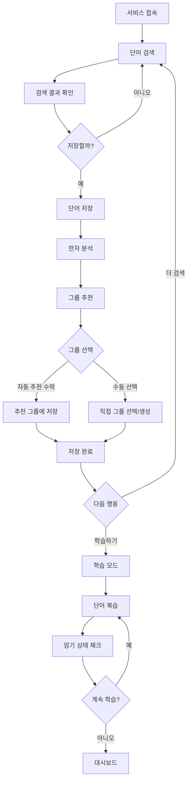

# 일본어 학습 단어장 서비스 기획안

## 1. 서비스 개요

### 서비스명
**일본어 단어장 (Japanese Vocabulary Book)**

### 한 줄 소개
네이버 일본어 사전 연동과 한자 그룹화 기능을 갖춘 스마트 일본어 학습 단어장

### 서비스 목적
일본어를 학습하는 사용자들이 단어를 효율적으로 검색하고 저장하며, 특히 복잡한 한자를 체계적으로 학습할 수 있도록 돕는 서비스입니다. 단순히 단어를 저장하는 것을 넘어, 비슷한 한자들을 연관 지어 학습함으로써 더 깊이 있는 이해와 오래 기억할 수 있도록 합니다.

### 해결하려는 문제
- 일본어 학습 시 한자가 많아 혼동하기 쉬운 문제
- 비슷하게 생긴 한자나 같은 음독/훈독을 가진 한자들을 체계적으로 정리하기 어려운 문제
- 단어장을 만들어도 효과적인 복습과 학습이 어려운 문제
- 신뢰할 수 있는 사전 정보를 빠르게 찾고 저장하기 어려운 문제

### 차별점
1. **신뢰할 수 있는 사전 데이터**: 오픈소스 및 검증된 사전 데이터를 활용한 정확한 정보 제공
2. **스마트 한자 그룹화**: 비슷한 한자를 자동으로 분석하여 연관 학습 가능
3. **맞춤형 학습 지원**: 암기 체크와 복습 알림으로 효과적인 학습 관리

### 1.5 데이터 소스 전략

서비스의 안정성과 법적 안전성을 위해 공개된 오픈소스 사전 데이터를 우선적으로 활용합니다.

#### 사전 데이터 출처

**1순위: JMdict (Japanese-Multilingual Dictionary)**
- 214,000개 이상의 일본어 단어 수록
- 일본어-한국어, 일본어-영어 등 다국어 지원
- CC BY-SA 3.0 라이선스 (무료 사용 가능)
- 정기적으로 업데이트되는 신뢰할 수 있는 데이터
- 뜻, 품사, 활용형 등 상세 정보 포함

**2순위: Jisho.org API**
- JMdict 기반의 웹 API
- 후리가나 자동 생성 지원
- 검색 결과 JSON 형식 제공
- 비공식 API이지만 커뮤니티에서 널리 사용됨
- 백업 및 보조 데이터 소스로 활용

**3순위: 사용자 직접 입력**
- 사전에 없는 신조어, 전문 용어 등
- 사용자가 직접 뜻과 예문을 입력
- 개인 맞춤형 단어장 구축 가능

#### 한자 데이터 출처

**KanjiDic2**
- 13,000개 이상의 한자 정보
- 음독(音読み), 훈독(訓読み) 데이터
- 부수(部首), 획수, JLPT 레벨
- 한자의 의미와 사용 빈도
- CC BY-SA 4.0 라이선스

**추가 한자 메타데이터**
- 부수 정보: 214개 부수 분류
- 획수: 1획~30획 이상
- JLPT 레벨: N5~N1 분류
- 상용한자 여부 (일본 교육용 한자 2,136자)
- 한자 구성 요소 정보 (예: 途 = 辶 + 余)

#### 예문 데이터 출처

**Tatoeba 프로젝트**
- 수백만 개의 다국어 예문 데이터베이스
- 일본어-한국어 예문 쌍 수만 개 이상
- CC BY 2.0 라이선스
- 커뮤니티 기반 검증 시스템
- 난이도별, 주제별 분류 가능

**예문 선별 기준**
- 일상생활에서 자주 사용되는 표현 우선
- 문장 길이: 5~20단어 (초급~중급 학습자 대상)
- 문법 난이도: JLPT N5~N3 수준 중심
- 명확한 문맥과 자연스러운 표현

#### 데이터 업데이트 전략

**초기 데이터 구축**
- JMdict 전체 데이터 다운로드 및 파싱
- KanjiDic2 데이터 JSON 변환
- Tatoeba 예문 중 상위 10,000개 선별
- 예상 데이터 크기: 약 8-12MB (압축 시 3-5MB)

**정기 업데이트**
- 분기별 JMdict/KanjiDic2 최신 버전 반영
- 사용자 피드백 기반 데이터 품질 개선
- 새로운 예문 추가 및 부적절한 예문 제거

#### 데이터 처리 방식

**오프라인 우선 전략**
- 앱 번들에 기본 데이터 포함
- 초기 로딩 후 로컬 IndexedDB에 저장
- 네트워크 없이도 기본 기능 사용 가능
- 선택적 온라인 업데이트

**검색 최적화**
- 역색인(Inverted Index) 구조 사용
- 히라가나, 가타카나, 한자, 로마자 모두 검색 가능
- 부분 일치 및 유사 단어 추천
- 평균 검색 속도: 100ms 이하 목표

## 2. 타겟 사용자

### 주요 페르소나

#### 페르소나 1: 초급 일본어 학습자 (김학생, 22세, 대학생)
- **특징**: JLPT N5-N4 수준, 기본 히라가나/가타카나는 익숙하지만 한자는 어려움
- **니즈**: 한자 읽기와 쓰기를 체계적으로 배우고 싶음
- **사용 시나리오**: 수업이나 교재에서 나온 새로운 한자 단어를 저장하고, 비슷한 한자들을 함께 복습

#### 페르소나 2: 중급 일본어 학습자 (이직장, 28세, 회사원)
- **특징**: JLPT N3-N2 수준, 기본 한자는 알지만 비슷한 한자를 자주 혼동
- **니즈**: 헷갈리는 한자들을 명확하게 구분하고 싶음
- **사용 시나리오**: 업무나 독서 중 만난 어려운 한자 단어를 저장하고, 비슷한 한자들을 그룹으로 정리하여 차이점 학습

#### 페르소나 3: 독학 일본어 학습자 (박독학, 19세, 수험생)
- **특징**: 체계적인 수업 없이 혼자 공부, 효율적인 학습 방법 필요
- **니즈**: 자신만의 단어장을 만들고 꾸준히 복습하고 싶음
- **사용 시나리오**: 매일 새로운 단어를 추가하고, 암기 상태를 체크하며 복습

### 2.5 경쟁 서비스 분석

기존 일본어 학습 서비스들의 강점과 약점을 분석하여 차별화 전략을 수립합니다.

#### 주요 경쟁 서비스

**1. Anki (앱/웹)**

*강점*
- 강력한 간격 반복 학습(SRS) 알고리즘
- 고도로 커스터마이징 가능한 카드 시스템
- 이미지, 오디오 등 멀티미디어 지원
- 크로스 플랫폼 동기화
- 대규모 커뮤니티와 공유 덱

*약점*
- 초보자에게 복잡한 인터페이스
- 카드 생성이 수동적이고 시간 소모적
- 한자 그룹화나 연관 학습 기능 부족
- 사전 기능 없음 (별도 검색 필요)

**2. Memrise / LingoDeer**

*강점*
- 게임화된 학습 경험
- 원어민 발음 제공
- 체계적인 커리큘럼
- 예문 중심 학습
- 직관적인 UI/UX

*약점*
- 사용자 정의 단어장 기능 제한적
- 한자 심화 학습 기능 부족
- 유료 구독 모델 (비용 부담)
- 오프라인 기능 제한적

**3. Midori (일본어 사전 앱)**

*강점*
- 상세한 한자 정보 (부수, 획순 애니메이션)
- 빠른 검색 속도
- 오프라인 사전 기능
- 한자 분해(radical breakdown) 표시
- 깔끔한 디자인

*약점*
- 학습 기능 미흡 (단순 조회 중심)
- 복습 시스템 없음
- 단어장 기능이 기본적
- 한자 간 연관성 분석 부족

**4. Kanjisho (한자 학습 앱)**

*강점*
- JLPT 급수별 필터링
- 획수, 부수 기반 검색
- 한자 상세 정보 제공
- 학습 진도 추적

*약점*
- 단어 학습보다 한자 개별 학습에 집중
- 예문이 부족하거나 없음
- 비슷한 한자 그룹화 기능 제한적
- 사용자 경험이 다소 구식

**5. Takoboto (일본어 사전)**

*강점*
- 오프라인 사전
- 플래시카드 기능 내장
- 무료 사용 가능
- 예문 제공

*약점*
- 한자 연관 학습 기능 없음
- 복습 알고리즘이 단순함
- 한국어 지원 부족 (주로 영어)
- UI가 복잡하고 정보 과다

#### 경쟁 우위 분석

| 기능 | 우리 서비스 | Anki | Memrise | Midori | Kanjisho |
|------|------------|------|---------|--------|----------|
| 사전 검색 | ⭐⭐⭐ | ❌ | ⭐ | ⭐⭐⭐ | ⭐⭐ |
| 한자 그룹화 | ⭐⭐⭐ | ❌ | ❌ | ⭐ | ⭐ |
| 간격 반복 학습 | ⭐⭐ | ⭐⭐⭐ | ⭐⭐⭐ | ❌ | ⭐ |
| 사용 편의성 | ⭐⭐⭐ | ⭐ | ⭐⭐⭐ | ⭐⭐ | ⭐⭐ |
| 한국어 지원 | ⭐⭐⭐ | ⭐⭐ | ⭐⭐ | ⭐ | ⭐ |
| 오프라인 사용 | ⭐⭐⭐ | ⭐⭐⭐ | ⭐ | ⭐⭐⭐ | ⭐⭐ |
| 무료 사용 | ⭐⭐⭐ | ⭐⭐⭐ | ⭐ | ⭐⭐ | ⭐⭐⭐ |

#### 차별화 전략

**핵심 차별점**

1. **스마트 한자 그룹화**
   - 비슷한 한자를 자동으로 분석하여 그룹 추천
   - 부수, 음독/훈독, 시각적 유사도 기반 연관 학습
   - 경쟁사에서 제공하지 않는 독특한 기능

2. **통합 경험**
   - 사전 검색 + 단어 저장 + 학습을 하나의 플로우로 통합
   - 별도 앱을 오가지 않고 모든 기능을 한 곳에서 해결
   - 끊김 없는 학습 경험 제공

3. **한국어 학습자 특화**
   - 한국어 뜻과 예문 우선 제공
   - 한국인이 자주 헷갈리는 한자 중점 지원
   - 한국어 UI/UX 최적화

4. **진입 장벽 낮춤**
   - Anki처럼 복잡하지 않은 직관적 인터페이스
   - 자동 그룹 추천으로 수동 작업 최소화
   - 초보자도 쉽게 시작 가능

5. **무료 + 오픈소스 데이터**
   - 검증된 오픈소스 사전 데이터 활용
   - 기본 기능 무료 제공
   - 데이터 소유권 및 내보내기 지원

#### 시장 포지셔닝

```
          복잡도
            ↑
            |
        Anki|
            |
            |
Kanjisho ---|--- 우리 서비스
            |
            |   Memrise
  Takoboto  |   
            |
            |________→ 기능 범위
         좁음        넓음
```

**목표 포지션**: 중간 복잡도, 넓은 기능 범위
- 초보자도 쉽게 사용 가능하면서
- 고급 학습자에게도 유용한 한자 분석 기능 제공

## 3. 핵심 기능

### 3.1 단어 검색 및 저장
네이버 일본어 사전과 연동하여 단어를 검색하고, 상세한 정보를 저장합니다.

**검색 결과 표시 (단어 유형별)**

#### 히라가나/가타카나 단어
- 단어 표기
- 뜻 (여러 의미가 있는 경우 모두 표시)
- 예문 (일본어 + 한국어 번역)

#### 한자 단어
- 단어 표기 (한자)
- 후리가나 (읽기)
- 뜻 (여러 의미가 있는 경우 모두 표시)
- 예문 (일본어 + 한국어 번역)

### 3.2 한자 그룹화 폴더
비슷한 한자들을 그룹으로 묶어 체계적으로 학습할 수 있는 기능입니다. 여러 기준으로 한자를 분류하여 연관 학습 효과를 극대화합니다.

**그룹화 기준 (5가지)**

#### 1) 부수(部首) 기반 그룹화
같은 부수를 가진 한자들을 묶어 의미적 연관성을 학습합니다.

*예시*
- **氵(물 수변)**: 河, 海, 湖, 池, 泳, 洗 등 - 물과 관련된 한자
- **亻(사람 인변)**: 他, 何, 作, 住, 体, 使 등 - 사람과 관련된 한자
- **木(나무 목)**: 林, 森, 桜, 校, 机, 村 등 - 나무와 관련된 한자
- **言(말씀 언)**: 話, 語, 読, 説, 記, 詩 등 - 말과 관련된 한자

*학습 효과*
- 부수를 통해 한자의 대략적인 의미 유추 가능
- 새로운 한자를 만났을 때 부수로 의미 추측
- 체계적인 한자 암기 가능

#### 2) 구성 요소 기반 그룹화
특정 한자를 구성 요소로 포함하는 한자들을 묶습니다.

*예시*
- **余 포함**: 余, 途, 叙, 徐 등
- **売 포함**: 売, 読, 続 등
- **青 포함**: 青, 清, 晴, 静, 請, 情 등
- **寺 포함**: 寺, 時, 持, 待, 詩 등

*학습 효과*
- 시각적으로 비슷한 한자 구분 학습
- 한자의 구조 이해 향상
- 헷갈리기 쉬운 한자 명확히 구분

#### 3) 음독(音読み) 동일 그룹화
같은 음독을 가진 한자들을 묶어 발음 연관성을 학습합니다.

*예시*
- **コウ(kou)**: 高, 公, 校, 行, 考, 工, 交, 港, 航 등
- **セイ(sei)**: 生, 正, 性, 成, 静, 清, 晴, 星, 声 등
- **シ(shi)**: 市, 私, 死, 詩, 試, 始, 紙, 師 등
- **カン(kan)**: 間, 館, 感, 漢, 完, 関, 観, 簡 등

*학습 효과*
- 읽기 능력 향상
- 동음이의어 구분 학습
- 한자 읽기 패턴 이해

#### 4) 훈독(訓読み) 동일 그룹화
같은 훈독을 가진 한자들을 묶어 의미 연관성을 학습합니다.

*예시*
- **あ(る) (aru, 있다)**: 有, 在, 存 등
- **み(る) (miru, 보다)**: 見, 視, 観, 診, 覧 등
- **き(く) (kiku, 듣다/묻다)**: 聞, 聴, 訊 등
- **おお(きい) (ookii, 크다)**: 大, 巨, 広 등

*학습 효과*
- 유사한 의미의 한자 비교 학습
- 미묘한 뜻 차이 이해
- 문맥에 맞는 한자 선택 능력 향상

#### 5) JLPT 급수별 그룹화
난이도별로 한자를 분류하여 단계적 학습을 지원합니다.

*분류*
- **JLPT N5**: 기초 한자 약 100자 (例: 日, 月, 人, 山, 川 등)
- **JLPT N4**: 초급 한자 약 300자 (例: 春, 夏, 秋, 冬, 朝 등)
- **JLPT N3**: 중급 한자 약 650자 (例: 説, 議, 因, 果, 状 등)
- **JLPT N2**: 중상급 한자 약 1,000자 (例: 層, 域, 項, 略, 術 등)
- **JLPT N1**: 고급 한자 약 2,000자 이상

*학습 효과*
- 시험 대비 효율적 학습
- 자신의 수준에 맞는 한자 우선 학습
- 학습 진도 추적 용이

#### 6) 시각적 유사도 그룹화
모양이 비슷해서 헷갈리기 쉬운 한자들을 묶습니다.

*예시*
- **土 vs 士**: 土(흙 토) ↔ 士(선비 사)
- **未 vs 末**: 未(아닐 미) ↔ 末(끝 말)
- **己 vs 已 vs 巳**: 己(몸 기) ↔ 已(이미 이) ↔ 巳(뱀 사)
- **日 vs 目**: 日(날 일) ↔ 目(눈 목)
- **千 vs 干**: 千(천 천) ↔ 干(방패 간)

*학습 효과*
- 자주 틀리는 한자 집중 학습
- 세밀한 차이점 인식 훈련
- 쓰기 정확도 향상

#### 7) 사용자 정의 그룹
사용자가 직접 기준을 정해 한자를 그룹화합니다.

*예시*
- "내가 자주 틀리는 한자"
- "비즈니스 일본어 한자"
- "음식 관련 한자"
- "JLPT N2 시험 대비"
- "이번 주 학습 목표"

*학습 효과*
- 개인 맞춤형 학습
- 특정 목적에 맞는 학습
- 유연한 학습 관리

**동작 방식**

**자동 그룹 추천 프로세스**
1. 사용자가 한자 단어를 저장 (예: "清潔")
2. 시스템이 각 한자 분석:
   - 清: 부수(氵), 구성요소(青), 음독(セイ), 훈독(きよい), JLPT N2
   - 潔: 부수(氵), 음독(ケツ), 훈독(いさぎよい), JLPT N1
3. 관련 그룹 검색:
   - "氵(물 수변) 한자 그룹" 추천
   - "청(青) 포함 한자 그룹" 추천
   - "セイ 음독 한자 그룹" 추천
4. 사용자에게 추천 그룹 표시
5. 사용자가 선택하거나 새 그룹 생성

**그룹 관리 기능**
- 그룹 생성/수정/삭제
- 그룹에 단어 추가/제거
- 그룹 이름 변경
- 그룹 병합/분할
- 그룹 내 단어 정렬 (가나다순, 추가순, 난이도순)

**그룹 학습 모드**
- 그룹 단위로 플래시카드 학습
- 그룹 내 한자 비교 보기
- 그룹별 학습 진도 추적
- 그룹별 복습 스케줄

### 3.3 기본 학습 기능

#### 암기 체크
- 각 단어별로 "암기함" / "학습중" 상태 표시
- 사용자가 직접 암기 상태를 토글

#### 복습 알림
- 저장한 날짜 기준으로 복습이 필요한 단어 표시
- 복습 주기: 1일, 3일, 7일, 14일, 30일 (간격 반복 학습법 기반)
- 복습이 필요한 단어 수를 대시보드에 표시

#### 단어 목록 보기
- 전체 단어 목록
- 한자 그룹별 단어 목록
- 암기 상태별 필터링
- 저장 날짜순 정렬

## 4. 사용자 플로우

### 주요 플로우 다이어그램



### 세부 플로우

#### 1) 단어 검색 및 저장 플로우
1. 사용자가 검색창에 일본어 단어 입력
2. 네이버 일본어 사전 API를 통해 검색 실행
3. 검색 결과 표시 (뜻, 후리가나, 예문)
4. "저장하기" 버튼 클릭
5. 한자가 포함된 경우, 관련 한자 그룹 자동 추천
6. 사용자가 그룹 선택 또는 수정
7. 단어장에 저장 완료

#### 2) 한자 그룹 관리 플로우
1. 저장된 한자 단어 목록 확인
2. "한자 그룹" 메뉴 선택
3. 그룹 목록 보기 (비슷한 한자별, 음독/훈독별)
4. 그룹 선택 → 해당 그룹의 한자 단어들 표시
5. 필요시 그룹 편집 (단어 추가/제거, 그룹명 변경)

#### 3) 학습 플로우
1. 대시보드에서 복습 필요 단어 확인
2. "학습하기" 버튼 클릭
3. 단어 카드 형식으로 단어 표시
4. 앞면: 한자 / 뒤면: 후리가나, 뜻, 예문
5. 암기 여부 체크
6. 다음 단어로 넘어가기
7. 학습 완료 후 통계 확인

## 5. 기능 상세 명세

### 5.1 단어 검색 기능

**입력**
- 검색어: 일본어 단어 (히라가나, 가타카나, 한자, 로마자 입력 가능)
- 입력 방식: 텍스트 입력, 음성 입력(향후), 클립보드 붙여넣기

**처리 프로세스**

*1단계: 입력 정규화*
- 로마자 입력 시 히라가나로 자동 변환 (예: "konnichiwa" → "こんにちは")
- 전각/반각 문자 통일
- 공백 제거 및 정리

*2단계: 데이터 소스 우선순위 검색*
```
1순위: 로컬 IndexedDB (오프라인 데이터)
   ↓ (없으면)
2순위: JMdict 데이터 검색
   ↓ (없으면)
3순위: Jisho.org API 호출 (온라인)
   ↓ (없으면)
4순위: 사용자 정의 단어 검색
```

*3단계: 후리가나 생성*
- 한자 단어인 경우 KanjiDic2 데이터로 후리가나 자동 생성
- 복수 읽기가 있는 경우 모두 표시
- 사용 빈도 높은 읽기 우선 표시

*4단계: 관련 정보 수집*
- 예문 매칭 (Tatoeba 데이터베이스)
- 한자 정보 추출 (부수, 획수, JLPT 레벨)
- 유사 단어 추천

**출력 정보**

**기본 정보**
- 단어 표기 (원형, 큰 글씨로 강조)
- 후리가나 (한자인 경우, 단어 위에 작게 표시)
- 품사 (명사, 동사, 형용사 등)
- JLPT 레벨 (N5~N1, 해당되는 경우)
- 사용 빈도 (상/중/하)

**뜻 정보**
- 주요 뜻 (번호로 구분, 최대 5개까지 표시)
- 각 뜻별 품사 표시
- 뉘앙스 설명 (격식체/구어체/비속어 등)
- 유의어/반의어 (있는 경우)

**예문 정보**
- 일본어 예문 (최소 2개, 최대 5개)
- 예문 내 검색 단어 하이라이트
- 한국어 번역
- 예문 출처 표기 (Tatoeba 등)
- 예문 난이도 표시

**한자 상세 정보** (한자 단어인 경우)
- 각 한자별 정보:
  - 한자 단독 의미
  - 음독/훈독
  - 부수와 획수
  - JLPT 레벨
  - 이 한자를 포함한 다른 단어 3개

**관련 정보**
- 비슷한 단어 추천 (3~5개)
- 관련 표현 또는 숙어
- 문법 정보 (동사 활용형, 형용사 변화 등)
- 발음 주의사항

**UI 표시 예시**
```
┌─────────────────────────────────┐
│  清潔 [せいけつ]         N2      │
│  ━━━━━━━━━━━━━━━━━━━━━━━━━━━  │
│  [명사, な형용사]                │
│                                  │
│  1. 깨끗함, 청결                 │
│  2. 결백함                       │
│                                  │
│  📝 例文                         │
│  部屋を清潔に保つ。              │
│  방을 깨끗하게 유지한다.         │
│                                  │
│  🔤 漢字                         │
│  清 [セイ/きよい] N2 氵+11획    │
│  潔 [ケツ/いさぎよい] N1 氵+15획│
│                                  │
│  🔗 関連語                       │
│  清潔感、不潔、衛生              │
│                                  │
│  [💾 保存]  [🔍 詳細]           │
└─────────────────────────────────┘
```

**검색 최적화**

*부분 일치 검색*
- 입력한 글자를 포함하는 모든 단어 검색
- 예: "学" 입력 → 学校, 学生, 大学, 学習 등

*유사 단어 추천*
- 오타 허용 검색 (편집 거리 2 이내)
- 예: "がっこ" 입력 → "がっこう(学校)" 추천

*검색 이력*
- 최근 검색한 단어 10개 저장
- 빠른 재검색 지원

*인기 검색어*
- 다른 사용자들이 많이 검색한 단어 (향후)
- 오늘의 추천 단어

**예외 처리**

*검색 결과 없음*
- 메시지: "검색 결과가 없습니다"
- 제안: 
  - 철자 확인 요청
  - 유사 단어 추천
  - 직접 단어 추가 옵션 제공

*네트워크 오류*
- 메시지: "연결에 실패했습니다"
- 대응:
  - 로컬 데이터로 재시도
  - 오프라인 모드 안내
  - 재시도 버튼 제공

*데이터 로딩 중*
- 로딩 스피너 표시
- 예상 대기 시간 안내
- 3초 이상 걸리면 "조금만 기다려주세요" 메시지

*API 제한*
- 분당 요청 수 제한 (예: 60회)
- 제한 초과 시 로컬 캐시 우선 사용
- "잠시 후 다시 시도해주세요" 안내

**성능 목표**
- 평균 검색 속도: 100ms 이하 (로컬)
- API 검색 속도: 500ms 이하
- 검색 결과 캐싱: 24시간
- 동시 검색 지원: 최대 5개

### 5.2 단어 저장 기능

**저장 정보**
- 단어 ID (고유 식별자)
- 단어 표기
- 후리가나 (한자인 경우)
- 뜻 (전체)
- 예문
- 포함된 한자 정보 (추출)
- 저장 날짜
- 마지막 복습 날짜
- 암기 상태 (학습중/암기함)
- 소속 그룹 ID (복수 가능)

**저장 위치**
- 브라우저 로컬 스토리지 (IndexedDB 사용)

### 5.3 한자 그룹화 기능

**그룹 데이터 구조**
- 그룹 ID
- 그룹 이름
- 그룹 유형 (형태 유사/음독 동일/훈독 동일/사용자 정의)
- 기준 한자
- 포함된 단어 ID 목록
- 생성 날짜

**자동 그룹 추천 로직**
1. 저장하려는 단어에서 한자 추출
2. 각 한자에 대해:
   - 기존 그룹 중 해당 한자를 포함하는 그룹 검색
   - 해당 한자의 음독/훈독 정보 조회 (데이터베이스)
   - 동일한 음독/훈독을 가진 다른 한자들을 포함한 그룹 검색
3. 발견된 그룹들을 사용자에게 추천
4. 사용자가 선택하거나 새 그룹 생성

**한자 데이터베이스**
- 상용한자 약 2,000자 정보
- 각 한자의 음독, 훈독, 부수, 획수 등 메타데이터
- 한자 간 형태 유사성 정보

### 5.4 학습 기능

#### 5.4.1 암기 상태 관리

**상태 분류**
- 🆕 **신규**: 방금 저장한 단어 (학습 0회)
- 📖 **학습중**: 복습 중인 단어 (학습 1~5회)
- ✅ **암기함**: 잘 외운 단어 (학습 6회 이상)
- ⚠️ **어려움**: 자주 틀리는 단어 (정답률 50% 미만)
- 📦 **보관함**: 당분간 복습하지 않을 단어

**상태 전환**
- 사용자가 수동으로 상태 변경 가능
- 학습 결과에 따라 자동 상태 업데이트
- 시각적 표시: 아이콘 + 색상 코드
  - 신규: 파란색
  - 학습중: 노란색
  - 암기함: 초록색
  - 어려움: 빨간색
  - 보관함: 회색

#### 5.4.2 간격 반복 학습 (SRS - Spaced Repetition System)

**알고리즘 기반**
에빙하우스 망각 곡선과 SM-2 알고리즘을 간소화한 버전 사용

**복습 간격 설정**

*기본 간격 (정답 시)*
1. 첫 복습: 1일 후
2. 두 번째: 3일 후
3. 세 번째: 7일 후
4. 네 번째: 14일 후
5. 다섯 번째: 30일 후
6. 여섯 번째: 60일 후
7. 이후: 90일 주기

*오답 시 간격 조정*
- 오답 1회: 간격 50% 감소
- 오답 2회 연속: 처음부터 (1일 후)
- 정답 후: 이전 간격의 2배

**난이도 평가**
사용자가 학습 후 난이도를 평가:
- 😊 **쉬움**: 다음 간격 2배 증가
- 😐 **보통**: 기본 간격 유지
- 😓 **어려움**: 다음 간격 50% 감소
- ❌ **모름**: 처음부터 다시

**복습 알림**

*대시보드 표시*
```
┌─────────────────────────────┐
│  📚 오늘의 복습              │
│  ━━━━━━━━━━━━━━━━━━━━━━━  │
│  복습 대기: 23개             │
│  신규 단어: 5개              │
│  어려운 단어: 3개            │
│                              │
│  [지금 복습하기 →]          │
└─────────────────────────────┘
```

*알림 설정*
- 브라우저 푸시 알림 (선택적)
- 알림 시간 설정 (예: 매일 오후 7시)
- 알림 빈도 설정 (매일/주 3회/주말만)

#### 5.4.3 사용자 태그 시스템

**태그 기능**
단어에 자유롭게 태그를 붙여 분류하고 관리합니다.

**기본 제공 태그**
- `#JLPT-N5`, `#JLPT-N4`, `#JLPT-N3`, `#JLPT-N2`, `#JLPT-N1`
- `#비즈니스`, `#여행`, `#일상`, `#음식`, `#쇼핑`
- `#동사`, `#명사`, `#형용사`, `#부사`
- `#자주틀림`, `#중요`, `#시험대비`

**사용자 정의 태그**
- 자유롭게 태그 생성
- 태그 색상 지정
- 태그별 아이콘 설정
- 예시: `#회사업무`, `#애니메이션`, `#요리레시피`

**태그 활용**
- 태그별 단어 목록 보기
- 여러 태그 조합 검색 (AND/OR)
- 태그별 학습 모드
- 태그별 통계 확인

#### 5.4.4 필터링 및 정렬

**필터 옵션**

*암기 상태별*
- 신규 단어만
- 학습중인 단어만
- 암기한 단어만
- 어려운 단어만

*복습 일정별*
- 오늘 복습할 단어
- 이번 주 복습할 단어
- 복습 기한 지난 단어
- 복습 예정 단어

*JLPT 레벨별*
- N5, N4, N3, N2, N1 각각
- 여러 레벨 동시 선택 가능

*한자 그룹별*
- 특정 부수 포함 단어
- 특정 음독/훈독 단어
- 그룹 미지정 단어

*태그별*
- 단일 태그 필터
- 복수 태그 조합 (AND/OR)
- 태그 없는 단어

**정렬 옵션**
- 추가일 순 (최신/오래된)
- 가나다 순 (ㄱㄴㄷ/あいうえお)
- 복습 예정일 순
- 학습 횟수 순
- 정답률 순
- 난이도 순 (JLPT 레벨)

#### 5.4.5 학습 모드

**플래시카드 모드**

*카드 구성*
```
┌─────────────────────────────┐
│         [앞면]               │
│                              │
│       清潔                   │
│                              │
│    [카드 뒤집기 ↻]          │
│                              │
│  진행: 5/23  ████░░░░░░      │
└─────────────────────────────┘

[뒤집은 후]
┌─────────────────────────────┐
│         [뒤면]               │
│                              │
│  清潔 [せいけつ]             │
│  깨끗함, 청결                │
│                              │
│  部屋を清潔に保つ。          │
│  방을 깨끗하게 유지한다.     │
│                              │
│  난이도 평가:                │
│  [😊 쉬움] [😐 보통]        │
│  [😓 어려움] [❌ 모름]      │
└─────────────────────────────┘
```

*조작 방법*
- 클릭/탭: 카드 뒤집기
- 좌우 스와이프: 이전/다음 카드
- 키보드: 스페이스(뒤집기), ←→(이동)
- 숫자 키: 난이도 평가 (1~4)

**퀴즈 모드** (MVP 이후)
- 한자 → 읽기 맞추기
- 뜻 → 단어 맞추기
- 예문 빈칸 채우기
- 4지선다형

**그룹 비교 모드**
같은 그룹의 한자들을 나란히 비교하며 학습
```
┌──────────┬──────────┬──────────┐
│   清     │   晴     │   静     │
│  せい    │  せい    │  せい    │
│ 맑을 청  │ 갤 청   │ 고요할 정│
│          │          │          │
│  清潔    │  晴天    │  静寂    │
│  清水    │  快晴    │  静止    │
└──────────┴──────────┴──────────┘
```

#### 5.4.6 학습 통계

**개인 통계**
- 총 저장 단어 수
- 학습 완료 단어 수
- 평균 정답률
- 연속 학습 일수 (스트릭)
- 오늘 학습한 단어 수
- 이번 주/월 학습량

**단어별 통계**
- 학습 횟수
- 정답/오답 횟수
- 정답률
- 마지막 학습 날짜
- 다음 복습 예정일
- 난이도 변화 그래프

**학습 목표 설정**
- 일일 목표: 하루 N개 단어 학습
- 주간 목표: 이번 주 N개 단어 암기
- 시험 대비: D-day까지 N개 단어 완료
- 목표 달성률 표시
- 목표 달성 시 축하 메시지

**학습 패턴 분석** (MVP 이후)
- 가장 잘 외우는 시간대
- 주로 틀리는 단어 유형
- 학습 효율이 높은 그룹
- 개인 맞춤 복습 추천

## 6. MVP 범위

### 포함 기능 (Phase 1 - MVP)

#### 핵심 기능 (필수)

**1. 단어 검색 및 저장**
- ✅ JMdict 기반 오프라인 검색
- ✅ 히라가나, 가타카나, 한자, 로마자 입력 지원
- ✅ 검색 결과 상세 표시 (뜻, 후리가나, 품사, 예문)
- ✅ 로컬 스토리지(IndexedDB)에 저장
- ✅ 저장된 단어 목록 보기
- ✅ 단어 수정 및 삭제

**2. 한자 그룹화 (차별화 핵심)**
- ✅ 한자 데이터베이스 구축 (KanjiDic2, 2,000자)
- ✅ 자동 그룹 추천 (3가지 기준):
  - 부수(部首) 기반
  - 음독/훈독 동일
  - 구성 요소 포함
- ✅ 수동 그룹 생성 및 편집
- ✅ 그룹별 단어 목록 보기
- ✅ 그룹 내 한자 비교 보기

**3. 기본 학습 기능**
- ✅ 암기 상태 관리 (신규/학습중/암기함/어려움)
- ✅ 간격 반복 학습(SRS) 알고리즘
- ✅ 복습 알림 (대시보드 표시)
- ✅ 플래시카드 학습 모드
- ✅ 학습 진도 추적
- ✅ 기본 통계 (저장 단어 수, 학습 횟수)

**4. 사용자 태그 시스템**
- ✅ 단어에 태그 추가/제거
- ✅ 기본 제공 태그 (JLPT, 주제별)
- ✅ 사용자 정의 태그 생성
- ✅ 태그별 필터링

**5. 필터링 및 정렬**
- ✅ 암기 상태별 필터
- ✅ 복습 일정별 필터
- ✅ JLPT 레벨별 필터
- ✅ 태그별 필터
- ✅ 다양한 정렬 옵션 (날짜, 가나다순, 난이도)

**6. 데이터 관리**
- ✅ 데이터 내보내기 (JSON)
- ✅ 데이터 가져오기 (JSON)
- ✅ 데이터 백업 안내
- ✅ 전체 데이터 삭제

**7. 오프라인 지원**
- ✅ 오프라인 우선 설계
- ✅ 기본 사전 데이터 번들 포함
- ✅ 인터넷 없이 모든 기능 사용 가능
- ✅ Service Worker 캐싱

**8. 반응형 UI/UX**
- ✅ 모바일 최적화 (터치, 스와이프)
- ✅ 다크 모드 지원
- ✅ 직관적인 네비게이션
- ✅ 페이지 구성:
  - 홈/대시보드
  - 단어 검색
  - 단어 목록
  - 한자 그룹
  - 학습 모드
  - 설정

#### 선택 기능 (MVP에 포함 가능)

**우선순위 높음**
- 🔶 검색 이력 (최근 검색 10개)
- 🔶 즐겨찾기 단어 (별표 표시)
- 🔶 학습 목표 설정 (일일 목표)
- 🔶 연속 학습 일수 (스트릭)

**우선순위 중간**
- 🔷 한자 상세 정보 페이지 (획순, 예시 단어)
- 🔷 예문 하이라이트 (검색 단어 강조)
- 🔷 유사 단어 추천
- 🔷 키보드 단축키

**우선순위 낮음** (시간 여유 시)
- 🔹 튜토리얼/온보딩
- 🔹 도움말 페이지
- 🔹 사용 팁 표시

### 제외 기능 (향후 확장)

#### Phase 2 (3-6개월 후)

**사용자 계정 시스템**
- ❌ 로그인/회원가입
- ❌ 소셜 로그인 (구글, 네이버, 카카오)
- ❌ 클라우드 데이터 백업
- ❌ 여러 기기 간 동기화
- ❌ 사용자 프로필

**이유**: MVP는 로컬 우선, 개발 복잡도 감소

#### Phase 3 (6-12개월 후)

**고급 학습 기능**
- ❌ 퀴즈 모드 (4지선다, 타이핑, 듣기)
- ❌ 학습 통계 그래프 (시간별, 일별, 월별)
- ❌ 성취도 배지 시스템
- ❌ 학습 리더보드
- ❌ AI 기반 맞춤 추천

**향상된 콘텐츠**
- ❌ 음성 발음 제공 (TTS)
- ❌ 원어민 발음 오디오
- ❌ 이미지 연상 학습
- ❌ 문법 설명 추가

**이유**: 기본 학습 기능 검증 후 추가

#### Phase 4 (12개월 이상)

**커뮤니티 기능**
- ❌ 공개 단어장 공유
- ❌ 다른 사용자 단어장 구독
- ❌ 학습 그룹 만들기
- ❌ 댓글 및 평가
- ❌ SNS 공유

**프리미엄 기능**
- ❌ 무제한 단어 저장 (무료는 1,000개 제한)
- ❌ 고급 통계 및 분석
- ❌ 광고 제거
- ❌ 우선 지원

**멀티 플랫폼**
- ❌ iOS/Android 네이티브 앱
- ❌ 브라우저 확장 프로그램
- ❌ 데스크톱 앱 (Electron)

**이유**: 사용자 확보 후 수익화 전략

#### 명확히 제외 (고려 안 함)

**기술적 이유**
- ❌ 음성 인식 발음 평가 (복잡도 높음)
- ❌ 실시간 협업 학습 (서버 비용)
- ❌ VR/AR 학습 (기술 제약)

**서비스 방향성**
- ❌ 문법 강의 콘텐츠 (단어장에 집중)
- ❌ 일본어 능력 테스트 (전문 서비스 존재)
- ❌ 번역 기능 (범위 초과)

### MVP 개발 우선순위

**Sprint 1 (2주)**: 기본 인프라
- 프로젝트 설정
- 데이터 준비 (JMdict, KanjiDic2 파싱)
- IndexedDB 설정
- 기본 UI 프레임워크

**Sprint 2 (2주)**: 검색 및 저장
- 단어 검색 기능
- 검색 결과 표시
- 단어 저장 기능
- 단어 목록 페이지

**Sprint 3 (2주)**: 한자 그룹화
- 한자 분석 로직
- 자동 그룹 추천
- 그룹 관리 UI
- 그룹별 단어 보기

**Sprint 4 (2주)**: 학습 기능
- 암기 상태 관리
- SRS 알고리즘 구현
- 플래시카드 UI
- 복습 알림

**Sprint 5 (1주)**: 부가 기능
- 태그 시스템
- 필터링/정렬
- 데이터 내보내기/가져오기

**Sprint 6 (1주)**: 마무리
- 오프라인 지원 (Service Worker)
- 성능 최적화
- 버그 수정
- 사용성 테스트

**총 개발 기간**: 10주 (2.5개월)

### MVP 성공 기준

**기능적 기준**
- ✅ 단어 검색 성공률 95% 이상
- ✅ 한자 그룹 자동 추천 정확도 80% 이상
- ✅ 오프라인 모드 정상 작동
- ✅ 데이터 손실 없음 (백업/복원 검증)

**성능 기준**
- ✅ 초기 로딩 3초 이하
- ✅ 검색 응답 100ms 이하
- ✅ 플래시카드 전환 부드러움 (60fps)
- ✅ 메모리 사용 150MB 이하

**사용자 경험 기준**
- ✅ 모바일 터치 반응 즉각적
- ✅ 직관적 UI (설명 없이 사용 가능)
- ✅ 에러 메시지 명확
- ✅ 로딩 상태 표시

**비즈니스 기준** (출시 1개월 후)
- 🎯 DAU 50명 이상
- 🎯 사용자당 평균 저장 단어 20개 이상
- 🎯 재방문율 30% 이상
- 🎯 평균 세션 시간 5분 이상

### 기술 범위

**플랫폼**
- 웹 애플리케이션 (반응형 웹)
- 브라우저: Chrome, Safari, Edge (최신 버전)
- 모바일 웹 최적화 (터치, 스와이프 제스처)

**데이터 저장**
- 브라우저 로컬 스토리지 (IndexedDB)
- 사용자 계정 없음 (MVP)
- 데이터 내보내기/가져오기 지원 (JSON)

**외부 연동**
- JMdict/KanjiDic2 오픈소스 데이터
- Jisho.org API (보조)
- Tatoeba 예문 데이터

### 6.5 기술 스택 및 데이터 준비

#### 프론트엔드 기술 스택

**핵심 프레임워크**
- **React 18+**: UI 컴포넌트 구축
- **TypeScript**: 타입 안정성 및 개발 생산성
- **Vite**: 빠른 개발 서버 및 빌드 도구

**상태 관리**
- **Zustand**: 경량 상태 관리 라이브러리
- 또는 **React Context API**: 간단한 전역 상태 관리

**스타일링**
- **Tailwind CSS**: 유틸리티 기반 CSS 프레임워크
- **shadcn/ui**: 재사용 가능한 UI 컴포넌트
- 반응형 디자인 (모바일 우선)

**데이터베이스 (클라이언트)**
- **Dexie.js**: IndexedDB 래퍼 라이브러리
- 오프라인 우선 데이터 저장
- 빠른 검색을 위한 인덱싱

**애니메이션**
- **Framer Motion**: 플래시카드 뒤집기, 페이지 전환
- CSS Transitions: 간단한 애니메이션

**유틸리티**
- **date-fns**: 날짜 계산 (복습 일정)
- **fuse.js**: 퍼지 검색 (유사 단어 찾기)
- **wanakana**: 로마자 ↔ 히라가나 변환

#### 백엔드 (선택적)

**서버리스 함수**
- **Vercel Functions** 또는 **Netlify Functions**
- 사전 API 프록시 (CORS 우회)
- 데이터 업데이트 엔드포인트

**API 구조**
```
GET  /api/search?q={word}        # 단어 검색
GET  /api/kanji/{character}      # 한자 정보
GET  /api/examples?word={word}   # 예문 검색
POST /api/feedback               # 사용자 피드백
```

#### 배포 및 호스팅

**호스팅 플랫폼**
- **Vercel** (추천): 자동 배포, 서버리스 함수 지원
- 또는 **Netlify**: 유사한 기능 제공
- 또는 **GitHub Pages**: 정적 호스팅 (무료)

**도메인**
- 초기: Vercel 제공 도메인 (*.vercel.app)
- 추후: 커스텀 도메인 구매

**CI/CD**
- GitHub Actions: 자동 테스트 및 배포
- 커밋 시 자동 빌드 및 배포

#### 데이터 준비 프로세스

**1단계: 원본 데이터 다운로드**

*JMdict*
- 출처: [EDRDG](http://www.edrdg.org/jmdict/j_jmdict.html)
- 형식: XML 또는 JSON
- 크기: 약 70MB (압축 해제 시)
- 라이선스: CC BY-SA 3.0

*KanjiDic2*
- 출처: [EDRDG](http://www.edrdg.org/wiki/index.php/KANJIDIC_Project)
- 형식: XML
- 크기: 약 6MB
- 라이선스: CC BY-SA 4.0

*Tatoeba*
- 출처: [Tatoeba.org](https://tatoeba.org/en/downloads)
- 형식: TSV (Tab-Separated Values)
- 크기: 일본어-한국어 쌍 약 50,000개
- 라이선스: CC BY 2.0

**2단계: 데이터 파싱 및 변환**

*JMdict 파싱*
```javascript
// XML → JSON 변환
{
  "word": "清潔",
  "reading": "せいけつ",
  "meanings": [
    { "pos": "noun", "definition": "깨끗함, 청결" },
    { "pos": "na-adj", "definition": "깨끗한" }
  ],
  "jlpt": "N2",
  "frequency": 1234
}
```

*KanjiDic2 파싱*
```javascript
// 한자 정보 추출
{
  "character": "清",
  "radical": "氵",
  "strokes": 11,
  "meanings": ["맑을 청", "깨끗할 청"],
  "readings": {
    "on": ["セイ", "ショウ"],
    "kun": ["きよい", "きよまる", "きよめる"]
  },
  "jlpt": "N2",
  "grade": 4,
  "frequency": 567
}
```

*Tatoeba 예문 선별*
```javascript
// 예문 필터링 및 저장
{
  "japanese": "部屋を清潔に保つ。",
  "korean": "방을 깨끗하게 유지한다.",
  "difficulty": "N3",
  "length": 10
}
```

**3단계: 데이터 최적화**

*크기 최적화*
- 불필요한 필드 제거
- 데이터 압축 (gzip)
- 청크 분할 (필요시 로딩)

*검색 최적화*
- 역색인(Inverted Index) 생성
- 히라가나/로마자 검색 키 추가
- 자주 사용되는 단어 우선 로딩

*최종 데이터 크기*
```
JMdict (필터링):     3-5MB
KanjiDic2:           1-2MB
Tatoeba (선별):      2-3MB
인덱스 데이터:       1MB
─────────────────────────
총합:                7-11MB (압축 전)
압축 후:             3-5MB
```

**4단계: 데이터 번들링**

*정적 데이터*
- 앱 번들에 포함
- 초기 로딩 시 IndexedDB에 저장
- 버전 관리 (데이터 업데이트 시)

*동적 로딩*
- 기본 데이터만 초기 로딩
- 고급 기능 데이터는 필요 시 로딩
- 점진적 개선 (Progressive Enhancement)

**5단계: 데이터 업데이트 전략**

*버전 관리*
```javascript
{
  "version": "2026.01.21",
  "jmdict_version": "1.09",
  "kanjidic_version": "2024-12",
  "last_updated": "2026-01-21T00:00:00Z"
}
```

*업데이트 프로세스*
1. 서버에서 최신 버전 확인
2. 로컬 버전과 비교
3. 차이가 있으면 업데이트 알림
4. 사용자 승인 후 다운로드
5. 백그라운드에서 IndexedDB 업데이트

*업데이트 주기*
- 분기별 정기 업데이트
- 긴급 수정 시 즉시 업데이트
- 사용자가 수동으로 업데이트 가능

#### 개발 환경 설정

**필수 도구**
- Node.js 18+ 및 npm/yarn
- Git 버전 관리
- VS Code (추천 에디터)

**개발 스크립트**
```json
{
  "scripts": {
    "dev": "vite",
    "build": "tsc && vite build",
    "preview": "vite preview",
    "test": "vitest",
    "lint": "eslint . --ext ts,tsx",
    "format": "prettier --write .",
    "prepare-data": "node scripts/prepare-data.js"
  }
}
```

**데이터 준비 스크립트**
- `scripts/download-jmdict.js`: JMdict 다운로드
- `scripts/parse-kanjidic.js`: KanjiDic2 파싱
- `scripts/filter-tatoeba.js`: Tatoeba 예문 선별
- `scripts/build-index.js`: 검색 인덱스 생성
- `scripts/optimize-data.js`: 데이터 최적화

#### 성능 목표

**로딩 성능**
- 초기 페이지 로드: 3초 이하
- 데이터 초기화: 5초 이하
- Time to Interactive (TTI): 5초 이하

**검색 성능**
- 로컬 검색: 100ms 이하
- API 검색: 500ms 이하
- 자동완성: 50ms 이하

**메모리 사용**
- 기본 메모리: 50MB 이하
- 최대 메모리: 150MB 이하
- IndexedDB 크기: 100MB 이하

**오프라인 지원**
- Service Worker 사용
- 캐시 우선 전략
- 오프라인 시 기본 기능 동작

## 7. 향후 확장 계획

### 단기 확장 (3-6개월)

#### 사용자 계정 시스템
- 소셜 로그인 (구글, 네이버, 카카오)
- 데이터 클라우드 백업
- 여러 기기 동기화

#### 학습 경험 개선
- 학습 통계 대시보드
- 일일/주간/월간 학습 목표 설정
- 연속 학습 일수 추적 (스트릭)

### 중기 확장 (6-12개월)

#### 고급 학습 기능
- 다양한 퀴즈 모드
  - 한자 → 읽기 맞추기
  - 뜻 → 단어 맞추기
  - 예문 빈칸 채우기
- 난이도별 단어 분류 (JLPT 레벨)
- AI 기반 복습 스케줄링

#### 콘텐츠 확장
- 사전 추가 (예: Jisho.org 연동)
- 예문 추가 (Tatoeba 등)
- 이미지 연상 학습 지원

### 장기 확장 (12개월 이상)

#### 커뮤니티 기능
- 공개 단어장 공유
- 다른 사용자 단어장 구독
- 학습 그룹 만들기

#### 프리미엄 기능
- 무제한 단어 저장
- 고급 통계 및 분석
- 광고 제거
- 오프라인 모드

#### 멀티 플랫폼
- iOS/Android 네이티브 앱
- 브라우저 확장 프로그램
- 데스크톱 앱

## 8. 성공 지표 (KPI)

### MVP 단계 지표
- 일간 활성 사용자 (DAU)
- 저장된 단어 수
- 단어당 평균 복습 횟수
- 사용자 재방문율
- 평균 학습 세션 시간

### 장기 목표
- 월간 활성 사용자 (MAU) 10,000명
- 사용자당 평균 저장 단어 수 100개 이상
- 주 3회 이상 재방문율 50% 이상
- 사용자 만족도 (설문) 4.5/5.0 이상

## 8.5 법적 고려사항 및 라이선스

서비스 운영 시 준수해야 할 법적 사항과 오픈소스 라이선스 관련 내용입니다.

### 사용 데이터 라이선스

#### JMdict (Japanese-Multilingual Dictionary)

**라이선스**: Creative Commons Attribution-ShareAlike 3.0 Unported (CC BY-SA 3.0)

**준수 사항**
- ✅ 상업적 사용 가능
- ✅ 수정 및 재배포 가능
- ⚠️ 출처 명시 필수
- ⚠️ 동일 라이선스로 재배포 필수

**출처 표기 방법**
```
이 서비스는 Electronic Dictionary Research and Development Group의 
JMdict 사전 파일을 사용합니다.
This service uses the JMdict dictionary files. 
These files are the property of the Electronic Dictionary 
Research and Development Group, and are used in conformance 
with the Group's licence.
```

**표기 위치**
- 앱 하단 푸터
- "정보" 또는 "About" 페이지
- 검색 결과 하단 (작게)

#### KanjiDic2

**라이선스**: Creative Commons Attribution-ShareAlike 4.0 International (CC BY-SA 4.0)

**준수 사항**
- ✅ 상업적 사용 가능
- ✅ 수정 및 재배포 가능
- ⚠️ 출처 명시 필수
- ⚠️ 변경사항 표시 필수
- ⚠️ 동일 라이선스로 재배포 필수

**출처 표기 방법**
```
한자 정보는 KANJIDIC2 데이터베이스를 사용합니다.
Copyright (C) 2024 The Electronic Dictionary Research 
and Development Group
Licensed under CC BY-SA 4.0
```

#### Tatoeba 예문

**라이선스**: Creative Commons Attribution 2.0 Generic (CC BY 2.0)

**준수 사항**
- ✅ 상업적 사용 가능
- ✅ 수정 및 재배포 가능
- ⚠️ 출처 명시 필수
- ✅ 라이선스 변경 가능 (CC BY-SA 아님)

**출처 표기 방법**
```
예문 출처: Tatoeba (tatoeba.org)
Licensed under CC BY 2.0
```

**예문별 출처 표기**
- 각 예문 하단에 "출처: Tatoeba" 작게 표시
- 클릭 시 원본 예문 페이지 링크

### 개인정보 보호

#### MVP 단계 (로컬 저장)

**수집하지 않는 정보**
- 사용자 이름, 이메일 등 개인 식별 정보
- IP 주소, 위치 정보
- 사용자 행동 추적 데이터

**로컬 저장 데이터**
- 저장한 단어 및 학습 기록
- 사용자 설정 (테마, 알림 등)
- 모든 데이터는 사용자 브라우저에만 저장
- 서버로 전송되지 않음

**개인정보처리방침**
```
본 서비스는 개인정보를 수집하지 않습니다.
모든 데이터는 사용자의 브라우저에 로컬로 저장되며,
서버로 전송되지 않습니다.
```

#### Phase 2 이후 (계정 시스템)

**수집 예정 정보**
- 이메일 주소 (로그인용)
- 학습 데이터 (클라우드 동기화용)
- 서비스 이용 통계 (익명화)

**준수할 법규**
- 개인정보보호법
- 정보통신망법
- GDPR (유럽 사용자 대상 시)

**필수 조치**
- 개인정보처리방침 작성 및 게시
- 이용약관 작성
- 개인정보 수집 동의 절차
- 데이터 삭제 요청 처리 절차

### 저작권 관련

#### 사용자 생성 콘텐츠

**사용자가 추가한 단어/예문**
- 저작권은 사용자에게 귀속
- 서비스는 저장 및 표시 목적으로만 사용
- 다른 사용자와 공유 시 사용자 동의 필요

**사용자 정의 그룹/태그**
- 개인 학습 데이터로 간주
- 외부 공유 시 익명화 처리

#### 제3자 콘텐츠 사용 금지

**금지 사항**
- ❌ 네이버 사전 콘텐츠 무단 스크래핑
- ❌ 저작권 있는 교재 내용 무단 사용
- ❌ 타 사전 서비스 콘텐츠 복제
- ❌ 유료 콘텐츠 무단 배포

**허용 사항**
- ✅ 오픈소스 라이선스 데이터 사용
- ✅ 사용자 직접 입력 데이터
- ✅ 공정 이용(Fair Use) 범위 내 인용

### 상표권

**서비스명 관련**
- 서비스명 상표 등록 검토 (선택)
- 타 서비스 상표권 침해 주의
- 로고 디자인 시 유사성 검토

**제3자 상표 사용**
- "JLPT"는 일본국제교육지원협회 상표
- 교육 목적 표기는 가능하나 공식 인증 표시 금지
- "Anki", "Memrise" 등 경쟁사 상표 무단 사용 금지

### 면책 조항

**서비스 제공 범위**
```
본 서비스는 일본어 학습을 돕기 위한 보조 도구입니다.
제공되는 정보의 정확성을 보장하지 않으며,
학습 효과를 보장하지 않습니다.

사전 데이터는 제3자 오픈소스를 활용하며,
오류나 누락이 있을 수 있습니다.
```

**책임 제한**
- 서비스 중단으로 인한 손해 책임 제한
- 데이터 손실에 대한 책임 제한 (백업 권장)
- 학습 결과에 대한 책임 제한

### 오픈소스 라이선스 (서비스 코드)

#### 코드 공개 여부

**옵션 1: 오픈소스 공개**
- MIT License 또는 Apache 2.0 추천
- GitHub에 코드 공개
- 커뮤니티 기여 가능
- 투명성 확보

**옵션 2: 비공개 (Proprietary)**
- 코드 비공개
- 상업적 독점 가능
- 유지보수 부담

**추천**: MVP는 오픈소스, 상업화 시 일부 비공개

#### 사용 라이브러리 라이선스

**확인 필요 라이브러리**
- React (MIT) ✅
- TypeScript (Apache 2.0) ✅
- Tailwind CSS (MIT) ✅
- Dexie.js (Apache 2.0) ✅
- Framer Motion (MIT) ✅

**라이선스 고지**
- `package.json`에 명시
- "오픈소스 라이선스" 페이지 생성
- 자동 생성 도구 사용 (license-checker)

### 준수 체크리스트

**출시 전 필수 확인**
- [ ] JMdict 출처 표기 완료
- [ ] KanjiDic2 출처 표기 완료
- [ ] Tatoeba 출처 표기 완료
- [ ] 개인정보처리방침 작성 (Phase 2)
- [ ] 이용약관 작성
- [ ] 면책 조항 게시
- [ ] 오픈소스 라이선스 고지
- [ ] 저작권 침해 요소 제거
- [ ] 상표권 검토 완료

**정기 점검 (분기별)**
- [ ] 라이선스 준수 여부 확인
- [ ] 데이터 출처 최신화
- [ ] 법규 변경사항 반영
- [ ] 사용자 신고 콘텐츠 검토

---

## 문서 버전 정보
- **버전**: 2.0
- **작성일**: 2026-01-21
- **최종 수정일**: 2026-01-21
- **작성자**: MVP 기획
- **상태**: 웹 리서치 반영 완료
