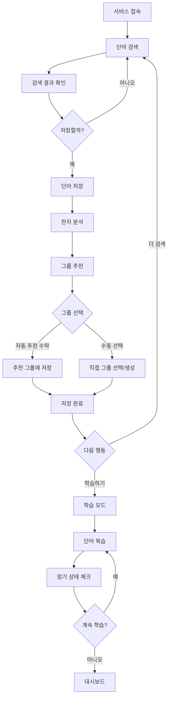

# 일본어 학습 단어장 서비스 기획안

## 1. 서비스 개요

### 서비스명
**일본어 단어장 (Japanese Vocabulary Book)**

### 한 줄 소개
네이버 일본어 사전 연동과 한자 그룹화 기능을 갖춘 스마트 일본어 학습 단어장

### 서비스 목적
일본어를 학습하는 사용자들이 단어를 효율적으로 검색하고 저장하며, 특히 복잡한 한자를 체계적으로 학습할 수 있도록 돕는 서비스입니다. 단순히 단어를 저장하는 것을 넘어, 비슷한 한자들을 연관 지어 학습함으로써 더 깊이 있는 이해와 오래 기억할 수 있도록 합니다.

### 해결하려는 문제
- 일본어 학습 시 한자가 많아 혼동하기 쉬운 문제
- 비슷하게 생긴 한자나 같은 음독/훈독을 가진 한자들을 체계적으로 정리하기 어려운 문제
- 단어장을 만들어도 효과적인 복습과 학습이 어려운 문제
- 신뢰할 수 있는 사전 정보를 빠르게 찾고 저장하기 어려운 문제

### 차별점
1. **네이버 일본어 사전 연동**: 신뢰할 수 있는 사전 데이터를 실시간으로 검색하고 저장
2. **스마트 한자 그룹화**: 비슷한 한자를 자동으로 분석하여 연관 학습 가능
3. **맞춤형 학습 지원**: 암기 체크와 복습 알림으로 효과적인 학습 관리

## 2. 타겟 사용자

### 주요 페르소나

#### 페르소나 1: 초급 일본어 학습자 (김학생, 22세, 대학생)
- **특징**: JLPT N5-N4 수준, 기본 히라가나/가타카나는 익숙하지만 한자는 어려움
- **니즈**: 한자 읽기와 쓰기를 체계적으로 배우고 싶음
- **사용 시나리오**: 수업이나 교재에서 나온 새로운 한자 단어를 저장하고, 비슷한 한자들을 함께 복습

#### 페르소나 2: 중급 일본어 학습자 (이직장, 28세, 회사원)
- **특징**: JLPT N3-N2 수준, 기본 한자는 알지만 비슷한 한자를 자주 혼동
- **니즈**: 헷갈리는 한자들을 명확하게 구분하고 싶음
- **사용 시나리오**: 업무나 독서 중 만난 어려운 한자 단어를 저장하고, 비슷한 한자들을 그룹으로 정리하여 차이점 학습

#### 페르소나 3: 독학 일본어 학습자 (박독학, 19세, 수험생)
- **특징**: 체계적인 수업 없이 혼자 공부, 효율적인 학습 방법 필요
- **니즈**: 자신만의 단어장을 만들고 꾸준히 복습하고 싶음
- **사용 시나리오**: 매일 새로운 단어를 추가하고, 암기 상태를 체크하며 복습

## 3. 핵심 기능

### 3.1 단어 검색 및 저장
네이버 일본어 사전과 연동하여 단어를 검색하고, 상세한 정보를 저장합니다.

**검색 결과 표시 (단어 유형별)**

#### 히라가나/가타카나 단어
- 단어 표기
- 뜻 (여러 의미가 있는 경우 모두 표시)
- 예문 (일본어 + 한국어 번역)

#### 한자 단어
- 단어 표기 (한자)
- 후리가나 (읽기)
- 뜻 (여러 의미가 있는 경우 모두 표시)
- 예문 (일본어 + 한국어 번역)

### 3.2 한자 그룹화 폴더
비슷한 한자들을 그룹으로 묶어 체계적으로 학습할 수 있는 기능입니다.

**그룹화 기준**

#### 1) 비슷하게 생긴 한자
- 같은 부수를 공유하거나 형태가 유사한 한자
- 예시: 
  - 余 (나머지 여) → 途 (길 도) - 余가 들어간 한자
  - 売 (팔 매) → 読 (읽을 독) - 売이 들어간 한자
  - 日 (날 일) → 明, 晴, 時 등 - 日이 포함된 한자들

#### 2) 음독/훈독이 같은 한자
- 같은 발음을 가진 다른 한자들
- 예시:
  - こう(kou): 高, 公, 校, 行, 考 등
  - せい(sei): 生, 正, 性, 成, 静 등

**동작 방식**
1. 사용자가 한자 단어를 저장할 때, 시스템이 자동으로 관련 한자 그룹을 추천
2. 사용자가 추천된 그룹을 확인하고 선택하거나 수정
3. 원하는 경우 직접 새로운 그룹을 생성하거나 기존 그룹에 수동 추가 가능

### 3.3 기본 학습 기능

#### 암기 체크
- 각 단어별로 "암기함" / "학습중" 상태 표시
- 사용자가 직접 암기 상태를 토글

#### 복습 알림
- 저장한 날짜 기준으로 복습이 필요한 단어 표시
- 복습 주기: 1일, 3일, 7일, 14일, 30일 (간격 반복 학습법 기반)
- 복습이 필요한 단어 수를 대시보드에 표시

#### 단어 목록 보기
- 전체 단어 목록
- 한자 그룹별 단어 목록
- 암기 상태별 필터링
- 저장 날짜순 정렬

## 4. 사용자 플로우

### 주요 플로우 다이어그램

### 세부 플로우

#### 1) 단어 검색 및 저장 플로우
1. 사용자가 검색창에 일본어 단어 입력
2. 네이버 일본어 사전 API를 통해 검색 실행
3. 검색 결과 표시 (뜻, 후리가나, 예문)
4. "저장하기" 버튼 클릭
5. 한자가 포함된 경우, 관련 한자 그룹 자동 추천
6. 사용자가 그룹 선택 또는 수정
7. 단어장에 저장 완료

#### 2) 한자 그룹 관리 플로우
1. 저장된 한자 단어 목록 확인
2. "한자 그룹" 메뉴 선택
3. 그룹 목록 보기 (비슷한 한자별, 음독/훈독별)
4. 그룹 선택 → 해당 그룹의 한자 단어들 표시
5. 필요시 그룹 편집 (단어 추가/제거, 그룹명 변경)

#### 3) 학습 플로우
1. 대시보드에서 복습 필요 단어 확인
2. "학습하기" 버튼 클릭
3. 단어 카드 형식으로 단어 표시
4. 앞면: 한자 / 뒤면: 후리가나, 뜻, 예문
5. 암기 여부 체크
6. 다음 단어로 넘어가기
7. 학습 완료 후 통계 확인

## 5. 기능 상세 명세

### 5.1 단어 검색 기능

**입력**
- 검색어: 일본어 단어 (히라가나, 가타카나, 한자, 로마자 입력 가능)

**처리**
- 네이버 일본어 사전 API 호출
- 검색 결과 파싱

**출력**
- 단어 표기 (원형)
- 후리가나 (한자인 경우)
- 품사
- 뜻 (다의어의 경우 번호로 구분)
- 예문 (최소 1개 이상, 일본어 + 한국어 번역)
- 관련 표현 또는 참고사항

**예외 처리**
- 검색 결과가 없는 경우: "검색 결과가 없습니다" 메시지 표시
- 네트워크 오류: "연결에 실패했습니다. 다시 시도해주세요" 메시지 표시

### 5.2 단어 저장 기능

**저장 정보**
- 단어 ID (고유 식별자)
- 단어 표기
- 후리가나 (한자인 경우)
- 뜻 (전체)
- 예문
- 포함된 한자 정보 (추출)
- 저장 날짜
- 마지막 복습 날짜
- 암기 상태 (학습중/암기함)
- 소속 그룹 ID (복수 가능)

**저장 위치**
- 브라우저 로컬 스토리지 (IndexedDB 사용)

### 5.3 한자 그룹화 기능

**그룹 데이터 구조**
- 그룹 ID
- 그룹 이름
- 그룹 유형 (형태 유사/음독 동일/훈독 동일/사용자 정의)
- 기준 한자
- 포함된 단어 ID 목록
- 생성 날짜

**자동 그룹 추천 로직**
1. 저장하려는 단어에서 한자 추출
2. 각 한자에 대해:
   - 기존 그룹 중 해당 한자를 포함하는 그룹 검색
   - 해당 한자의 음독/훈독 정보 조회 (데이터베이스)
   - 동일한 음독/훈독을 가진 다른 한자들을 포함한 그룹 검색
3. 발견된 그룹들을 사용자에게 추천
4. 사용자가 선택하거나 새 그룹 생성

**한자 데이터베이스**
- 상용한자 약 2,000자 정보
- 각 한자의 음독, 훈독, 부수, 획수 등 메타데이터
- 한자 간 형태 유사성 정보

### 5.4 학습 기능

**암기 체크**
- 토글 방식: 클릭으로 "학습중" ↔ "암기함" 전환
- 시각적 표시: 체크 아이콘 또는 색상 변경

**복습 알림**
- 에빙하우스 망각 곡선 기반 복습 주기
- 저장/마지막 복습 후 경과 일수 계산
- 복습 필요 단어 수를 대시보드에 배지로 표시
- 복습 단어 목록 페이지 제공

**학습 모드**
- 플래시카드 스타일 UI
- 앞면: 한자 단어 크게 표시
- 뒤집기: 후리가나, 뜻, 예문 표시
- 좌우 스와이프 또는 버튼으로 이전/다음 단어
- "암기함" 체크 시 다음 복습 날짜 자동 업데이트

## 6. MVP 범위

### 포함 기능 (Phase 1)

#### 필수 기능
1. **단어 검색 및 저장**
   - 네이버 일본어 사전 API 연동
   - 검색 결과 표시
   - 로컬 스토리지에 저장

2. **한자 그룹화**
   - 한자 데이터베이스 구축 (기본 2,000자)
   - 자동 그룹 추천
   - 수동 그룹 생성 및 편집
   - 그룹별 단어 목록 보기

3. **기본 학습 기능**
   - 암기 상태 체크
   - 복습 알림 (일정 기반)
   - 플래시카드 형식 학습 모드

4. **기본 UI/UX**
   - 단어 검색 페이지
   - 단어 목록 페이지
   - 한자 그룹 페이지
   - 학습 모드 페이지
   - 대시보드 (복습 알림, 통계)

### 제외 기능 (향후 확장)

#### Phase 2 (추후 개발)
- 사용자 계정 시스템 (로그인/회원가입)
- 클라우드 동기화
- 여러 기기 간 데이터 동기화

#### Phase 3 (추후 개발)
- 고급 학습 기능
  - 퀴즈 모드 (4지선다, 타이핑)
  - 학습 통계 및 그래프
  - 성취도 배지 시스템
- SNS 공유 기능
- 단어장 가져오기/내보내기

#### Phase 4 (추후 개발)
- AI 기반 개인 맞춤 학습 추천
- 음성 인식 발음 연습
- 커뮤니티 기능 (단어장 공유)

### 기술 범위

**플랫폼**
- 웹 애플리케이션 (반응형 웹)
- 브라우저: Chrome, Safari, Edge (최신 버전)

**데이터 저장**
- 브라우저 로컬 스토리지 (IndexedDB)
- 사용자 계정 없음 (MVP)

**외부 연동**
- 네이버 일본어 사전 API 또는 웹 스크래핑

## 7. 향후 확장 계획

### 단기 확장 (3-6개월)

#### 사용자 계정 시스템
- 소셜 로그인 (구글, 네이버, 카카오)
- 데이터 클라우드 백업
- 여러 기기 동기화

#### 학습 경험 개선
- 학습 통계 대시보드
- 일일/주간/월간 학습 목표 설정
- 연속 학습 일수 추적 (스트릭)

### 중기 확장 (6-12개월)

#### 고급 학습 기능
- 다양한 퀴즈 모드
  - 한자 → 읽기 맞추기
  - 뜻 → 단어 맞추기
  - 예문 빈칸 채우기
- 난이도별 단어 분류 (JLPT 레벨)
- AI 기반 복습 스케줄링

#### 콘텐츠 확장
- 사전 추가 (예: Jisho.org 연동)
- 예문 추가 (Tatoeba 등)
- 이미지 연상 학습 지원

### 장기 확장 (12개월 이상)

#### 커뮤니티 기능
- 공개 단어장 공유
- 다른 사용자 단어장 구독
- 학습 그룹 만들기

#### 프리미엄 기능
- 무제한 단어 저장
- 고급 통계 및 분석
- 광고 제거
- 오프라인 모드

#### 멀티 플랫폼
- iOS/Android 네이티브 앱
- 브라우저 확장 프로그램
- 데스크톱 앱

## 8. 성공 지표 (KPI)

### MVP 단계 지표
- 일간 활성 사용자 (DAU)
- 저장된 단어 수
- 단어당 평균 복습 횟수
- 사용자 재방문율
- 평균 학습 세션 시간

### 장기 목표
- 월간 활성 사용자 (MAU) 10,000명
- 사용자당 평균 저장 단어 수 100개 이상
- 주 3회 이상 재방문율 50% 이상
- 사용자 만족도 (설문) 4.5/5.0 이상

---

## 문서 버전 정보
- **버전**: 1.0
- **작성일**: 2026-01-21
- **작성자**: MVP 기획
- **상태**: 초안
