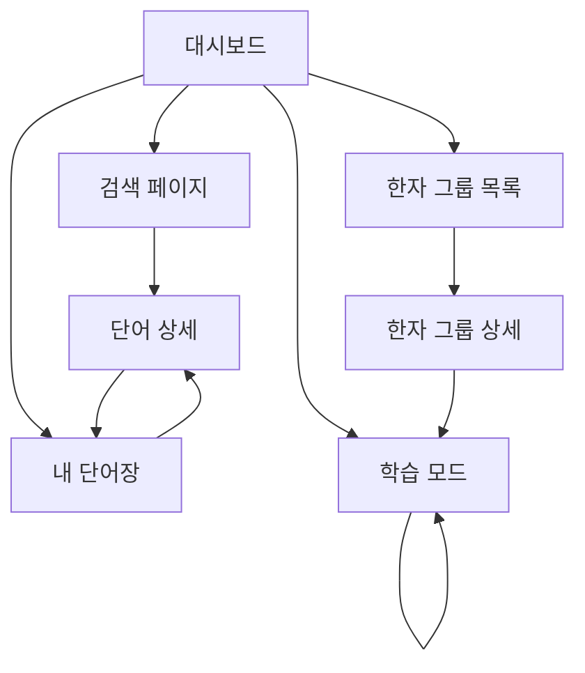
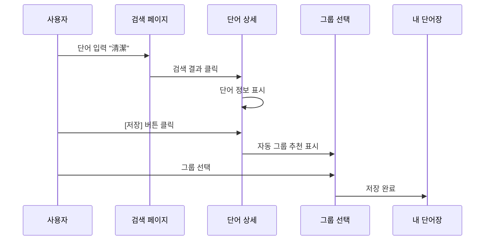
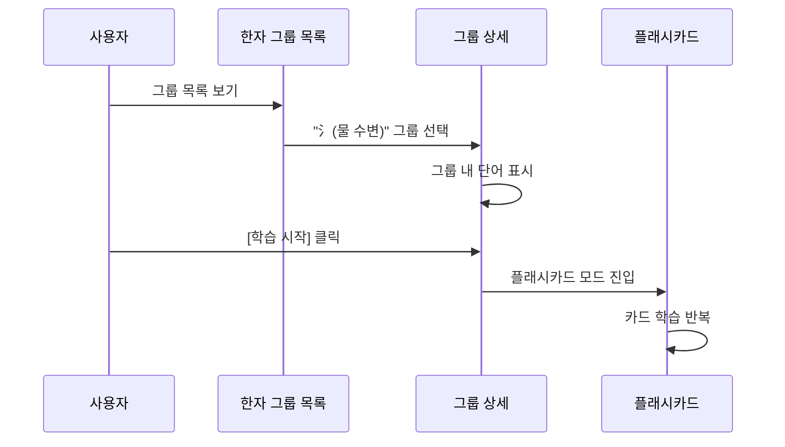

# 일본어 학습 단어장 서비스 - Wireframe 문서

## 1. 개요

본 문서는 일본어 학습 단어장 서비스의 화면 구조와 UI 레이아웃을 시각화한 wireframe 문서입니다. MVP 범위에 맞춰 핵심 기능을 담은 7개 주요 화면의 구조를 정의합니다.

### 목적
- 개발 전 화면 구조 명확화
- 사용자 경험(UX) 흐름 시각화
- UI 컴포넌트 정의 및 재사용성 확보
- 개발팀과 디자인팀 간 커뮤니케이션 도구

### 범위
- **플랫폼**: 데스크톱 웹 우선 (반응형 웹)
- **개발 전략**: MVP는 데스크톱 레이아웃으로 개발 후, 모바일 반응형 추가
- **선택 이유**: 
  - 개발 및 테스트 편의성 (브라우저에서 직접 테스트)
  - 빠른 프로토타입 검증
  - 복잡한 터치 제스처 구현 불필요
  - 넓은 화면을 활용한 직관적인 UI
- **화면 수**: 7개 핵심 화면
- **디자인 레벨**: Low-fidelity wireframe (구조 중심)

### 표기법
- `[버튼]`: 클릭 가능한 버튼
- `[ 입력창 ]`: 텍스트 입력 필드
- `☰`: 메뉴 아이콘
- `←`: 뒤로가기
- `⋮`: 더보기 메뉴
- `✓`: 체크박스
- `♡`: 즐겨찾기/저장

---

## 2. 네비게이션 플로우

### 2.1 전체 화면 구조



### 2.2 사용자 플로우 (주요 시나리오)

#### 시나리오 1: 단어 검색 및 저장



#### 시나리오 2: 그룹별 학습



---

## 3. 화면별 Wireframe

### 3.1 대시보드 (Dashboard)

**화면 목적**: 학습 현황 요약 및 빠른 액션 제공

**화면 구조** (데스크톱 - 1200px 이상):

```
┌────────────┬─────────────────────────────────────────────────────────────────┐
│            │  일본어 단어장                    🔍 검색...     👤 사용자  ⚙️ │ ← 헤더
│            ├─────────────────────────────────────────────────────────────────┤
│            │                                                                 │
│ 일본어     │  📚 오늘의 복습              📊 학습 통계                      │
│ 단어장     │  ┌─────────────────────┐    ┌─────────────────────┐           │
│            │  │ 복습 대기: 23개      │    │ 총 단어: 156개       │           │
├────────────┤  │ 신규 단어: 5개       │    │ 암기 완료: 89개      │           │
│            │  │ 어려운 단어: 3개     │    │ (57%)               │           │
│ 🏠 대시보드│  │                      │    │                     │           │
│            │  │ [지금 복습하기 →]   │    │ ████████░░░ 57%     │           │
│ 🔍 검색    │  └─────────────────────┘    │                     │           │
│            │                              │ 연속 학습: 7일 🔥   │           │
│ 📚 내 단어장│  ⚡ 빠른 액션               └─────────────────────┘           │
│            │  ┌────────┐ ┌────────┐                                        │
│ 👥 한자 그룹│  │  🔍   │ │  📖   │      📈 학습 진도                      │
│            │  │단어검색│ │그룹보기│      ┌─────────────────────┐           │
│ 📊 학습 통계│  └────────┘ └────────┘      │     이번 주          │           │
│            │                              │  월 ■■■□□□□      │           │
├────────────┤  🎯 학습 목표               │  화 ■■■■□□□      │           │
│            │  ┌─────────────────────┐    │  수 ■■■■■□□      │           │
│ ⚙️ 설정    │  │ 오늘 목표: 20개      │    │  목 ■■□□□□□      │           │
│            │  │ 현재: 12개 (60%)     │    │  금 ■■■■■■■      │           │
│ 👤 프로필  │  │ ████████░░░░ 60%     │    │  토 ■■■□□□□      │           │
│            │  └─────────────────────┘    │  일 ■■■■□□□      │           │
└────────────┘                              └─────────────────────┘           │
                                                                               │
                                            📝 최근 학습한 단어                │
                                            清潔, 学校, 勉強, 環境, 清掃       │
                                                                               │
└───────────────────────────────────────────────────────────────────────────┘
```

**주요 요소**:
- **좌측 사이드바**: 고정 네비게이션 (240px 너비)
  - 로고/앱 이름
  - 주요 메뉴 5개
  - 설정/프로필
- **헤더**: 전역 검색, 사용자 프로필
- **메인 영역** (2-3단 컬럼):
  - 좌측 컬럼: 복습 요약, 빠른 액션, 학습 목표
  - 우측 컬럼: 학습 통계, 진도 그래프, 최근 학습 단어

**인터랙션**:
- 사이드바 메뉴 클릭 → 페이지 전환
- `[지금 복습하기]` 클릭 → 학습 모드로 이동
- 빠른 액션 버튼 클릭 → 해당 페이지로 이동
- 통계 카드 호버 → 상세 정보 툴팁 표시
- 헤더 검색바 → 즉시 검색 모드

---

### 3.2 검색 페이지 (Search)

**화면 목적**: 단어 검색 및 결과 확인

**화면 구조** (데스크톱 - 1200px 이상):

```
┌────────────┬─────────────────────────────────────────────────────────────────┐
│            │  단어 검색                        🔍 검색...     👤 사용자  ⚙️ │
│            ├─────────────────────────────────────────────────────────────────┤
│            │                                                                 │
│ [사이드바] │          ┌───────────────────────────────────────┐              │
│            │          │ 🔍  [ 단어를 입력하세요... ]          │ ← 중앙 검색창│
│ 🏠 대시보드│          └───────────────────────────────────────┘              │
│            │                                                                 │
│ 🔍 검색    │  검색 결과 (8)                │  단어 미리보기                  │
│   (활성)   │  ─────────────────────────   │  ─────────────────────         │
│            │                               │                                 │
│ 📚 내 단어장│  ┌────────────────────────┐  │       清潔                     │
│            │  │ 清潔      [♡ 저장]     │  │     [せいけつ]          N2     │
│ 👥 한자 그룹│  │ [せいけつ]       N2    │◄─┤                                │
│            │  │ 깨끗함, 청결            │  │  뜻                            │
│ 📊 학습 통계│  └────────────────────────┘  │  1. [명사] 깨끗함, 청결        │
│            │                               │  2. [な형용사] 깨끗한          │
├────────────┤  ┌────────────────────────┐  │                                │
│            │  │ 清潔感    [♡ 저장]     │  │  📝 예문                       │
│ ⚙️ 설정    │  │ [せいけつかん]   N2    │  │  部屋を清潔に保つ。            │
│            │  │ 청결감, 깔끔한 느낌    │  │  방을 깨끗하게 유지한다.       │
│ 👤 프로필  │  └────────────────────────┘  │                                │
│            │                               │  🔤 한자 분석                  │
└────────────┘  ┌────────────────────────┐  │  ┌──────┬──────┐             │
                │ 清水      [♡ 저장]     │  │  │ 清   │ 潔   │             │
                │ [しみず]         N3    │  │  │セイ  │ケツ  │             │
                │ 맑은 물                │  │  └──────┴──────┘             │
                └────────────────────────┘  │                                │
                                            │  🔗 관련 단어                  │
                ┌────────────────────────┐  │  清潔感, 不潔, 衛生            │
                │ 清掃      [♡ 저장]     │  │                                │
                │ [せいそう]       N3    │  │  [💾 단어 저장하기]            │
                │ 청소                   │  │                                │
                └────────────────────────┘  │                                │
                                            │                                │
                ┌────────────────────────┐  │                                │
                │ 清流      [♡ 저장]     │  │                                │
                │ [せいりゅう]     N1    │  │                                │
                │ 맑은 물살, 청류        │  │                                │
                └────────────────────────┘  │                                │
                                            │                                │
└───────────────────────────────────────────┴─────────────────────────────────┘
```

**검색 전 상태** (최근 검색):

```
┌────────────┬─────────────────────────────────────────────────────────────────┐
│            │  단어 검색                        🔍 검색...     👤 사용자  ⚙️ │
│            ├─────────────────────────────────────────────────────────────────┤
│            │                                                                 │
│ [사이드바] │          ┌───────────────────────────────────────┐              │
│            │          │ 🔍  [ 단어를 입력하세요... ]          │              │
│ 🏠 대시보드│          └───────────────────────────────────────┘              │
│            │                                                                 │
│ 🔍 검색    │  최근 검색                        │  💡 검색 팁                │
│   (활성)   │  ─────────────────────────────   │  ─────────────────         │
│            │                                   │                            │
│ 📚 내 단어장│  清潔                       ✕    │  • 히라가나로 검색         │
│            │  学校                       ✕    │    예: せいけつ            │
│ 👥 한자 그룹│  食べる                     ✕    │                            │
│            │  勉強                       ✕    │  • 한자로 검색             │
│ 📊 학습 통계│  環境                       ✕    │    예: 清潔                │
│            │                                   │                            │
├────────────┤  인기 검색어                     │  • 로마자로 검색           │
│            │  ─────────────────────────────   │    예: seiketsu            │
│ ⚙️ 설정    │  学校  勉強  食べる  日本語      │    (자동 변환됨)           │
│            │  会社  先生  友達   旅行         │                            │
│ 👤 프로필  │                                   │  • 부분 검색 가능          │
│            │                                   │    예: 清 → 清潔, 清掃...  │
└────────────┘                                   │                            │
                                                 └────────────────────────────┘
```

**주요 요소**:
- **2단 레이아웃**:
  - 좌측: 검색 결과 리스트 (스크롤 가능)
  - 우측: 선택한 단어의 상세 미리보기
- **중앙 검색창**: 넓은 입력창 (자동 포커스)
- **검색 결과**: 단어, 후리가나, 주요 뜻, JLPT 레벨, 저장 버튼
- **최근 검색어**: 빠른 재검색
- **인기 검색어**: 다른 사용자들이 많이 검색한 단어
- **검색 팁**: 우측 패널에 도움말 표시

**인터랙션**:
- 검색 입력 → 실시간 자동완성 + 엔터 키로 검색
- 검색 결과 클릭 → 우측 미리보기에 상세 정보 표시
- 검색 결과 더블클릭 → 단어 상세 페이지로 이동
- `[♡ 저장]` 버튼 → 단어 저장 및 그룹 추천 모달
- 최근 검색어 클릭 → 해당 단어 재검색
- 키보드 단축키: `Ctrl/Cmd + K` → 검색창 포커스
- 검색 결과에서 `↑↓` 키로 선택 이동

---

### 3.3 단어 상세 페이지 (Word Detail)

**화면 목적**: 단어의 상세 정보 표시 및 저장

**화면 구조** (데스크톱 - 1200px 이상):

```
┌────────────┬─────────────────────────────────────────────────────────────────┐
│            │  ← 검색 결과로 돌아가기              🔍 검색...  👤 사용자  ⚙️ │
│            ├─────────────────────────────────────────────────────────────────┤
│            │                                                                 │
│ [사이드바] │              清潔                                 [N2]  [💾 저장]│
│            │            [せいけつ]                                           │
│ 🏠 대시보드│                                                                 │
│            │  ━━━━━━━━━━━━━━━━━━━━━━━━━━━━━━━━━━━━━━━━━━━━━━━━━━━━━━  │
│ 🔍 검색    │                                                                 │
│            │  뜻                               │  🔤 한자 상세 분석           │
│ 📚 내 단어장│  ────────────────────────────   │  ─────────────────────      │
│            │  1. [명사] 깨끗함, 청결           │                             │
│ 👥 한자 그룹│  2. [な형용사] 깨끗한             │  ┌──────────────────┐      │
│            │                                   │  │      清           │      │
│ 📊 학습 통계│  📝 예문                          │  │  [セイ/ショウ]    │      │
│            │  ────────────────────────────   │  │  きよい/きよまる  │      │
├────────────┤                                   │  │                   │      │
│            │  ┌────────────────────────────┐ │  │  氵(물 수변) +11획│      │
│ ⚙️ 설정    │  │ 部屋を清潔に保つ。          │ │  │  JLPT N2          │      │
│            │  │ へやをせいけつにたもつ      │ │  │                   │      │
│ 👤 프로필  │  │                             │ │  │  의미: 맑을 청     │      │
│            │  │ 방을 깨끗하게 유지한다.     │ │  │                   │      │
└────────────┘  │                      [🔊 듣기]│ │  │  이 한자를 포함한  │      │
                └────────────────────────────┘ │  │  다른 단어:        │      │
                                                │  │  清水, 清掃, 清算  │      │
                ┌────────────────────────────┐ │  └──────────────────┘      │
                │ 清潔な環境が大切です。      │ │                             │
                │ せいけつなかんきょうが      │ │  ┌──────────────────┐      │
                │ たいせつです                │ │  │      潔           │      │
                │                             │ │  │  [ケツ]           │      │
                │ 청결한 환경이 중요합니다.   │ │  │  いさぎよい       │      │
                │                      [🔊 듣기]│ │  │                   │      │
                └────────────────────────────┘ │  │  氵(물 수변) +15획│      │
                                                │  │  JLPT N1          │      │
                ┌────────────────────────────┐ │  │                   │      │
                │ 清潔感のある服装            │ │  │  의미: 깨끗할 결   │      │
                │ せいけつかんのあるふくそう  │ │  │                   │      │
                │                             │ │  │  이 한자를 포함한  │      │
                │ 청결감 있는 복장            │ │  │  다른 단어:        │      │
                │                      [🔊 듣기]│ │  │  簡潔, 純潔, 潔白  │      │
                └────────────────────────────┘ │  └──────────────────┘      │
                                                │                             │
                🔗 관련 단어                    │  추천 그룹                  │
                ────────────────────────────── │  ─────────────────────     │
                [清潔感] [不潔] [衛生]          │  □ 氵(물 수변) 한자        │
                [きれい] [清掃] [清潔剤]        │  □ 青 포함 한자            │
                                                │  □ セイ 음독 그룹          │
                                                │                             │
└───────────────────────────────────────────────┴─────────────────────────────┘
```

**저장 후 그룹 추천 모달**:

```
┌─────────────────────────────────────┐
│                                     │
│  ┌───────────────────────────────┐ │
│  │  단어가 저장되었습니다! ✓     │ │
│  │                                │ │
│  │  추천 그룹                     │ │
│  │  ─────────────────────────    │ │
│  │                                │ │
│  │  ✓ 氵(물 수변) 한자 그룹       │ │ ← 자동 선택됨
│  │    河, 海, 湖, 池, 清, 潔 등   │ │
│  │                                │ │
│  │  □ 青(청) 포함 한자 그룹      │ │
│  │    青, 清, 晴, 静, 請 등       │ │
│  │                                │ │
│  │  □ セイ 음독 그룹             │ │
│  │    清, 正, 生, 成, 静 등       │ │
│  │                                │ │
│  │  ─────────────────────────    │ │
│  │                                │ │
│  │  [그룹 없이 저장]  [완료]     │ │
│  └───────────────────────────────┘ │
│                                     │
└─────────────────────────────────────┘
```

**주요 요소**:
- **2단 레이아웃**:
  - 좌측 넓은 영역: 뜻, 예문, 관련 단어
  - 우측 패널: 한자 상세 분석, 추천 그룹
- **헤더**: 단어 표기 (대형), 후리가나, JLPT 레벨, 저장 버튼
- **뜻**: 번호로 구분, 품사 명시
- **예문**: 3개 이상, 후리가나 포함, 듣기 버튼
- **한자 분석 카드**: 각 한자별 상세 정보 (독립된 카드)
  - 음독/훈독, 부수+획수, JLPT 레벨, 의미
  - 이 한자를 포함한 다른 단어 링크
- **관련 단어**: 클릭 가능한 태그
- **추천 그룹**: 체크박스로 그룹 선택

**인터랙션**:
- `[💾 저장]` 버튼 (우상단) → 선택한 그룹과 함께 즉시 저장
- 추천 그룹 체크 → 실시간 선택 반영
- 관련 단어 클릭 → 해당 단어 상세 페이지로 이동
- 한자 카드 클릭 → 한자 상세 정보 모달
- `[🔊 듣기]` 버튼 → 예문 음성 재생
- 키보드 단축키: `Ctrl/Cmd + S` → 저장
- 마우스 호버: 한자 위에 호버 → 간단한 툴팁 표시

---

### 3.4 내 단어장 (My Words)

**화면 목적**: 저장한 단어 목록 관리 및 학습 상태 추적

**화면 구조** (데스크톱 - 1200px 이상):

```
┌────────────┬───────────┬──────────────────────┬──────────────────────────────┐
│            │           │  내 단어장  (156개)  │   🔍 검색...  👤 사용자  ⚙️ │
│            │           ├──────────────────────┴──────────────────────────────┤
│            │           │                                                      │
│ [사이드바] │  필터     │  단어 리스트           │  단어 상세                  │
│            │  ───────  │  ─────────────────── │  ─────────────────         │
│ 🏠 대시보드│           │  정렬: 최근 추가순 ▼  │                             │
│            │  상태     │                        │       清潔                  │
│ 🔍 검색    │  ●전체 156│  ┌──────────────────┐ │     [せいけつ]       [N2]  │
│            │  ○학습중67│  │☐ 清潔   [氵][청]│◄┤                             │
│ 📚 내 단어장│  ○암기함89│  │  [せいけつ] N2   │ │  뜻                         │
│   (활성)   │           │  │  깨끗함, 청결    │ │  1. [명사] 깨끗함, 청결    │
│            │  ━━━━━━ │  │  복습: 3일 후    │ │  2. [な형용사] 깨끗한      │
│ 👥 한자 그룹│           │  └──────────────────┘ │                             │
│            │  JLPT     │                        │  📝 예문                    │
│ 📊 학습 통계│  ☑ N5     │  ┌──────────────────┐ │  部屋を清潔に保つ。         │
│            │  ☑ N4     │  │✓ 学校    [学]   │ │  방을 깨끗하게 유지한다.    │
├────────────┤  ☑ N3     │  │  [がっこう] N5   │ │                             │
│            │  ☑ N2     │  │  학교            │ │  🔤 한자                    │
│ ⚙️ 설정    │  ☐ N1     │  │  암기 완료 ✓     │ │  清 [セイ/きよい]           │
│            │           │  └──────────────────┘ │  潔 [ケツ/いさぎよい]        │
│ 👤 프로필  │  ━━━━━━ │                        │                             │
│            │           │  ┌──────────────────┐ │  🔗 관련 단어               │
└────────────┘  복습     │  │☐ 清掃   [氵][청]│ │  清潔感, 不潔, 衛生         │
                ☑오늘    │  │  [せいそう] N3   │ │                             │
                ☐기한지남│  │  청소            │ │  그룹                       │
                ☐예정    │  │  복습: 오늘      │ │  [氵(물 수변)]              │
                          │  └──────────────────┘ │  [청 포함]                  │
                ━━━━━━ │                        │                             │
                          │  ┌──────────────────┐ │  통계                       │
                그룹     │  │☐ 環境    [環]   │ │  학습 횟수: 5회             │
                ☐氵(23)  │  │  [かんきょう] N3 │ │  정답률: 80%                │
                ☐청(12)  │  │  환경            │ │  마지막 학습: 3일 전        │
                ☐학(18)  │  │  복습: 1일 후    │ │                             │
                          │  └──────────────────┘ │  [📝 메모 추가]             │
                ━━━━━━ │                        │  [🗑️ 삭제]                  │
                          │  ┌──────────────────┐ │                             │
                [필터초기화]│  │☐ 勉強    [勉]   │ │                             │
                          │  │  [べんきょう] N5 │ │                             │
                          │  │  공부            │ │                             │
                          │  │  복습: 오늘      │ │                             │
                          │  └──────────────────┘ │                             │
                          │                        │                             │
                          │  [...더 많은 단어]    │                             │
                          │                        │                             │
└───────────────────────┴────────────────────────┴─────────────────────────────┘
```

**우클릭 컨텍스트 메뉴** (단어 카드 우클릭):

```
┌──────────────────────┐
│ 📖 단어 상세 보기    │
│ ✏️ 메모 추가         │
│ 👥 그룹 변경         │
│ 📤 내보내기          │
│ ──────────────────── │
│ 🗑️ 삭제              │
└──────────────────────┘
```

**주요 요소**:
- **3단 레이아웃**:
  - 좌측: 필터 사이드바 (상태, JLPT, 복습, 그룹)
  - 중앙: 단어 카드 리스트 (스크롤 가능)
  - 우측: 선택한 단어의 상세 정보
- **필터 사이드바**: 
  - 상태 라디오 버튼 (전체/학습중/암기함)
  - JLPT 레벨 체크박스
  - 복습 상태 체크박스
  - 그룹 체크박스
  - 필터 초기화 버튼
- **단어 카드**: 체크박스, 단어, 후리가나, 뜻, 그룹 태그, 복습 상태
- **단어 상세 패널**: 뜻, 예문, 한자, 관련 단어, 그룹, 통계, 액션 버튼

**인터랙션**:
- 필터 사이드바의 옵션 클릭 → 즉시 필터 적용
- 체크박스 클릭 → 암기 상태 토글 (애니메이션 효과)
- 단어 카드 클릭 → 우측 패널에 상세 정보 표시
- 단어 카드 더블클릭 → 단어 상세 페이지로 이동
- 단어 카드 우클릭 → 컨텍스트 메뉴 표시
- 단어 카드 호버 → 하이라이트 효과
- 그룹 태그 클릭 → 해당 그룹 페이지로 이동
- 정렬 드롭다운 변경 → 즉시 정렬 적용
- 키보드 `↑↓` → 단어 선택 이동
- 키보드 `Space` → 암기 체크 토글
- 키보드 `Delete` → 선택한 단어 삭제 확인
- 드래그 앤 드롭 → 단어를 그룹으로 이동 (향후)

---

### 3.5 한자 그룹 목록 (Kanji Groups)

**화면 목적**: 자동 생성된 한자 그룹 목록 표시

**화면 구조** (데스크톱 - 1200px 이상):

```
┌────────────┬─────────────────────────────────────────────────────────────────┐
│            │  한자 그룹                        🔍 검색...  👤 사용자  ⚙️  +  │
│            ├─────────────────────────────────────────────────────────────────┤
│            │                                                                 │
│ [사이드바] │  [전체 15] [부수 8] [구성요소 4] [음독 3]  ← 그룹 유형 필터    │
│            │  ━━━━━━━━                                                      │
│ 🏠 대시보드│                                                                 │
│            │  자동 생성된 그룹 (12)                                          │
│ 🔍 검색    │  ─────────────────────────────────────────────────────────────  │
│            │                                                                 │
│ 📚 내 단어장│  ┌───────────────────┐  ┌───────────────────┐  ┌──────────┐  │
│            │  │ 氵 (물 수변)      │  │ 青 포함 한자      │  │ 学 포함  │  │
│ 👥 한자 그룹│  │ 한자 그룹         │  │ 그룹              │  │ 한자     │  │
│   (활성)   │  │ ━━━━━━━━━━━━━   │  │ ━━━━━━━━━━━━━   │  │ 그룹     │  │
│            │  │                   │  │                   │  │ ━━━━━━ │  │
│ 📊 학습 통계│  │ 河 海 湖 池       │  │ 青 清 晴 静       │  │ 学 学校  │  │
│            │  │ 清 潔 洗 泳       │  │ 請 情 精 靖       │  │ 学生 ...  │  │
├────────────┤  │ ...              │  │ ...              │  │          │  │
│            │  │                   │  │                   │  │ 18개     │  │
│ ⚙️ 설정    │  │ 23개 단어         │  │ 12개 단어         │  │ 구성요소 │  │
│            │  │ 부수 기반         │  │ 구성 요소 기반    │  │ 3일 전   │  │
│ 👤 프로필  │  │ 2일 전            │  │ 오늘              │  │ [보기→]  │  │
│            │  │ [보기→]          │  │ [보기→]          │  └──────────┘  │
└────────────┘  └───────────────────┘  └───────────────────┘                 │
                                                                               │
                ┌───────────────────┐  ┌───────────────────┐  ┌──────────┐  │
                │ セイ 음독 그룹    │  │ カン 음독 그룹    │  │ シ 음독  │  │
                │ ━━━━━━━━━━━━━   │  │ ━━━━━━━━━━━━━   │  │ 그룹     │  │
                │                   │  │                   │  │ ━━━━━━ │  │
                │ 清 正 生 成       │  │ 間 館 感 漢       │  │ 市 私    │  │
                │ 静 晴 星 声       │  │ 完 関 観 簡       │  │ 死 ...   │  │
                │ ...              │  │ ...              │  │          │  │
                │                   │  │                   │  │ 10개     │  │
                │ 15개 단어         │  │ 14개 단어         │  │ 음독     │  │
                │ 음독 기반         │  │ 음독 기반         │  │ 1주 전   │  │
                │ 1주일 전          │  │ 5일 전            │  │ [보기→]  │  │
                │ [보기→]          │  │ [보기→]          │  └──────────┘  │
                └───────────────────┘  └───────────────────┘                 │
                                                                               │
                내가 만든 그룹 (3)  [+ 새 그룹]                                │
                ─────────────────────────────────────────────────────────────  │
                                                                               │
                ┌───────────────────┐  ┌───────────────────┐  ┌──────────┐  │
                │ 내가 자주 틀리는  │  │ JLPT N2 대비      │  │ 비즈니스 │  │
                │ 한자              │  │ 한자              │  │ 일본어   │  │
                │ ━━━━━━━━━━━━━   │  │ ━━━━━━━━━━━━━   │  │ ━━━━━━ │  │
                │                   │  │                   │  │          │  │
                │ 士 土 末 未       │  │ 製 造 設 備       │  │ 営 業    │  │
                │ 己 已 巳 日       │  │ 許 認 証 ...     │  │ 会 議... │  │
                │ ...              │  │                   │  │          │  │
                │                   │  │ 45개 단어         │  │ 12개     │  │
                │ 8개 단어          │  │ 사용자 정의       │  │ 사용자   │  │
                │ 사용자 정의       │  │ 3주 전            │  │ 1개월 전 │  │
                │ 어제              │  │ [보기→]          │  │ [보기→]  │  │
                │ [보기→]          │  └───────────────────┘  └──────────┘  │
                └───────────────────┘                                         │
                                                                               │
└───────────────────────────────────────────────────────────────────────────┘
```

**그룹 추가 모달** (+ 버튼 클릭 시):

```
┌─────────────────────────────────────┐
│  새 그룹 만들기                ✕   │
├─────────────────────────────────────┤
│                                     │
│  그룹 이름                          │
│  ┌─────────────────────────────┐   │
│  │ [그룹 이름 입력...]          │   │
│  └─────────────────────────────┘   │
│                                     │
│  그룹 유형                          │
│  ○ 자동 (한자 분석 기반)           │
│  ● 수동 (직접 단어 추가)           │
│                                     │
│  설명 (선택사항)                    │
│  ┌─────────────────────────────┐   │
│  │ [그룹 설명...]               │   │
│  │                               │   │
│  └─────────────────────────────┘   │
│                                     │
│     [취소]          [만들기]       │
│                                     │
└─────────────────────────────────────┘
```

**주요 요소**:
- **그리드 레이아웃**: 3열 (1200px 기준), 2열 (1024px)
- **그룹 유형 필터 탭**: 전체/부수/구성요소/음독 (숫자 표시)
- **그룹 카드**:
  - 그룹명 (대형)
  - 포함 한자 미리보기 (2-3줄)
  - 하단 메타 정보 (단어 수, 유형, 날짜)
  - `[보기→]` 버튼 (호버 시 표시)
- **섹션 구분**: 자동 생성 / 내가 만든 그룹
- **새 그룹 버튼** (+): 헤더 우측 상단

**인터랙션**:
- 그룹 유형 탭 클릭 → 즉시 필터링 적용
- 그룹 카드 클릭 → 그룹 상세 페이지로 이동
- 그룹 카드 호버 → 카드 확대 효과 + `[보기→]` 버튼 표시
- `[+ 새 그룹]` 버튼 → 새 그룹 만들기 모달
- 그룹 카드 우클릭 → 컨텍스트 메뉴 (편집/삭제/복제)
- 키보드 `Ctrl/Cmd + N` → 새 그룹 만들기

---

### 3.6 한자 그룹 상세 (Group Detail)

**화면 목적**: 그룹 내 단어 목록 및 한자 비교 학습

**화면 구조** (데스크톱 - 1200px 이상):

```
┌────────────┬─────────────────────────────────────────────────────────────────┐
│            │  ← 그룹 목록    氵(물 수변) 한자 그룹    🔍 검색  👤 사용자  ⚙️│
│            ├─────────────────────────────────────────────────────────────────┤
│            │                                                                 │
│ [사이드바] │  ┌─────────────────────────────────────────────────────────┐   │
│            │  │ 그룹 정보                     [✏️ 편집] [🗑️ 삭제]        │   │
│ 🏠 대시보드│  │ ━━━━━━━━━━━━━━━━━━━━━━━━━━━━━━━━━━━━━━━━━━━━━━━━━━  │   │
│            │  │ 부수: 氵 (물 수변, sanzui)                              │   │
│ 🔍 검색    │  │ 의미: 물과 관련된 한자들을 모은 그룹                    │   │
│            │  │ 단어 수: 23개  |  그룹 유형: 부수 기반                  │   │
│ 📚 내 단어장│  │ 생성일: 2025-12-15  |  마지막 수정: 어제               │   │
│            │  └─────────────────────────────────────────────────────────┘   │
│ 👥 한자 그룹│                                                                 │
│   (활성)   │  [리스트] [한자 비교] [학습하기]  정렬: JLPT 레벨순 ▼          │
│            │  ━━━━━━━━                                                      │
│ 📊 학습 통계│                                                                 │
│            │  ┌───────────────────┐  ┌───────────────────┐  ┌──────────┐  │
├────────────┤  │☐ 清潔  [氵][청]N2│  │☐ 河川   [氵] N2  │  │☐ 海洋N2 │  │
│            │  │  [せいけつ]       │  │  [かせん]         │  │[かいよう]│  │
│ ⚙️ 설정    │  │  깨끗함, 청결     │  │  하천             │  │ 해양     │  │
│            │  │  清(氵+11) 潔(...) │  │  河(氵+5) 川(川+0)│  │ 海 洋... │  │
│ 👤 프로필  │  └───────────────────┘  └───────────────────┘  └──────────┘  │
│            │                                                                 │
└────────────┘  ┌───────────────────┐  ┌───────────────────┐  ┌──────────┐  │
                │☐ 湖水  [氵] N1    │  │✓ 清掃  [氵][청]N3│  │☐ 洗濯N3 │  │
                │  [こすい]         │  │  [せいそう]       │  │[せんたく]│  │
                │  호수             │  │  청소             │  │ 세탁     │  │
                │  湖(氵+12) 水(...) │  │  清(氵+11) 掃(...)│  │ 洗 濯... │  │
                └───────────────────┘  └───────────────────┘  └──────────┘  │
                                                                               │
                [...더 많은 단어 그리드...]                                    │
                                                                               │
                ┌───────────────────────────────────────────────────────────┐ │
                │         [이 그룹 전체 학습하기 →]                         │ │
                └───────────────────────────────────────────────────────────┘ │
                                                                               │
└───────────────────────────────────────────────────────────────────────────┘
```

**한자 비교 모드** (한자 비교 탭 선택 시):

```
┌─────────────────────────────────────┐
│  ← 氵(물 수변) 한자 그룹      ⋮    │
├─────────────────────────────────────┤
│                                     │
│  [리스트] [한자 비교] [학습하기]   │
│         ━━━━━━━━                    │
│                                     │
│  ┌──────────┬──────────┬──────────┐│
│  │   清     │   河     │   海     ││
│  ├──────────┼──────────┼──────────┤│
│  │ せい     │ かわ     │ うみ     ││
│  │ きよい   │ か       │ かい     ││
│  ├──────────┼──────────┼──────────┤│
│  │ 氵+11획  │ 氵+5획   │ 氵+10획  ││
│  │ N2       │ N5       │ N5       ││
│  ├──────────┼──────────┼──────────┤│
│  │ 맑을 청  │ 강 하    │ 바다 해  ││
│  ├──────────┼──────────┼──────────┤│
│  │ 清潔     │ 河川     │ 海洋     ││
│  │ 清水     │ 河口     │ 海外     ││
│  │ 清掃     │ 運河     │ 海岸     ││
│  └──────────┴──────────┴──────────┘│
│                                     │
│  ┌──────────┬──────────┬──────────┐│
│  │   湖     │   池     │   泳     ││
│  ├──────────┼──────────┼──────────┤│
│  │ こ       │ いけ     │ およぐ   ││
│  │ みずうみ │ ち       │ えい     ││
│  ├──────────┼──────────┼──────────┤│
│  │ 氵+12획  │ 氵+6획   │ 氵+8획   ││
│  │ N1       │ N3       │ N3       ││
│  ├──────────┼──────────┼──────────┤│
│  │ 호수 호  │ 못 지    │ 헤엄칠 영││
│  ├──────────┼──────────┼──────────┤│
│  │ 湖水     │ 池袋     │ 水泳     ││
│  │ 湖畔     │ 電池     │ 泳法     ││
│  │ 琵琶湖   │ 用水池   │ 競泳     ││
│  └──────────┴──────────┴──────────┘│
│                                     │
│  < 이전       1/4       다음 >      │
│                                     │
├─────────────────────────────────────┤
│ [🏠]  [🔍]  [📚]  [👥]  [⚙️]      │
└─────────────────────────────────────┘
```

**주요 요소**:
- **그룹 정보 헤더**: 편집/삭제 버튼 포함
- **뷰 모드 탭**: 리스트/한자 비교/학습하기
- **그리드 레이아웃**: 단어 카드 3열 배치
- **정렬 드롭다운**: JLPT 레벨순/가나다순/추가순
- **단어 카드**: 체크박스, 그룹 태그, 한자 정보
- **학습 시작 버튼**: 하단 고정 (큰 버튼)

**인터랙션**:
- 뷰 모드 탭 클릭 → 즉시 뷰 전환
- 단어 카드 클릭 → 단어 상세 페이지
- 단어 카드 호버 → 하이라이트 효과
- 체크박스 클릭 → 암기 상태 토글
- `[✏️ 편집]` → 그룹 정보 수정 모달
- `[🗑️ 삭제]` → 그룹 삭제 확인 모달
- `[이 그룹 전체 학습하기]` → 플래시카드 모드 시작
- 한자 비교 탭에서 한자 클릭 → 한자 상세 모달
- 정렬 드롭다운 변경 → 즉시 재정렬
- 키보드 단축키: `Ctrl/Cmd + L` → 학습 시작

---

### 3.7 학습 모드 - 플래시카드 (Flashcard)

**화면 목적**: 단어 플래시카드 학습

**화면 구조 - 카드 앞면** (데스크톱 - 1200px 이상):

```
┌───────────────────────────────────────────────────────────────────────────┐
│  ✕ 학습 중...              5 / 23  (22%)            단축키: Space (뒤집기)│
├───────────────────────────────────────────────────────────────────────────┤
│                                                                           │
│            ┌─────────────────────────────────────────┐                   │
│            │                                         │                   │
│            │                                         │                   │
│            │                                         │                   │
│            │                                         │                   │
│ 💡 팁      │               清潔                      │        📊 진도   │
│ ──────     │                                         │        ────────  │
│ Space:     │                                         │        완료: 4개 │
│ 카드 뒤집기│                                         │        남음: 19개│
│            │                                         │                  │
│ ←→:       │                                         │        🎯 목표   │
│ 이전/다음  │       [Space 또는 클릭으로 뒤집기]     │        ────────  │
│            │                                         │        오늘:20개 │
│ 1-4:       │                                         │        진행:25%  │
│ 난이도평가 │                                         │                  │
│            │                                         │                  │
│ ESC:       │                                         │                  │
│ 학습 종료  │                                         │                  │
│            │                                         │                  │
│            └─────────────────────────────────────────┘                   │
│                                                                           │
│                    [← 이전]              [다음 →]                        │
│                                                                           │
│            ████████░░░░░░░░░░░░░░░░░░░░░░░░░░░░ 22%                     │
│                                                                           │
└───────────────────────────────────────────────────────────────────────────┘
```

**화면 구조 - 카드 뒤면** (데스크톱):

```
┌───────────────────────────────────────────────────────────────────────────┐
│  ✕ 학습 중...              5 / 23  (22%)            단축키: 1~4 (난이도) │
├───────────────────────────────────────────────────────────────────────────┤
│                                                                           │
│            ┌─────────────────────────────────────────┐                   │
│            │                                         │                   │
│            │         清潔 [せいけつ]          [N2]  │                   │
│            │                                         │                   │
│            │  뜻                                     │                   │
│ 💡 팁      │  1. 깨끗함, 청결                       │        📊 통계   │
│ ──────     │  2. 깨끗한                             │        ────────  │
│ 1: 쉬움    │                                         │        오늘      │
│ 2: 보통    │  📝 例文                               │        ■■■□□   │
│ 3: 어려움  │  部屋を清潔に保つ。                    │                  │
│ 4: 모름    │  방을 깨끗하게 유지한다.               │        이번주    │
│            │                                         │        ■■■■■   │
│ ←→:       │  🔤 한자                               │                  │
│ 이전/다음  │  清 [セイ/きよい] 氵+11획              │        연속학습  │
│            │  潔 [ケツ/いさぎよい] 氵+15획          │        7일 🔥    │
│ Space:     │                                         │                  │
│ 카드 뒤집기│  🔗 관련: 清潔感, 不潔, 衛生           │                  │
│            │                                         │                  │
│            └─────────────────────────────────────────┘                   │
│                                                                           │
│                    이 단어를 얼마나 잘 아시나요?                         │
│                                                                           │
│         [1️⃣ 쉬움]  [2️⃣ 보통]  [3️⃣ 어려움]  [4️⃣ 모름]              │
│                                                                           │
│            ████████░░░░░░░░░░░░░░░░░░░░░░░░░░░░ 22%                     │
│                                                                           │
└───────────────────────────────────────────────────────────────────────────┘
```

**학습 완료 화면** (데스크톱):

```
┌───────────────────────────────────────────────────────────────────────────┐
│  ✕ 학습 완료                                                              │
├───────────────────────────────────────────────────────────────────────────┤
│                                                                           │
│                                 🎉                                        │
│                          학습 완료!                                       │
│                                                                           │
│                   오늘 23개 단어를 학습했습니다                           │
│                                                                           │
│  ━━━━━━━━━━━━━━━━━━━━━━━━━━━━━━━━━━━━━━━━━━━━━━━━━━━━━━━━━━━━━━━━  │
│                                                                           │
│  📊 학습 결과                        📈 예상 복습 일정                    │
│  ──────────────────────────────     ──────────────────────────────────  │
│                                                                           │
│  ┌────────────┐ ┌────────────┐     쉬움 (8개) → 7일 후 복습            │
│  │    쉬움    │ │    보통    │     보통 (10개) → 3일 후 복습           │
│  │   8개      │ │   10개     │     어려움 (3개) → 1일 후 복습          │
│  │   35%      │ │   43%      │     모름 (2개) → 오늘 다시 복습         │
│  │   ■■■■   │ │   ■■■■■ │                                           │
│  └────────────┘ └────────────┘                                           │
│                                                                           │
│  ┌────────────┐ ┌────────────┐     💡 학습 팁                            │
│  │   어려움   │ │    모름    │     ────────────────────────────────── │
│  │   3개      │ │   2개      │     어려운 단어는 내일 다시 복습하세요!  │
│  │   13%      │ │   9%       │                                           │
│  │   ■■     │ │   ■       │                                           │
│  └────────────┘ └────────────┘                                           │
│                                                                           │
│  ━━━━━━━━━━━━━━━━━━━━━━━━━━━━━━━━━━━━━━━━━━━━━━━━━━━━━━━━━━━━━━━━  │
│                                                                           │
│  다시 복습이 필요한 단어 (5개)                                            │
│  ──────────────────────────────────────────────────────────────────────  │
│  [清潔] [環境] [清掃] [湖水] [河川]                                      │
│                                                                           │
│  ━━━━━━━━━━━━━━━━━━━━━━━━━━━━━━━━━━━━━━━━━━━━━━━━━━━━━━━━━━━━━━━━  │
│                                                                           │
│            [어려운 단어만 다시]      [완료하고 대시보드로]               │
│                                                                           │
└───────────────────────────────────────────────────────────────────────────┘
```

**주요 요소**:
- **와이드 레이아웃**: 중앙 카드 + 좌우 사이드 패널
- **좌측 패널**: 학습 팁, 키보드 단축키 안내
- **중앙 카드**: 큰 플래시카드 (800px 너비)
- **우측 패널**: 진도, 목표, 통계
- **진행률 바**: 하단 전체 너비
- **카드 앞면**: 한자 단어 (초대형 텍스트)
- **카드 뒤면**: 후리가나, 뜻, 예문, 한자 분석, 관련 단어
- **난이도 평가**: 큰 버튼 (키보드 번호 표시)
- **학습 완료 화면**: 통계 그래프, 예상 복습 일정, 학습 팁

**인터랙션**:
- **키보드 단축키**:
  - `Space` → 카드 뒤집기
  - `←→` → 이전/다음 카드
  - `1~4` → 난이도 평가 (쉬움/보통/어려움/모름)
  - `ESC` → 학습 종료 확인
- **마우스**:
  - 카드 클릭 → 뒤집기
  - 난이도 버튼 클릭 → 평가 후 다음 카드로 자동 이동
  - `[← 이전]` / `[다음 →]` 버튼 → 카드 이동
  - `[✕]` 버튼 → 학습 중단 확인 모달
- **애니메이션**:
  - 카드 3D 플립 효과
  - 카드 전환 시 슬라이드 효과
  - 진행률 바 부드러운 증가
- **학습 완료 후**:
  - `[어려운 단어만 다시]` → 어려움/모름 단어만 재학습
  - `[완료하고 대시보드로]` → 대시보드로 이동

---

## 4. 공통 컴포넌트

### 4.1 사이드바 네비게이션 (Sidebar Navigation) - 데스크톱 전용

**구조** (240px 고정 너비):

```
┌─────────────┐
│             │
│ 일본어 단어장│ ← 로고/앱 이름
│             │
├─────────────┤
│             │
│ 🏠 대시보드 │ ← 메인 메뉴
│             │
│ 🔍 검색     │
│             │
│ 📚 내 단어장│
│   (활성)    │ ← 활성 상태 표시
│             │
│ 👥 한자 그룹│
│             │
│ 📊 학습 통계│
│             │
├─────────────┤
│             │
│ ⚙️ 설정     │ ← 하단 메뉴
│             │
│ 👤 프로필   │
│             │
└─────────────┘
```

**요소**:
- **로고 영역**: 앱 이름 또는 로고 (클릭 시 대시보드로)
- **메인 메뉴** (5개):
  - 🏠 대시보드
  - 🔍 검색
  - 📚 내 단어장
  - 👥 한자 그룹
  - 📊 학습 통계 (Phase 2)
- **하단 메뉴**:
  - ⚙️ 설정
  - 👤 프로필 (Phase 2)

**상태 표시**:
- **활성 메뉴**: 배경색 변경 + 좌측 강조선
- **호버**: 배경색 살짝 변경
- **뱃지**: 알림 숫자 표시 (예: 복습 대기 23개)

**반응형**:
- **1024px 이상**: 항상 표시 (240px)
- **768px~1023px**: 접기 가능 (햄버거 메뉴로 토글)
- **767px 이하**: 하단 네비게이션 바로 대체 (모바일)

---

### 4.2 헤더 (Header) - 데스크톱

**기본 헤더**:
```
┌─────────────────────────────────────────────────────────────┐
│  페이지 제목              🔍 검색...     👤 사용자    ⚙️   │
└─────────────────────────────────────────────────────────────┘
```

**뒤로가기 포함 헤더**:
```
┌─────────────────────────────────────────────────────────────┐
│  ← 상위 페이지    페이지 제목    🔍 검색...  👤 사용자  ⚙️ │
└─────────────────────────────────────────────────────────────┘
```

**액션 버튼 포함 헤더**:
```
┌─────────────────────────────────────────────────────────────┐
│  ← 돌아가기  페이지 제목  [편집] [삭제]  🔍  👤  ⚙️   +   │
└─────────────────────────────────────────────────────────────┘
```

**요소**:
- **좌측**: 뒤로가기 버튼 (선택), 페이지 제목
- **중앙**: 전역 검색 바 (항상 표시 또는 클릭 시 확장)
- **우측**: 사용자 프로필, 설정, 액션 버튼 (+ 등)

**상태**:
- **검색 바**: 포커스 시 확장
- **사용자 프로필**: 클릭 시 드롭다운 메뉴
- **알림**: 아이콘에 빨간 점 표시

---

### 4.3 하단 네비게이션 바 (Bottom Navigation) - 모바일 전용

```
┌─────────────────────────────────────┐
│ [🏠]  [🔍]  [📚]  [👥]  [⚙️]      │
│  홈   검색  단어장  그룹  설정      │
└─────────────────────────────────────┘
```

**5개 주요 메뉴**:
1. **홈** (🏠): 대시보드
2. **검색** (🔍): 단어 검색
3. **단어장** (📚): 내 단어장
4. **그룹** (👥): 한자 그룹 목록
5. **설정** (⚙️): 설정 페이지

**상태 표시**:
- 활성 탭: 아이콘 색상 변경 + 상단 선 표시
- 비활성 탭: 회색 아이콘

**반응형**:
- **767px 이하**: 표시 (모바일)
- **768px 이상**: 숨김 (사이드바로 대체)

---

### 4.3 단어 카드 컴포넌트

**기본 단어 카드**:
```
┌─────────────────────────────────────┐
│ ☐ 清潔           [氵] [청]         │ ← 체크박스 + 그룹 태그
│   [せいけつ]              N2        │ ← 후리가나 + JLPT
│   깨끗함, 청결                      │ ← 뜻
│   복습: 3일 후                      │ ← 복습 정보
└─────────────────────────────────────┘
```

**암기 완료 단어 카드**:
```
┌─────────────────────────────────────┐
│ ✓ 学校           [学]              │
│   [がっこう]              N5        │
│   학교                              │
│   암기 완료 ✓                       │
└─────────────────────────────────────┘
```

**검색 결과 단어 카드**:
```
┌─────────────────────────────────────┐
│ 清潔                    [♡ 저장]    │
│ [せいけつ]                  N2      │
│ 깨끗함, 청결                        │
└─────────────────────────────────────┘
```

---

### 4.4 버튼 스타일

**Primary 버튼** (주요 액션):
```
┌─────────────────────┐
│   [지금 복습하기]   │ ← 배경색 있음, 큰 버튼
└─────────────────────┘
```

**Secondary 버튼** (보조 액션):
```
┌─────────────────────┐
│      [취소]         │ ← 테두리만, 배경색 없음
└─────────────────────┘
```

**Icon 버튼**:
```
[♡]  [🔍]  [⋮]  [✕]
```

**버튼 그룹**:
```
┌──────────┬──────────┐
│  [취소]  │  [확인]  │
└──────────┴──────────┘
```

---

### 4.5 입력 필드

**텍스트 입력**:
```
┌─────────────────────────────────────┐
│ [ 단어를 입력하세요...             ]│
└─────────────────────────────────────┘
```

**검색 입력**:
```
┌─────────────────────────────────────┐
│ 🔍 [ 검색...                       ]│
└─────────────────────────────────────┘
```

**멀티라인 입력**:
```
┌─────────────────────────────────────┐
│ [ 내용을 입력하세요...              │
│                                     │
│                                    ]│
└─────────────────────────────────────┘
```

---

### 4.6 모달 / 팝업

**확인 모달**:
```
┌─────────────────────────────────────┐
│                                     │
│  ┌───────────────────────────────┐ │
│  │  단어를 삭제하시겠습니까?     │ │
│  │                                │ │
│  │  이 작업은 되돌릴 수 없습니다.│ │
│  │                                │ │
│  │  [취소]          [삭제]       │ │
│  └───────────────────────────────┘ │
│                                     │
└─────────────────────────────────────┘
```

**선택 모달**:
```
┌─────────────────────────────────────┐
│  그룹 선택                     ✕   │
├─────────────────────────────────────┤
│                                     │
│  ☑ 氵(물 수변) 한자 그룹            │
│  □ 青 포함 한자 그룹               │
│  □ セイ 음독 그룹                  │
│                                     │
│  [새 그룹 만들기]                  │
│                                     │
│     [취소]          [완료]         │
│                                     │
└─────────────────────────────────────┘
```

---

### 4.7 태그 / 뱃지

**그룹 태그**:
```
[氵]  [청]  [学]  [セイ]
```

**JLPT 레벨 뱃지**:
```
[N5]  [N4]  [N3]  [N2]  [N1]
```

**상태 뱃지**:
```
[신규]  [학습중]  [암기함]  [어려움]
```

---

### 4.8 프로그레스 바

**선형 프로그레스**:
```
████████████░░░░░░░░ 60%
```

**원형 프로그레스** (텍스트로 표현):
```
  ╭─────╮
  │ 57% │
  ╰─────╯
```

---

### 4.9 알림 / 토스트

**성공 알림**:
```
┌─────────────────────────────────────┐
│ ✓ 단어가 저장되었습니다             │
└─────────────────────────────────────┘
```

**오류 알림**:
```
┌─────────────────────────────────────┐
│ ✕ 검색에 실패했습니다. 다시 시도해주세요│
└─────────────────────────────────────┘
```

**정보 알림**:
```
┌─────────────────────────────────────┐
│ ℹ 복습할 단어가 23개 있습니다       │
└─────────────────────────────────────┘
```

---

## 5. 반응형 레이아웃

### 5.1 브레이크포인트

- **데스크톱**: 1024px 이상 (기본 개발 타겟)
- **태블릿**: 768px ~ 1023px
- **모바일**: 320px ~ 767px

**개발 접근법**:
- MVP는 데스크톱 레이아웃으로 먼저 개발
- 이후 CSS 미디어 쿼리로 태블릿/모바일 반응형 추가
- 데스크톱 기준으로 축소/조정하는 방식

---

### 5.2 데스크톱 레이아웃 (1024px~) - 기본

**특징**:
- **기본 타겟**: 1200px~1400px (최대 너비)
- **사이드바 네비게이션**: 좌측 고정 (240px)
- **3단 컬럼 가능**: 필터 + 리스트 + 상세
- **호버 효과**: 마우스 인터랙션 강조
- **키보드 단축키 지원**: 빠른 탐색
- **드래그 앤 드롭**: 단어 그룹 이동 (향후)
- **넓은 여백**: 24px~32px

**예시** (전체 레이아웃):
```
┌───────────────────────────────────────────────────────────┐
│  일본어 단어장                      👤 사용자      ⚙️    │
├────────┬──────────────────────────────────────────────────┤
│        │                                                  │
│ [🏠 홈]│              메인 콘텐츠 영역                    │
│        │                                                  │
│ [🔍 검색]│  ┌────────────────────────────────────────┐   │
│        │  │                                          │   │
│ [📚 단어장]│                                          │   │
│        │  │                                          │   │
│ [👥 그룹]│                                          │   │
│        │  │                                          │   │
│ [⚙️ 설정]│                                          │   │
│        │  │                                          │   │
│        │  └────────────────────────────────────────┘   │
│        │                                                  │
│        │                                                  │
├────────┴──────────────────────────────────────────────────┤
│  출처: JMdict, KanjiDic2              버전: 1.0.0        │
└───────────────────────────────────────────────────────────┘
```

**3단 레이아웃 예시** (내 단어장):
```
┌───────────────────────────────────────────────────────────┐
│  일본어 단어장                                           │
├────────┬──────────────┬───────────────────────────────────┤
│        │              │                                   │
│ [네비] │  단어 리스트 │        단어 상세                  │
│        │              │                                   │
│ [홈]   │ ┌──────────┐ │   清潔 [せいけつ]                │
│        │ │ 단어 1   │ │                                   │
│ [검색] │ └──────────┘ │   깨끗함, 청결                    │
│        │              │                                   │
│ [단어장]│ ┌──────────┐ │   예문:                          │
│        │ │ 단어 2   │ │   部屋を清潔に保つ。             │
│ [그룹] │ └──────────┘ │                                   │
│        │              │   한자: 清 [セイ], 潔 [ケツ]     │
│ [설정] │ ┌──────────┐ │                                   │
│        │ │ 단어 3   │ │   관련: 清潔感, 不潔, 衛生       │
│        │ └──────────┘ │                                   │
│        │              │                                   │
└────────┴──────────────┴───────────────────────────────────┘
```

---

### 5.3 태블릿 레이아웃 (768px~1023px)

**특징**:
- 단일 컬럼 레이아웃
- 하단 네비게이션 바 (고정)
- 풀 스크린 모달
- 터치 제스처 지원 (스와이프, 길게 누르기)
- 큰 터치 타겟 (최소 44x44px)

**예시** (단어 목록):
```
┌───────────┐
│ ← 단어장  │
├───────────┤
│           │
│ ┌───────┐ │
│ │단어 1 │ │
│ └───────┘ │
│           │
│ ┌───────┐ │
│ │단어 2 │ │
│ └───────┘ │
│           │
│ ┌───────┐ │
│ │단어 3 │ │
│ └───────┘ │
│           │
├───────────┤
│ [네비게이션]│
└───────────┘
```

---

### 5.3 태블릿 레이아웃 (768px~1023px) - 데스크톱에서 조정

**데스크톱 대비 변경사항**:
- **사이드바**: 240px → 접기 가능 (햄버거 메뉴)
- **3단 레이아웃**: → 2단 레이아웃으로 축소
  - 필터 사이드바는 모달/드로어로 변경
  - 리스트 + 상세만 표시
- **그리드**: 3열 → 2열로 축소
- **여백**: 24px → 16px로 축소
- **폰트**: 일부 크기 조정

**예시** (한자 그룹 목록):
```
┌─────────────────────────────────────┐
│  ← 한자 그룹                    +   │
├─────────────────────────────────────┤
│                                     │
│  ┌──────────────┐  ┌──────────────┐│
│  │  그룹 1      │  │  그룹 2      ││
│  │              │  │              ││
│  └──────────────┘  └──────────────┘│
│                                     │
│  ┌──────────────┐  ┌──────────────┐│
│  │  그룹 3      │  │  그룹 4      ││
│  │              │  │              ││
│  └──────────────┘  └──────────────┘│
│                                     │
├─────────────────────────────────────┤
│        [네비게이션]                 │
└─────────────────────────────────────┘
```

**분할 뷰 예시** (목록 + 상세):
```
┌─────────────────────────────────────┐
│  ← 내 단어장                        │
├────────────────┬────────────────────┤
│                │                    │
│  ┌──────────┐  │   단어 상세        │
│  │ 단어 1   │  │                    │
│  └──────────┘  │   清潔             │
│                │   [せいけつ]       │
│  ┌──────────┐  │                    │
│  │ 단어 2   │  │   뜻:              │
│  └──────────┘  │   깨끗함, 청결     │
│                │                    │
│  ┌──────────┐  │   예문:            │
│  │ 단어 3   │  │   部屋を...        │
│  └──────────┘  │                    │
│                │                    │
├────────────────┴────────────────────┤
│            [네비게이션]             │
└─────────────────────────────────────┘
```

---

### 5.4 모바일 레이아웃 (320px~767px) - 최소 지원

**데스크톱 대비 변경사항** (Phase 2):
- **사이드바 → 하단 네비게이션 바**:
  - 좌측 사이드바 제거
  - 하단에 5개 메뉴 고정
- **3단 레이아웃 → 단일 컬럼**:
  - 필터/리스트/상세를 별도 페이지로 분리
  - 전체 화면 모달 사용
- **그리드 → 리스트**:
  - 3열 카드 → 단일 리스트
- **마우스 → 터치**:
  - 호버 효과 제거
  - 터치 제스처 추가 (스와이프, 길게 누르기)
  - 터치 타겟 최소 44x44px
- **키보드 단축키 제거**
- **여백 축소**: 24px → 12px

**예시** (단어 목록):
```
┌───────────┐
│ ← 단어장  │
├───────────┤
│           │
│ ┌───────┐ │
│ │단어 1 │ │
│ └───────┘ │
│           │
│ ┌───────┐ │
│ │단어 2 │ │
│ └───────┘ │
│           │
│ ┌───────┐ │
│ │단어 3 │ │
│ └───────┘ │
│           │
├───────────┤
│ [네비게이션]│
└───────────┘
```

**구현 우선순위**:
- MVP (1-2일): 데스크톱만 구현
- Phase 2 (1주): 모바일 반응형 추가

---

### 5.5 반응형 컴포넌트 예시

**단어 카드 - 데스크톱** (기본):
```
┌──────────────────────────────────────────────┐
│ ☐ 清潔              [氵] [청]        N2     │
│   [せいけつ]                                │
│   깨끗함, 청결                               │
│   복습: 3일 후          [상세보기] [편집]   │
└──────────────────────────────────────────────┘
```

**단어 카드 - 태블릿** (중간):
```
┌────────────────────────────────┐
│ ☐ 清潔            [氵] [청]    │
│   [せいけつ]            N2     │
│   깨끗함, 청결                 │
│   복습: 3일 후                 │
└────────────────────────────────┘
```

**단어 카드 - 모바일** (최소):
```
┌─────────────────────┐
│ ☐ 清潔       [氵][청]│
│   [せいけつ]   N2   │
│   깨끗함, 청결      │
│   복습: 3일 후      │
└─────────────────────┘
```

---

## 6. 인터랙션 노트

### 6.1 마우스 인터랙션 (데스크톱 우선)

**기본 마우스 동작**:
- **클릭**: 선택, 액션 실행
- **더블클릭**: 단어 상세 페이지로 이동
- **우클릭**: 컨텍스트 메뉴 표시
- **호버**: 하이라이트 효과, 툴팁 표시
- **드래그 앤 드롭**: 단어를 그룹으로 이동 (Phase 2)

**단어 카드 마우스 동작**:
- **클릭**: 우측 패널에 상세 정보 표시
- **더블클릭**: 단어 상세 페이지로 이동
- **우클릭**: 컨텍스트 메뉴 (편집, 삭제, 공유)
- **호버**: 카드 하이라이트 + 추가 정보 표시

**학습 모드 마우스 동작**:
- **클릭 (카드)**: 카드 뒤집기
- **클릭 (난이도 버튼)**: 평가 후 다음 카드
- **클릭 (이전/다음)**: 카드 이동

---

### 6.2 키보드 단축키 (데스크톱)

**전역 단축키**:
- `Ctrl/Cmd + K`: 검색 포커스
- `Ctrl/Cmd + H`: 홈으로 이동
- `Ctrl/Cmd + N`: 새 단어 추가
- `Ctrl/Cmd + L`: 학습 시작
- `Ctrl/Cmd + S`: 저장 (단어 상세 페이지)
- `Esc`: 모달 닫기 / 뒤로가기

**학습 모드 단축키** (중요):
- `Space`: 카드 뒤집기
- `←`: 이전 카드
- `→`: 다음 카드
- `1`: 쉬움
- `2`: 보통
- `3`: 어려움
- `4`: 모름
- `Esc`: 학습 종료

**단어 목록 단축키**:
- `↑↓`: 단어 선택 이동
- `Enter`: 단어 상세 보기
- `Space`: 암기 체크 토글
- `Delete`: 선택한 단어 삭제 확인
- `Ctrl/Cmd + A`: 전체 선택

**검색 페이지 단축키**:
- `↑↓`: 검색 결과 이동
- `Enter`: 선택한 단어 상세 보기
- `Tab`: 다음 결과로 이동

---

### 6.3 터치 제스처 (모바일 - Phase 2)

**기본 제스처**:
- **탭**: 선택, 클릭
- **길게 누르기**: 컨텍스트 메뉴 표시
- **스와이프 (좌우)**: 이전/다음 페이지 또는 카드
- **스와이프 (위)**: 새로고침 (페이지 최상단에서)
- **스와이프 (아래)**: 뒤로가기 (일부 화면)
- **핀치**: 확대/축소 (한자 상세 보기)

**학습 모드 제스처**:
- **위로 스와이프**: 카드 뒤집기
- **좌로 스와이프**: 이전 카드
- **우로 스와이프**: 다음 카드
- **아래로 스와이프**: 학습 종료

**단어 카드 제스처**:
- **탭**: 단어 상세 보기
- **길게 누르기**: 액션 메뉴 (편집, 삭제, 공유)
- **좌로 스와이프**: 빠른 삭제
- **우로 스와이프**: 빠른 암기 체크

**구현 우선순위**:
- MVP: 터치 제스처 제외
- Phase 2: 모바일 반응형과 함께 터치 제스처 추가

---

### 6.4 애니메이션 효과

**페이지 전환**:
- 좌우 슬라이드 (탭 전환)
- 페이드 인/아웃 (모달)
- 위로 슬라이드 (바텀시트)

**카드 애니메이션**:
- 3D 플립 (카드 뒤집기)
- 슬라이드 (이전/다음)
- 바운스 (저장 완료)

**리스트 애니메이션**:
- 스태거 (순차 등장)
- 페이드 인 (새 항목 추가)
- 슬라이드 아웃 (항목 삭제)

**피드백 애니메이션**:
- 버튼 눌림 효과 (스케일 다운)
- 체크박스 체크 (체크마크 그리기)
- 로딩 스피너

---

### 6.4 상태 표시

**로딩 상태**:
```
┌─────────────────────────────────────┐
│                                     │
│         ⏳ 로딩 중...               │
│                                     │
└─────────────────────────────────────┘
```

**빈 상태**:
```
┌─────────────────────────────────────┐
│                                     │
│           📭                        │
│     저장된 단어가 없습니다          │
│                                     │
│     [단어 검색하기]                 │
│                                     │
└─────────────────────────────────────┘
```

**오류 상태**:
```
┌─────────────────────────────────────┐
│                                     │
│           ⚠️                        │
│     오류가 발생했습니다             │
│     다시 시도해주세요               │
│                                     │
│     [다시 시도]                     │
│                                     │
└─────────────────────────────────────┘
```

---

### 6.6 접근성 (Accessibility)

**키보드 네비게이션**:
- 모든 인터랙티브 요소 `Tab`으로 접근 가능
- 포커스 표시 명확하게
- `Enter`/`Space`로 활성화

**스크린 리더**:
- 의미 있는 `aria-label` 제공
- 페이지 제목 명확히
- 버튼 역할 명시
- 상태 변경 알림

**색상 대비**:
- WCAG AA 기준 준수 (4.5:1 이상)
- 색상만으로 정보 전달하지 않기
- 다크모드 지원

**터치 타겟**:
- 최소 크기 44x44px
- 충분한 간격 유지

---

## 7. 디자인 토큰 (참고)

### 10.1 색상 (Color)

**Primary Colors**:
- Primary: `#3B82F6` (파란색)
- Primary Dark: `#2563EB`
- Primary Light: `#60A5FA`

**Semantic Colors**:
- Success: `#10B981` (초록)
- Warning: `#F59E0B` (주황)
- Error: `#EF4444` (빨강)
- Info: `#3B82F6` (파란)

**Neutral Colors**:
- Gray 50: `#F9FAFB`
- Gray 100: `#F3F4F6`
- Gray 200: `#E5E7EB`
- Gray 300: `#D1D5DB`
- Gray 400: `#9CA3AF`
- Gray 500: `#6B7280`
- Gray 600: `#4B5563`
- Gray 700: `#374151`
- Gray 800: `#1F2937`
- Gray 900: `#111827`

**JLPT Level Colors**:
- N5: `#10B981` (초록)
- N4: `#3B82F6` (파랑)
- N3: `#F59E0B` (주황)
- N2: `#EF4444` (빨강)
- N1: `#8B5CF6` (보라)

---

### 10.2 타이포그래피 (Typography)

**폰트 패밀리**:
- 한글: `Noto Sans KR`, sans-serif
- 일본어: `Noto Sans JP`, sans-serif
- 영어: `Inter`, sans-serif

**폰트 크기**:
- Display: 48px (화면 타이틀)
- H1: 32px
- H2: 24px
- H3: 20px
- Body: 16px (기본)
- Small: 14px
- Tiny: 12px

**폰트 굵기**:
- Regular: 400
- Medium: 500
- SemiBold: 600
- Bold: 700

**줄 간격**:
- Tight: 1.25
- Normal: 1.5
- Relaxed: 1.75

---

### 10.3 간격 (Spacing)

**기본 단위**: 4px

- `xs`: 4px
- `sm`: 8px
- `md`: 16px
- `lg`: 24px
- `xl`: 32px
- `2xl`: 48px
- `3xl`: 64px

---

### 7.4 모서리 (Border Radius)

- `none`: 0px
- `sm`: 4px
- `md`: 8px
- `lg`: 12px
- `xl`: 16px
- `2xl`: 24px
- `full`: 9999px (원형)

---

### 10.6 그림자 (Shadow)

**카드 그림자**:
- `sm`: `0 1px 2px rgba(0,0,0,0.05)`
- `md`: `0 4px 6px rgba(0,0,0,0.1)`
- `lg`: `0 10px 15px rgba(0,0,0,0.1)`
- `xl`: `0 20px 25px rgba(0,0,0,0.15)`

---

## 8. 추가 고려사항

### 8.1 오프라인 지원

- 저장된 단어는 항상 오프라인 사용 가능
- 검색 기능은 로컬 데이터 우선 검색
- 오프라인 상태 표시 (상단 알림)
- 온라인 복구 시 자동 동기화

---

### 8.2 다국어 지원

- 한국어 (기본)
- 일본어 (선택)
- 영어 (선택)
- 언어 설정 메뉴

---

### 8.3 다크모드

- 시스템 설정 자동 감지
- 수동 토글 가능
- 모든 화면 다크모드 지원
- 색상 대비 유지

---

### 8.4 데이터 백업

- 자동 로컬 백업 (매일)
- 수동 내보내기 (JSON)
- 가져오기 기능
- 클라우드 백업 (Phase 2)

---

## 9. 개발 우선순위

### Phase 1 (MVP - 1-2일) - 데스크톱 전용

**Day 1 (8-10시간): 기본 인프라 + 핵심 화면**

*오전 (4시간)*:
1. 프로젝트 설정 (React + TypeScript + Vite) - 30분
2. 사이드바 네비게이션 구조 - 1시간
3. 데스크톱 레이아웃 기본 틀 (240px 사이드바 + 메인) - 1.5시간
4. 라우팅 설정 - 30분
5. 공통 컴포넌트 (헤더, 버튼, 카드) - 30분

*오후 (4-6시간)*:
6. 검색 페이지 (데스크톱 2단 레이아웃) - 2시간
7. 단어 상세 페이지 (데스크톱 2단 레이아웃) - 2시간
8. IndexedDB 설정 및 단어 저장 기능 - 1.5시간

**Day 2 (8-10시간): 한자 그룹 + 학습 모드**

*오전 (4시간)*:
9. 내 단어장 (데스크톱 3단 레이아웃) - 2시간
10. 한자 그룹 목록 (그리드 레이아웃) - 1시간
11. 한자 그룹 상세 (그리드 레이아웃) - 1시간

*오후 (4-6시간)*:
12. 학습 모드 - 플래시카드 (키보드 단축키 포함) - 2시간
13. 한자 분석 로직 (부수, 구성요소) - 1.5시간
14. 그룹 자동 추천 기능 - 1.5시간
15. 버그 수정 및 테스트 - 1시간

**MVP 완료 기준**:
- ✅ 데스크톱에서 모든 기능 작동
- ✅ 사이드바 네비게이션 완벽 동작
- ✅ 검색 → 저장 → 그룹 → 학습 플로우 완성
- ✅ 키보드 단축키 작동
- ✅ IndexedDB 데이터 저장/로드

---

### Phase 2 (1주) - 반응형 추가 + 기능 강화

**반응형 레이아웃**:
1. CSS 미디어 쿼리 추가 - 1일
2. 태블릿 레이아웃 (사이드바 접기) - 1일
3. 모바일 레이아웃 (하단 네비게이션) - 1일
4. 터치 제스처 추가 - 1일

**기능 강화**:
5. 대시보드 (통계, 복습 알림) - 1일
6. 고급 필터/정렬 - 1일
7. 데이터 내보내기/가져오기 - 0.5일

---

### Phase 3 (2-4주) - 고급 기능

**학습 기능 고도화**:
1. 간격 반복 학습(SRS) 알고리즘 - 3일
2. 복습 스케줄 관리 - 2일
3. 학습 통계 대시보드 - 2일
4. 학습 목표 설정 - 1일

**UI/UX 개선**:
5. 다크모드 - 2일
6. 애니메이션 강화 - 2일
7. 드래그 앤 드롭 - 2일
8. 로딩 최적화 - 1일

**오프라인 지원**:
9. Service Worker 캐싱 - 2일
10. PWA 설정 (앱처럼 설치) - 1일
11. 오프라인 감지 및 알림 - 1일

---

### 제외 기능 (Phase 4+)

**사용자 계정 시스템**:
- 로그인/회원가입
- 클라우드 동기화
- 여러 기기 간 데이터 동기화

**고급 콘텐츠**:
- 음성 발음 (TTS)
- 원어민 발음 오디오
- 퀴즈 모드
- 이미지 연상 학습

**커뮤니티**:
- 공개 단어장 공유
- 학습 그룹
- SNS 공유

---

### 개발 원칙

**MVP 철학**:
1. **데스크톱 우선**: 개발/테스트 편의성
2. **기능 완성도**: 7개 핵심 화면 완벽 구현
3. **빠른 검증**: 1-2일 내 프로토타입 완성
4. **점진적 개선**: 반응형은 나중에 추가

**기술 선택 기준**:
- 개발 속도 최우선
- 복잡한 라이브러리 지양
- 브라우저 기본 기능 활용
- 성능보다 구현 속도 우선 (MVP)

---

## 11. 문서 정보

- **버전**: 1.1
- **작성일**: 2026-01-22
- **최종 수정일**: 2026-01-22
- **작성자**: 일본어 학습 단어장 프로젝트팀
- **기반 문서**: [service-plan.md](service-plan.md)
- **상태**: 데스크톱 우선 MVP 설계 완료
- **주요 변경사항**: 
  - 플랫폼 우선순위 변경: 모바일 웹 → 데스크톱 웹
  - 모든 화면을 데스크톱 레이아웃으로 재설계
  - 사이드바 네비게이션 추가
  - 3단 레이아웃 활용 (필터 + 리스트 + 상세)
  - 마우스/키보드 인터랙션 강화
  - 반응형은 Phase 2로 연기

---

## 12. 참고 자료

### 기획 문서
- [서비스 기획안](service-plan.md)

### 디자인 가이드라인
- Material Design Guidelines (구글)
- Fluent Design System (마이크로소프트)
- Human Interface Guidelines (애플)

### 벤치마킹 대상
- Anki (데스크톱 버전 UI)
- Notion (사이드바 네비게이션)
- Duolingo (학습 플로우)
- Jisho.org (일본어 사전 UI)
